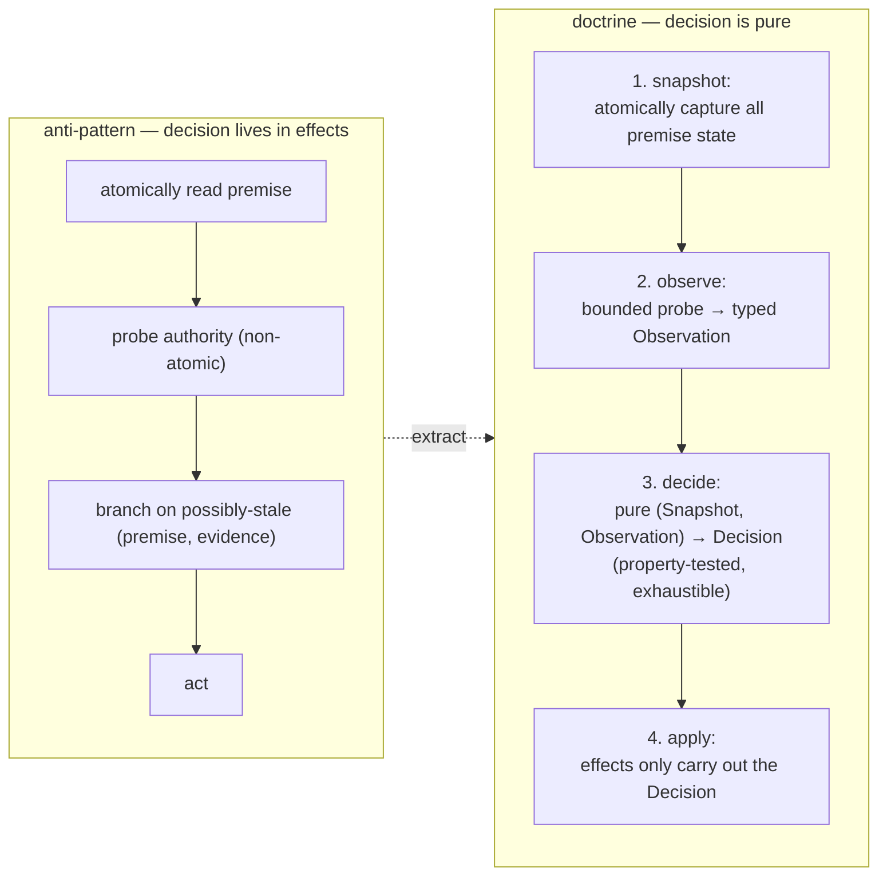
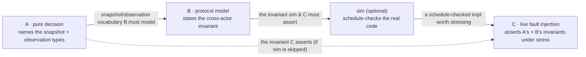
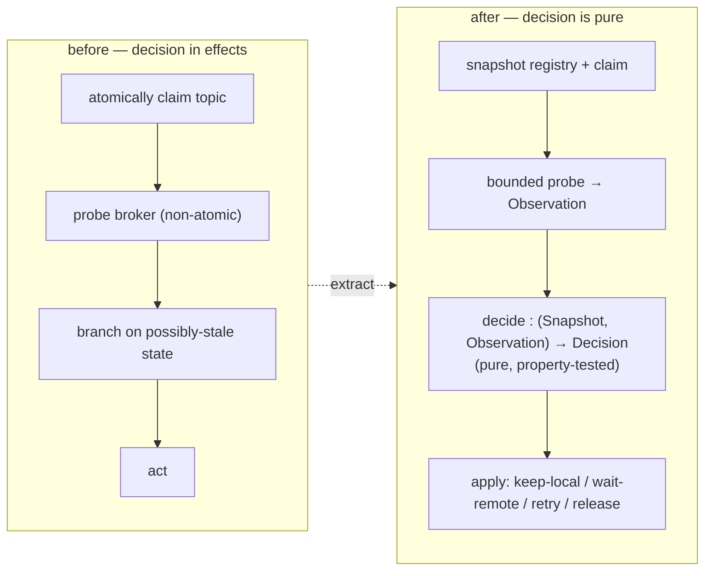
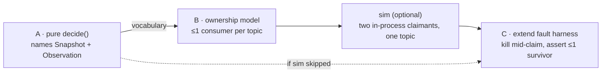
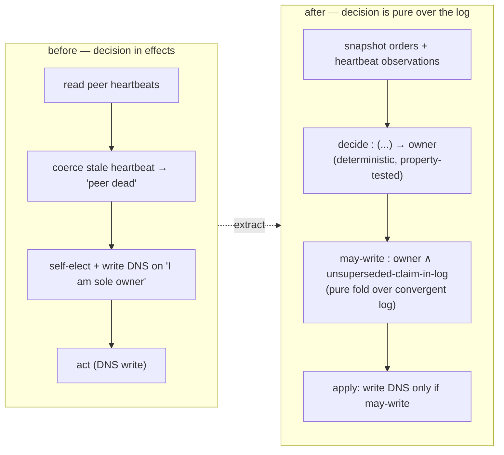
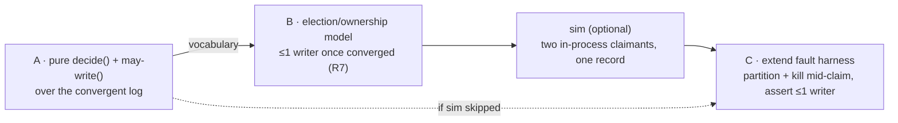
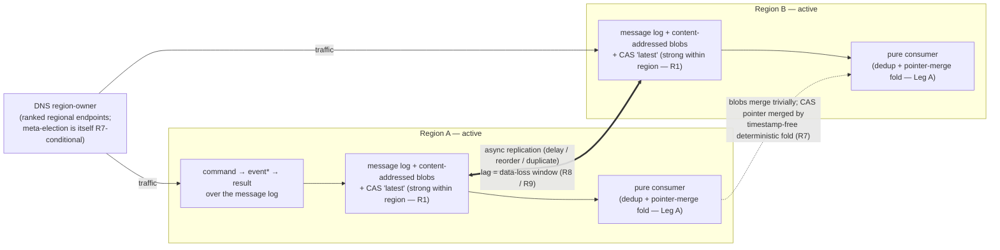
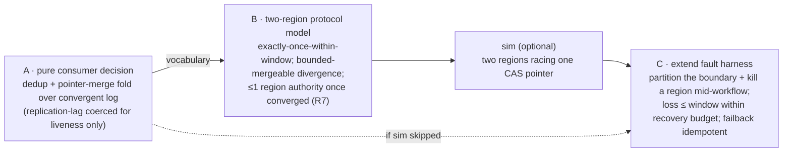
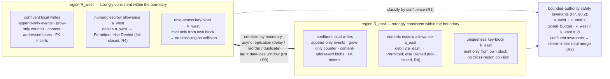
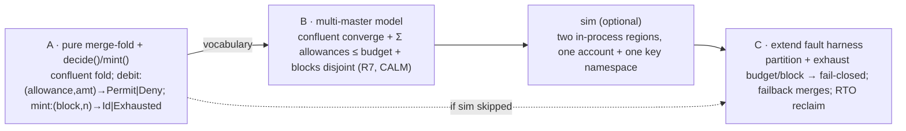

# Chaos-hardening doctrine: making concurrency defects unrepresentable, then provable, then survivable

**Status**: Doctrine / reusable best practices
**Audience**: anyone designing or hardening a high-availability system that makes decisions under
concurrency
**Scope**: any system that meets the §0 applicability gate. This document is project-neutral; a single
fenced worked example in Appendix A instantiates every rule against one concrete subsystem.

---

## 0. Applicability and vocabulary

### 0.1 When this doctrine applies

This doctrine governs a specific and common kind of system. It applies when **all three** of these hold:

1. **Decisions under concurrency** — the system takes branches (claim/yield, accept/reject, retry/fail,
   promote/wait) whose correctness depends on state that other actors can change concurrently.
2. **Coordination only through shared durable substrates** — replicas/processes share no in-memory
   state; they agree only through a database, log, broker, cache, or consensus store.
3. **A safety invariant no single process can enforce alone** — the property that must hold
   (*at most one owner*, *exactly-once effect*, *no split-brain write*) is a property of a protocol
   spanning multiple actors plus a shared substrate, not of any one process.

If a system meets the gate, the defect class in §1 is *present whether or not it has ever been
observed*, and the rules in §3–§4 are the means to make it unrepresentable, provable, and survivable.
If it fails the gate (single-process, or no cross-actor invariant), most of this is over-engineering.

### 0.2 Defined terms

- **Decision** — a branch taken in effectful code on the basis of observed state.
- **Premise** — the state a decision assumes to be true at the moment it branches.
- **Snapshot** — a single atomically-captured read of state.
- **Observation** — a typed result of probing state that *may not resolve* (success, failure, or an
  explicit *not-yet-known*). The opposite of coercing an unknown into a definite value.
- **The three layers** — *Decision* (one process), *Protocol* (across processes), *Runtime* (the live
  deployed system). Defined in §2.
- **The four techniques** — *pure-decision extraction* (A), *design model-checking* (B),
  *deterministic-scheduler simulation* (optional), and *live fault injection* (C). Defined in §3.
- **Conformance** — a project conforms when it can answer, for every layer and every concurrency
  primitive, the demonstration demanded by the checklist in §7.

The next three terms apply only when a substrate spans more than one strongly-consistent domain with
asynchronous replication between domains. They are inert for a single-domain system.

- **Consistency boundary** — the perimeter within which a shared substrate provides synchronous,
  strongly-consistent coordination (atomic snapshots, the substrate's contracted ordering,
  quorum-durable convergence). Across that boundary the same substrate replicates *asynchronously*:
  bounded lag, no global ordering across the boundary, possible duplication, and — if both sides accept
  writes — possible **divergence into independently-advanced histories**. It **classifies every
  invariant** that must cross it, and the master classifier is **invariant-confluence** (below):
  **(i) Confluent** — convergent / idempotent / content-addressed data, *and* every mutable
  multi-record invariant *proven* confluent — may cross and be applied active-active on both sides,
  bounded only by replication lag, healing by a deterministic total merge (R7); **(ii) Non-confluent —
  held by bounded authority** — may cross only under R7's conditional forms, never as an absolute and
  never by a fabricated per-record merge, in one of these sub-forms: *singleton-ownership* via R7's
  claim/yield pattern; an *aggregate-numeric floor/ceiling budget* via escrow/reservation; a
  *uniqueness namespace* via disjoint-namespace allocation; a coordinating *single writer / consensus /
  lock*; *downgrade* to a weaker confluent invariant; or *restructure* into a confluent representation
  (after which it re-classifies into (i)). Every coordination guarantee this doctrine otherwise relies
  on — an atomic snapshot, a convergent fold, "heals on reconvergence" — holds **only within one
  boundary** unless stated.
- **Invariant-confluence (I-confluence)** — a multi-record invariant is *confluent* iff the set of
  invariant-valid states is **closed under merge** of concurrent, independently-applied updates. The
  governing result — a theorem, named here as FLP/CAP are named in R7 — is that an invariant has a
  **coordination-free**, available, convergent implementation across an asynchronous boundary **iff** it
  is I-confluent (Bailis et al.); the corollary the doctrine relies on is that a **non-confluent**
  invariant **requires coordination**. (The CALM result — *consistency as logical monotonicity*,
  Hellerstein & Alvaro — reaches the same conclusion via program monotonicity; the two are convergent
  results, not one theorem.) Consequently a per-record merge **cannot manufacture a *non-I-confluent*
  cross-record invariant** (a global floor, global uniqueness, "the parts sum to the whole") the
  substrate did not synchronously enforce — while cross-record invariants that *are* confluent
  (referential-integrity inserts, monotone aggregates in the safe direction, delta-merged sums) survive
  merge.
- **Escrow / reservation** — a coordination-free protocol for a non-confluent **aggregate-numeric**
  budget (a count, a sum, a remaining floor/ceiling): partition the global budget into disjoint per-side
  **allowances**, so each side acts coordination-free *up to its allowance* — turning a *global*
  non-confluent invariant into a *per-side* confluent one bounded by the allowance. Allowances are
  **leased** (a bounded-time premise, R8) and may be **re-partitioned (rebalanced / refilled)** only
  under a single coordinating authority on a bounded timer (a rebalance *moves* budget, never *creates*
  it); when that coordination is unavailable a side runs to exhaustion and **fails closed** (R4). Escrow
  governs *numeric* budgets only; the sibling route for **uniqueness** is **disjoint-namespace
  allocation** (substrate-assigned / per-side identifier blocks), not escrow.

---

## 1. The defect class: the stale-premise decision

Every defect this doctrine targets is one shape: **a decision taken across a sequence of non-atomic
effects, on a premise that was true at snapshot time but is trusted after it could have changed.**

The minimal form, language-neutral:

```
  premise  := atomically read shared state          -- true at instant t0
  evidence := probe an external authority            -- resolves at instant t1 > t0, non-atomically
  branch   := act on (premise, evidence)             -- but the world at t1 ≠ the world at t0
```

Between `t0` and `t1` another actor can invalidate the premise (register the consumer the probe was
checking for, advance the version the decision gated on, drop the lock the branch assumed it held). The
branch is then taken on a **self-contradictory input**: a premise from one instant fused with evidence
from another. Two sub-species recur:

- **Timeout-coerces-unknown** — a probe that times out or errors is read as a definite negative
  ("no consumer exists"), when the truthful value is *unknown*. The decision then confidently does the
  wrong thing on missing information.
- **State-conflation** — two distinct conditions (not-yet-true vs known-false; draining vs failed;
  absent vs unreachable) are collapsed into one branch, so the decision cannot distinguish cases that
  demand different actions.

The same shape recurs **at the storage layer** whenever a decision reads from an
*asynchronously-replicated* substrate. A read from a replica that lags the authoritative history is a
premise true at the replica's last-applied instant but trusted after the history has moved on — the
stale-premise defect with the consistency boundary (§0.2) playing the role of the gap between `t0` and
`t1`. It carries both sub-species: a not-yet-arrived conflicting write read as "no such write" is
*state-conflation*; "I have not observed it, therefore it does not exist" is *timeout-coerces-unknown*.
The typed-unknown remedy applies unchanged (§3.1) — an un-fresh read is *not-yet-known*, not *current* —
and the safety remedy is bounded authority (R7), never a coerced "I read it, therefore it holds."

The defect is invisible to ordinary tests because it requires a *specific interleaving* of two actors
to surface, and a single-threaded test never runs two actors. It is therefore the canonical
"once-in-N-thousand-runs" bug: real, rare, and never reproduced on demand. The whole of §3 exists to
make this shape first unrepresentable, then provable, then survivable.

---

## 2. Three correctness layers, and why each is blind to the others

A concurrency defect can live in any of three layers, and **each layer is structurally invisible to the
tools that guard the others.** This is the load-bearing observation of the whole doctrine: you cannot
cover one layer's risk with another layer's tool.

| Layer | The question it answers | What a defect here looks like |
|---|---|---|
| **Decision** (one process) | Is the branch taken on a single consistent snapshot? | A stale-premise decision (§1): premise and evidence captured at different instants. |
| **Protocol** (across processes) | Is the *algorithm* sound regardless of implementation? | The cross-actor invariant fails on some interleaving of claim / probe / register / crash, *no matter how perfectly each process is coded*. |
| **Runtime** (the live system) | Does the deployed system actually survive faults? | Timeout tuning, failover timing, resource cleanup, partition recovery — failures only a running cluster exhibits. |

The blindness property, stated as three facts:

- A perfect **Decision**-layer proof (the branch is a pure function of one snapshot) says **nothing**
  about whether the *protocol* those decisions compose into is sound. A locally-correct decision on a
  point-in-time read of a shared authority is still wrong if the protocol lets two actors read
  compatible-but-stale views.
- A green **Protocol** model says **nothing** about whether the code implements it, nor whether the
  live system's timeouts and cleanup actually hold.
- A passing **Runtime** fault test says **nothing** about interleavings it did not happen to schedule,
  and cannot tell you an invariant is sound — only that it survived the faults you injected.

Hence the doctrine is multi-legged by necessity, not taste. Each leg covers a layer the others cannot
see.

**A fourth blindness, orthogonal to the three layers: every leg is blind to the substrate's consistency
boundary (§0.2) unless it is modeled in.** Leg A's convergent-log fold is pure *because its input
converges* — and is blind to the fact that convergence stops at the boundary. Leg B, written against a
single shared substrate in logical time, sees no boundary unless the model encodes **two** substrates
with asynchronous replication between them. Leg C exercises only the lag and partitions it happens to
inject. The boundary therefore — exactly like the R8 synchrony premise — must be **named (R1/§0.2), its
lag bounded and monitored (R8), and its failover budgeted (R9)**, because no leg proves it.

---

## 3. The doctrine

The progression is **unrepresentable → provable → survivable**: first make the in-process decision
*unable to be wrong* (A), then prove the cross-process *algorithm* sound (B), then confirm the *running
system* survives faults (C). A fourth technique — deterministic-scheduler simulation — sits optionally
between A and B. Each is stated below as **Rule → Why → How you conform.**

### 3.1 Leg A — make the in-process decision unrepresentable-as-wrong

**Rule.** A decision must be a **pure function of one consistent snapshot**. Effectful code may capture
the snapshot and apply the result, but **must not compute the branch**. Concretely, every decision
follows a four-stage pipeline:



Two sub-rules make the pipeline sound:

- **The typed-unknown rule.** A probe that times out, errors, or has not resolved must yield an explicit
  *not-yet-observed* value — never a coerced definite. The decision branches on a type that *names the
  unknown*, so it can never silently treat "I could not tell" as "the answer is no." This is the direct
  remedy for *timeout-coerces-unknown* and *state-conflation* (§1). The rule binds every decision whose
  **safety** depends on the observation. A decision may deliberately coerce an unknown to a definite
  *only when* the coercion can affect *liveness* but **not** the safety invariant — i.e. a separate
  mechanism (a convergent-log gate, a fail-closed apply step) enforces safety regardless of the coerced
  value. State which case you are in; an unexamined coercion is the §1 defect by default.
- **Bound everything.** Every probe, retry, queue, and wait carries an explicit finite bound. An
  unbounded effect inside the pipeline reintroduces an instant the decision cannot reason about.

**Why.** When the premise is captured atomically and the branch is pure, no interleaving can feed the
decision a self-contradictory input — the stale-premise defect becomes *unrepresentable in the decision
layer*. The branch is now a value, which means it can be exhaustively property-tested without a cluster,
a clock, or a network.

**How you conform.** The branch logic exists as a pure function with no effectful argument; its input
types make *unknown* and each distinguished state representable; and a property test exhausts
`(Snapshot × Observation) → Decision`. If the only test of a decision is an integration test, you do not
conform — the decision is still entangled with effects.

**What this leg cannot do.** It cannot establish the *cross-process* invariant. A pure decision is only
ever as sound as the observation handed to it, and an observation is a point-in-time read of a shared
authority another actor can invalidate immediately after. Whether the *protocol* of snapshot → observe →
decide guarantees the cluster-wide invariant is a question this leg structurally cannot answer. That is
Leg B. (A deeper structural option — making the observation a fold over a replicated append-only log, so
the decision is pure *because its input is convergent*, not merely *because it was wrapped* — is the
strongest form of this leg where the substrate allows it.) That convergent-fold form is convergent
**only within one consistency boundary** (§0.2): where the log is replicated asynchronously across a
boundary and both sides append, each side's fold stays perfectly pure and yet the two results can
disagree — purity does not imply agreement once the substrate has a boundary. Cross-boundary, the fold's
single-owner guarantee is recovered only by keeping one side authoritative plus a reconciliation/merge
for any divergence admitted (R7), within the failover budget (R9).

### 3.2 Leg B — prove the cross-process protocol is sound (design model-checking)

**Rule.** The cross-actor safety invariant must be stated and machine-checked against a **model of the
protocol** that includes the adversarial actions — concurrent claim, message reordering/duplication,
and **actor crash** — exhaustively explored within a bounded scope. (TLA+/TLC and Alloy are the usual
tools; the technique, not the tool, is the rule.)

**Why.** The *catastrophic* failure — two actors both believing they own the same singleton resource —
lives in the protocol layer, which Leg A cannot reach (§2). A flaw there is wrong *regardless of how
perfectly the code is written*, so no test of the implementation can reveal it; only checking the
algorithm can. This is the cheapest way to reach the multi-actor design space, because the model omits
all implementation detail and explores interleavings a test would have to get astronomically lucky to
hit.

**How you conform.** There is a model of the protocol; it encodes crash and reordering, not just the
happy path; it states the safety invariant (e.g. *cardinality of owners ≤ 1*) and at least one liveness
property (*demand is eventually served*); and a checker explores it to exhaustion at a bounded scope that
**matches the real actor count** (do not model 2 actors if you deploy 3). The model's vocabulary — the
snapshot and observation types — should be the same ones Leg A named; if A and B disagree about a case,
you have found either a protocol bug or an implementation bug, and you will know which.

Where the invariant is **impossibility-bounded** (R7), state it *conditionally* — e.g. *≤ 1 owner once
views converge* — model it with that condition explicit, and verify two things: that the invariant holds
inside the condition, and that any violation outside it (under partition) is **bounded and
self-healing** rather than permanent. The canonical failover hazard the model must rule out is a
**deposed actor that still believes it owns the resource and keeps acting**. The remedy is not a local
flag but to gate every owner-only action on **convergent proof of current ownership** — the §3.1 log-fold
(the action is permitted only when the actor observes its own current claim, unsuperseded, in the
replicated log) — so a stale owner cannot act on a belief the rest of the cluster has already overwritten.

**The honest limit.** This leg checks the **design, not the code**. A green model does not prove the
implementation refines it; the model and the code are separate artifacts that drift, and a bounded scope
hides any bug that needs more actors than the scope allows. A further blind spot: a model in **logical
time** says nothing about the **real-time / clock-skew** assumptions the implementation actually depends
on — those are abstracted away, not verified, and must be named and bounded separately (R8). Its unique
and irreplaceable value is finding algorithm flaws that are wrong no matter how perfectly implemented.
Record these limits explicitly (§6) so the model is never mistaken for a proof of the running system.

A further limit appears once the substrate has a **consistency boundary** (§0.2): the deposed-actor
remedy above — gating every owner-only action on convergent proof of current ownership — **weakens
across the boundary**. The proof of supersession must now propagate across an asynchronous gate, so its
latency is the replication lag (R8); a deposed side can keep acting for up to that lag before it observes
the superseding claim. The remedy no longer *prevents* the deposed-actor window — it only **bounds it to
the lag** — leaving a residual violation that must be stated as a bounded, self-healing R7 violation (and
reconciled per R7 if both sides advanced).

### 3.3 Deterministic-scheduler simulation — the optional middle

**Rule (conditional).** Where in-process concurrency is intricate enough that Leg A's purity boundary
leaves real schedule-dependent behaviour (interacting retry loops, cancellation, async exceptions), run
the **real in-process code** against an **adversarial deterministic scheduler with simulated time**, so a
rare interleaving becomes deterministically replayable.

**Why.** Unlike Leg B, this exercises the *actual* code — the real concurrency primitives — with no
model/implementation drift and no wall-clock flakiness. It catches schedule-dependent defects in the
glue *between* pure decisions that A made pure but did not eliminate.

**Why it is not load-bearing, and is optional.** Adopting it typically means abstracting the concurrency
primitives behind a polymorphic interface, which propagates that abstraction through every
concurrency-touching signature — a **standing cost on all future change**, not a one-time edit. And its
marquee scenario (several simulated actors racing) only faithfully reproduces production if the actors
genuinely share in-process state; where they coordinate through an external substrate, the simulation's
fidelity rests on a hand-built stub of that substrate, and the catastrophic cross-actor invariant is
better served by Leg B. **Adopt it scoped to one subsystem, after A, as evidence the abstraction tax is
worth paying — and gate any broader adoption on that evidence.** A sibling system reaching the same
invariant safely *without* it is sufficient grounds to defer it.

**How you conform (if adopted).** The same source runs unchanged in production and under the simulator;
at least one property explores schedules over the real code and asserts the invariant plus the absence of
leaked/orphaned concurrency.

### 3.4 Leg C — confirm the running system survives faults (extend, don't build)

**Rule.** The live system must be subjected to **fault injection that asserts the exact invariants A and
B establish** — and the injection must include *adversarial* faults, not only benign ones.

**Why.** Some failures exist only in the running system and no static leg can see them: timeout tuning,
failover timing, resource cleanup, real partition recovery. A fault test is also the only thing that
confirms a *believed-correct* system (pure decisions, sound protocol) actually holds up under stress.

**The extend-don't-build sub-rule.** Most HA systems already inject *some* faults (rolling restarts,
single-node outage, failover-in-isolation). The work is rarely to build a fault harness from nothing; it
is to **extend the existing one** with the scenarios that target what A and B newly assert. Adding a
parallel harness when one exists is waste.

**The adversarial-vs-benign axis.** This is the maturity measure for a fault suite:

- *Benign* (most suites stop here): one fault at a time, system quiesced between faults — node restart,
  isolated failover, single dependency bounce. Proves *recovery from outages*.
- *Adversarial* (what this rule demands): a fault injected **during** a critical operation, **under
  load**, with **concurrent** actors — kill an actor mid-claim while writes are in flight; two actors
  racing one singleton; partition / latency / packet loss; message reordering against an at-least-once
  guarantee; failover *concurrent with* live queries; cascading faults with no recovery between.
  Proves the *correctness core holds under stress*.

**How you conform.** For each invariant A and B establish, a live scenario injects the adversarial fault
that targets it and asserts the invariant survives (e.g. kill an owner mid-claim under load, assert
exactly one owner cluster-wide afterward). A suite that only injects benign faults conforms to
"recovers from outages," not to this doctrine.

---

## 4. Supporting rules

These rules are not optional add-ons; they are the conditions under which the four techniques actually
hold. Each is a portable best practice in its own right.

- **R1 — No shared in-memory state between replicas; and name the consistency boundary the substrate
  actually provides.** Replicas coordinate only through durable shared substrates. Any in-memory
  cross-replica assumption is a split-brain waiting to happen and is invisible to Leg B's model. A
  substrate's atomicity, ordering, and convergence hold only *within* one consistency boundary (§0.2);
  across it the substrate is asynchronous, so coordination that silently assumes a single global view is
  a cross-boundary split-brain in waiting — the same defect one level up, equally invisible to a
  single-substrate model. For every cross-boundary invariant that is **mutable and spans multiple
  records**, run the invariant-confluence test (§0.2) *before* assigning a bucket: that two records each
  merge cleanly says nothing about whether a constraint *between* them (a sum, a floor, a uniqueness
  namespace, a referenced-row deletion) is confluent. An unclassified mutable multi-record invariant
  **defaults to non-confluent** and to R7's bounded-authority treatment until proven confluent.
- **R2 — Determinism in tests: inject time and scheduling; never assert on wall-clock.** Tests drive
  timing and ordering through injected hooks/seams, not real delays. Wall-clock tests are slow, flaky,
  and — fatally — cannot deterministically reproduce the interleaving that exposes a §1 defect. This rule
  is what makes Legs A and the simulator fast and repeatable.
- **R3 — At-least-once delivery with idempotent handlers is a named invariant — and across a
  consistency boundary it must stay one.** Treat "no effect lost, none double-applied under redelivery
  and crash-mid-acknowledge" as a first-class protocol invariant worth its own Leg-B model and Leg-C
  fault — not an implementation afterthought. Asynchronous replication can re-present, after a failover,
  work a now-lost side already applied, so the idempotency key must be a stable identity that *survives
  replication* (content- or call-identity, not a local sequence number); the invariant then widens from
  "none double-applied under redelivery and crash-mid-acknowledge" to "none double-applied under
  post-failover cross-boundary replay."
- **R4 — Crash-only / fail-closed recovery; and it scales to the consistency boundary.** On an
  unrecoverable fault, fail loudly and let a supervisor restart from clean state (e.g.
  negatively-acknowledge in-flight work, kill the child, exit non-zero) rather than attempting intricate
  in-process recovery. Crash-only paths have far smaller state spaces for Legs B and C to cover. When a
  whole side of a consistency boundary is lost, the surviving side recovers from its own durable,
  replicated — and therefore *stale-by-the-lag* — state, rather than reaching across the boundary to
  reconcile with the failed side. This keeps the failover state space small (R4's original motive) and
  turns the accepted staleness into an explicit budgeted loss (R9) instead of a hidden recovery attempt.
- **R5 — Bound everything.** Every timeout, retry budget, queue depth, and wait is explicitly finite.
  (This is R-of-Leg-A promoted to a system-wide rule: an unbounded effect is an instant no decision can
  reason about and no model can scope.)
- **R6 — Structured concurrency only.** Coordination paths use scoped concurrency
  (spawn-within-a-scope, race, cancel-on-exit) — never unstructured fire-and-forget tasks or ad-hoc
  sleeps. Structured scopes make cancellation and async-exception safety analyzable; unstructured tasks
  leak and hide races.
- **R7 — Impossibility-bounded invariants are stated conditionally, with the failure mode chosen
  explicitly.** Some safety invariants *cannot* hold unconditionally in an asynchronous system that
  admits partitions — the FLP/CAP results make "absolute safety *and* always-available autonomous
  progress under partition" unachievable. PACELC adds that the tradeoff does not wait for a partition:
  across a consistency boundary (§0.2), even fully healthy, synchronous cross-boundary coordination
  costs latency on every operation while asynchronous coordination buys it back at the price of lag and
  the divergence it permits — so state the steady-state posture (synchronous-and-slow vs
  asynchronous-and-lagging) as deliberately as the under-partition mode, and record both in the §6
  ledger. When the invariant you need is one of these: (a) **state the
  condition** under which it holds (e.g. *under view convergence* or *under bounded synchrony*); (b)
  **choose the failure mode explicitly** — *safety-first* (fail closed: refuse to act under uncertainty)
  or *availability-first* (act, and accept a **bounded** violation that deterministically heals on
  reconvergence) — and document which; and (c) **record the chosen mode and its condition in the §6
  ledger.** An honestly *conditional* invariant the system enforces is worth more than an *absolute* one
  it silently violates under partition.

  Cross-boundary, **"heals" has two forms.** Within one convergent substrate, healing is *passive*: a
  single ordering makes the losing action observe its supersession and stop. Where divergence spans a
  consistency boundary and **both sides advanced independently**, there is no single ordering to defer
  to; healing must be *active* — a deterministic, **total** reconciliation/merge over the divergent
  histories, with conflict resolution defined and any unmergeable conflict surfaced explicitly rather
  than silently dropped. A merge may be claimed total **only for a *confluent* invariant** (§0.2): *a
  per-record merge cannot manufacture a non-I-confluent cross-record invariant the substrate did not
  synchronously enforce.* "Active-active" on a **non-confluent** invariant is reached only by *bounding
  concurrent authority*, drawn from §0.2's sub-form families — a **single writer / consensus** for the
  invariant's scope; an **escrow/reservation** budget partition for an aggregate-numeric floor/ceiling
  (allowance leased under R8, exhaustion failing closed under R4); a **disjoint-namespace allocation**
  for uniqueness; **downgrade** to a confluent invariant, stated as such; or **restructure** into a
  confluent representation, after which it crosses as bucket (i). These are *families* of coordination,
  not an exhaustive set; reaching for a bare merge on a non-confluent invariant is the §1 stale-premise
  defect lifted to the storage layer. Prefer a posture that keeps healing passive (a single
  authoritative side) when the merge is not provably total.

  Cross-boundary, **safety-first additionally means a fail-closed promotion gate**: the surviving side
  withholds authority until it proves freshness — caught up to a known commit watermark, or holding a
  fence — trading recovery time (R9's RTO) for zero divergence beyond the suffix already lost at the
  instant of failover (R8/R9). This is the only form in which the R8 lag *bound* is enforceable: not by
  un-losing the suffix, but by refusing to promote a too-stale replica into service.
- **R8 — Name and bound every synchrony assumption; no leg verifies it.** Where correctness rests on a
  real-time premise — bounded cross-node clock skew, a lease/TTL, heartbeat timing — that premise is
  proven by **none** of the legs: Leg A's purity abstracts it, Leg B's model uses logical not wall-clock
  time, and Leg C only samples the timings it happens to inject. Therefore (a) **name** the assumption
  and give it an explicit numeric **bound**; (b) **enforce and monitor** it at runtime (reject inputs
  outside the bound; export the observed maximum so drift is visible before it crosses); and (c) record
  it as **assumed** in the §6 ledger. A safety property built on an unstated or unmonitored synchrony
  assumption is unsound the instant that assumption silently fails. This includes the **cross-boundary
  replication lag** the asynchronous substrate runs at (§0.2): name it, bound it, and monitor it (export
  the observed maximum lag / replica-offset gap so drift is visible before a failover relies on it). Its
  enforcement differs from clock skew in *what* the bound gates, and the distinction is load-bearing:
  the un-replicated suffix that exists *at the instant of failover* is already lost — that irrecoverable
  window cannot be prevented and becomes a **data-loss budget** (its value at failover *is* the recovery
  point, handed to R9), not something a runtime check can reject after the fact. **But the bound is
  still enforceable as a fail-closed gate on the *promotion decision*** (R7 safety-first): a surviving
  side may refuse to take authority until it proves it has caught up to a known commit watermark, so a
  too-stale replica is never promoted into service. (A leased escrow/reservation or namespace allowance
  is the same species of bounded-time premise; its lease/rebalance bound and its fail-closed exhaustion
  ride this rule and R4 — see §0.2.)
- **R9 — Budget every cross-boundary failover (bounded data loss and bounded recovery time).** A
  failover across a consistency boundary (§0.2) incurs a cost R7's transient-violation-that-heals does
  **not** capture: the un-replicated suffix is *permanently* lost. Declare the budget in two dimensions —
  a bounded **data-loss window** (how much acknowledged-but-un-replicated work may be lost; *this is the
  replication-lag bound of R8 at the instant of failover*, not a separately-derived quantity) and a
  bounded **recovery time** (how long until a surviving side resumes authority). Monitor the live lag
  against the first, and validate the second by **drill, not assertion**. This is R5's "bound
  everything" raised to the failover *event*, with a permanent-loss dimension R5 never had: the
  recovery-time bound is **tested** (drilled) and the data-loss bound is **assumed** under real disaster
  (§6). Every existing rule's violation is transient and heals; R9's data-loss dimension is permanent,
  accepted, and never heals — which is why no other rule can host it.

---

## 5. Sequencing: the portable dependency, and the per-project ROI

The legs have a **genuine dependency order** that is doctrine, and a **sequencing-by-ROI** that is a
per-project judgment. Keep them distinct.

### 5.1 The dependency DAG (portable)

Each leg emits the vocabulary the next consumes. This ordering is structural, not preferential:



- You cannot **model** a protocol (B) until you have **named** the decision's snapshot and observation
  (A) — the model needs that vocabulary.
- You cannot **assert** an invariant in a fault test or simulator (C / sim) until the invariant has been
  **stated** (B), or at minimum the decision made pure and checkable (A).
- The optional simulator sits between B and C: once there is a design to conform to and a pure decision
  to exercise, it checks the real code against schedules before the expense of live injection.

### 5.2 Sequencing by ROI (per-project — not doctrine)

*Which* leg to invest in first, and how far, is a project-specific cost/benefit call, not a rule. The
considerations are: how cheaply each leg reuses existing patterns and harnesses; how large the blast
radius of each layer's defect is; and how much of each leg already exists. A typical — but not
mandatory — judgment is *A first* (cheapest, removes a real defect now, and sharpens B by forcing the
vocabulary), *then B* (small focused model against a catastrophic blast radius), *then extend C* (most
meaningful once the decision is pure and the protocol sound), *with the simulator only if A leaves a real
schedule question*. State your project's actual reasoning explicitly; do not present it as doctrine.

A useful anchor: a **machine-checked type system is already a zero-cost design check** for the
state machines it covers — illegal transitions are compile errors. That is the cheapest verification
there is. It also marks exactly where types *stop* reaching: the distributed, multi-actor, runtime
invariants — which is precisely the territory Legs B and C exist to cover.

---

## 6. The proven / tested / assumed ledger

A system is "provably chaos-hardened" only to the degree it can say, for each technique, **what is
proven, what is merely tested, and what is assumed.** Conflating these is the difference between provable
hardening and "we ran some chaos tests." Maintain this ledger explicitly:

| Technique | Establishes | Strength | Does **not** establish |
|---|---|---|---|
| Type-indexed state machine | Illegal in-process transitions are compile errors | **Proven** (machine-checked, exhaustive) | Anything across processes |
| Leg A — pure decision + property test | The branch is a function of one snapshot; the enumerated input space is correct | **Proven** for purity; **tested** (sampled) for the property unless the input space is finite and exhausted | That the protocol composing these decisions is sound |
| Leg B — design model-checking | The *algorithm* upholds the (possibly *conditional*, R7) invariant under modeled crash/reorder, within scope | **Proven for the model**; **assumed** for model↔code refinement and for actor counts beyond scope | That the code refines the model; behaviour above the bounded scope; real-time/clock-skew premises (R8) |
| Simulation (optional) | The *real code* upholds the invariant under the schedules explored | **Tested** (sampled schedules, not exhaustive) | Schedules not explored; anything outside the simulated subsystem |
| Leg C — live fault injection | The deployed system survived the injected faults | **Tested** (the faults you chose), never proven | Faults/interleavings not injected; that the invariant is *sound* |
| Synchrony / real-time assumption (R8) | The timing premise the live system relies on (clock-skew bound, lease, heartbeat) is named, bounded, and monitored | **Assumed** — monitored at runtime, never proven by any leg | Behaviour when the bound is exceeded; that the premise actually holds in the field |
| Cross-boundary consistency premise (R1/§0.2, R8) | The substrate's consistency boundary is named; cross-boundary replication lag is bounded and its observed maximum monitored; the data-loss window equals the lag at the instant of failover; a fail-closed promotion gate can refuse a too-stale replica | **Assumed** — monitored at runtime, never proven by any leg | That field lag stays within bound during a real disaster; the data already lost beyond the bound; that a single-substrate / logical-time model saw the boundary at all |
| Cross-boundary failover budget (R9) + reconciliation (R7) | The two-dimensional budget — bounded permanent data loss and bounded recovery time — is declared and exercised by drill; where divergence is admitted, a deterministic merge reconciles the divergent histories | Recovery time and reconciliation **tested** (drilled), never proven; the data-loss bound **assumed** under real disaster | That an un-drilled disaster stays within budget; that every conflict is mergeable; behaviour when divergence exceeds the modeled scope |
| Invariant-confluence classification + bounded-authority protocol (§0.2, R7) | Each cross-boundary mutable invariant is confluent (mergeable) or held by single-writer / escrow / namespace-partition / downgrade / restructure; the chosen protocol never overspends the global budget or collides a namespace, and fails closed on exhaustion | Classification **proven** by the I-confluence/CALM argument; protocol safety **proven for the model** (Leg B); exhaustion-under-partition survival **tested** (Leg C) | The per-side lease/rebalance bound in the field (R8, **assumed**); the replication-lag bound (R8, **assumed**); model↔code refinement; behaviour above modeled scope; the un-replicated committed suffix lost at failover (R9 data-loss budget) |

The rule: **never report a tested or assumed result as proven.** The two genuinely-proven rows
(type-checking, decision purity) are the floor; everything above the line is evidence, not proof, and the
ledger must say so.

---

## 7. Conformance checklist

A project conforms when, for each **correctness layer** crossed with each **concurrency primitive it
uses**, it can name the demonstration. Use this matrix as a self-audit: the cell is not "is there a
test" but "what does the project demonstrate here?"

| Concern | Pure decision (A) | Sequential state-machine test | **Concurrent / interleaved test** | Cross-process model (B) | Live adversarial fault (C) |
|---|:--:|:--:|:--:|:--:|:--:|
| Each branch that reads externally-mutable state | required | — | required where the branch races | — | — |
| Each take-then-act / lock / handle primitive | — | required | **required** (contention + async-exception) | — | — |
| Each cross-actor singleton/ownership invariant | the decision is pure | — | required | **required** | **required** (kill mid-operation) |
| At-least-once + idempotency (R3) | — | required | required | **required** | **required** (reorder/redeliver, incl. post-failover cross-boundary replay) |
| Crash/recovery & failover (R4) | — | the recovery decision is pure | — | recommended | **required** (failover under load, incl. cross-boundary failover) |
| Impossibility-bounded invariant (R7) | — | — | — | **required** (state condition; choose failure mode; model the *conditional* invariant — and, if active-active on a non-confluent invariant, see the dedicated row below) | **required** (partition; assert the violation is bounded & self-healing) |
| Synchrony / real-time assumption (R8) | name + bound | — | — | recorded *assumed* (a logical-time model cannot prove it) | **required** (inject skew/lease beyond the bound) |
| Cross-boundary consistency / replication lag (R1/§0.2, R8) | name the boundary + lag bound | — | — | recorded *assumed* unless replication is modeled as two substrates | **required** (partition the boundary; drive lag beyond bound; assert the promotion-freshness gate fires and loss stays within the data-loss window) |
| Cross-boundary failover budget & reconciliation (R9, R7) | the merge/reconciliation decision is pure | — | — | **required** (model divergence + merge; assert merge converges and preserves the invariant) | **required** (drill failover across the boundary; assert loss ≤ data-loss window, recovery ≤ recovery-time bound, histories reconcile, no double-applied effect) |
| Non-confluent invariant across a consistency boundary (§0.2, R7) | classify confluent / non-confluent; the per-side allowance-or-namespace spend is a pure decision | — | required (concurrent spend on both sides) | **required** (model the budget/namespace partition: each per-side allowance is confluent; no path overspends the global budget or collides; exhaustion fails closed) | **required** (exhaust an allowance under partition; assert fail-closed, *not* overspend; assert the global budget is honored after reconvergence) |

Reading the matrix:

- A **blank** cell where the column applies is a conformance gap, not a neutral absence.
- The **"Concurrent / interleaved"** column is where most suites are empty — and emptiness there is the
  signature of a single-threaded suite that cannot, even in principle, surface a §1 defect. A
  take-then-act primitive with **zero** contention test is the most common and most glaring instance:
  its entire reason to exist is correct behaviour under concurrent modification, asserted by code review
  alone.
- The **"Cross-process model"** and **"Live adversarial fault"** columns are where benign-only suites
  stop. Their emptiness means the catastrophic invariant (§3.2) and its survival under stress (§3.4) are
  unverified.

Conformance is layered: a project can be fully conformant at the Decision layer (every branch pure and
property-tested) and entirely non-conformant at the Protocol and Runtime layers — and by the blindness
property (§2), the Decision-layer conformance tells you *nothing* about the other two. Audit all three.

---

## Appendix A — Worked example (fenced): cluster-wide single-consumer ownership

> This appendix is a single concrete instantiation of the doctrine. Everything above is project-neutral;
> everything here is one illustrative subsystem. The diagrams are reusable templates; the specifics are
> not normative.

**The system.** A multi-replica service routes chat prompts through a shared message broker. The
invariant: **at most one active consumer per chat topic, cluster-wide.** Each replica keeps its own
in-memory claim registry; the only shared truth is the broker's view of "does a consumer exist on this
topic?" The invariant is therefore a property of a protocol across N replicas plus the broker — it meets
the §0 gate (decisions under concurrency; coordination only via the broker; an invariant no replica can
enforce alone).

**The defect (§1 made concrete).** When a topic is activated, a replica *atomically claims* it in its
local registry (establishing the premise "no consumer here yet"), then *probes the broker over one or
more non-atomic calls* to decide whether it owns the worker. Between the atomic claim's snapshot and the
probe's response, another replica can register a consumer, or the local registry can change — and the
branch is taken on the stale premise. A probe timeout coerced to "no consumer exists" is the
*timeout-coerces-unknown* species; conflating "not yet registered" with "will not be registered" is the
*state-conflation* species.

**Leg A applied.** Split the entangled path into the four-stage pipeline of §3.1: atomically snapshot
the registry and claim; route the broker probe through a bounded observation so a timeout becomes an
explicit *not-yet-observed* (never a false "no consumer"); move every branch-worthy choice into a pure
`decide : (Snapshot, Observation) → Decision` where `Decision` enumerates the outcomes (keep-local /
wait-remote / retry-after-delay / release); and leave effects only carrying out the chosen outcome. The
pure `decide` is then exhausted by property tests. (Where the broker exposes an append-only ownership
record, the stronger form folds the observation over that log so the decision is pure *because its input
is convergent* — see §3.1's deeper-structural note.) This makes the *in-process* stale-premise race
unrepresentable; it does **not** settle the cross-replica race — see Leg B.

The before/after, as the §3.1 template instantiates:



**Leg B applied.** Model the protocol: N replicas each with a private claim registry; the broker's
shared consumer-existence view; actions *claim / probe / register / release / crash*. State the safety
invariant — *for every topic, the number of replicas with an active consumer is ≤ 1* — and a liveness
property — *a topic with demand eventually gets exactly one consumer*. Check it to exhaustion at a scope
matching the real replica count (e.g. 3 replicas, 2 topics), including crash-mid-probe and stale-broker
reads. This reaches the cross-replica design space Leg A cannot. Its honest limit (§3.2, §6): a green
model does not prove the code refines it. Two further invariants qualify for their own models once this
one proves the approach: at-least-once + idempotent delivery (R3), and recovery after an
availability-zone outage (R4).

**Leg C applied.** The system already injects benign faults (rolling restarts, isolated failover,
dependency bounces). Extend that existing harness with the adversarial scenarios of §3.4 that target the
invariants A and B established: kill a replica *during* the claim under active write load and assert
exactly one consumer survives cluster-wide; two replicas racing one topic at the same instant; partition
and latency; message reordering against the at-least-once guarantee; failover concurrent with live
queries.

**The dependency, instantiated** (the §5.1 template):



**The conformance gap this example exposes** (reading §7's matrix against a typical such system): the
pure decision modules are well tested; the live fault tier is real but benign-only; and the
"Concurrent / interleaved" column is empty — the take-then-act registry primitive has no contention
test, no test reproduces the claim+probe race, and there is no cross-process model. That emptiness is
the single-threaded-suite signature of §7: the system proves its decisions correct *in isolation* and
has not yet proven they stay correct *under concurrency*, nor that the protocol they serve is sound.
A → B → (sim) → extend-C is exactly the sequence that closes it.

---

## Appendix B — Worked example (fenced): single authoritative writer elected over a replicated log

> A second concrete instantiation, included because it exercises the rules Appendix A does not:
> impossibility-bounded conditional invariants (R7) and a load-bearing synchrony premise (R8).
> Everything above is project-neutral; everything here is one illustrative subsystem. The diagrams are
> reusable templates; the specifics are not normative.

**The system.** A small fixed set of ranked daemons must keep exactly one public DNS A record pointing
at whichever of them is the elected leader, so traffic always reaches a live owner. The daemons share
no in-memory state; they coordinate only through a **replicated, append-only, signed event log** (claim
/ yield / heartbeat / dns-write entries), reconciled peer-to-peer by idempotent anti-entropy push. The
only externally-visible effect is the DNS write. The invariant: **at most one daemon writes the DNS
record — once the daemons' views have converged.** That conditional clause is deliberate and load-bearing
(R7): the invariant is *not* absolute. It meets the §0 gate — decisions under concurrency (claim / yield
/ write), coordination only through the shared log, and a *no-two-writers* invariant no single daemon
can enforce alone.

**The defect (§1 made concrete).** Each daemon decides "am I the owner, and may I write DNS?" from its
local view of peer liveness (heartbeat ages) and the log. The naive path reads a *peer heartbeat older
than the timeout* as "that peer is dead," elects itself, and writes DNS on the premise "I am the sole
owner" — a premise that may already be false. This is *timeout-coerces-unknown*: a missing heartbeat
means *unreachable-or-slow*, not provably *dead*. It compounds with *state-conflation* if the daemon
collapses "I successfully pushed to the peer's socket" (outbound reachability) with "the peer is alive
and emitting" (inbound freshness) — two distinct facts that a one-way partition drives apart, and that
must be tracked as **separate** observations, not one boolean.

**Leg A applied.** Make the decision a pure function of a convergent input (§3.1, log-fold form). Election
is `decide : (orders, heartbeat-observations, up-set) → owner`, a *deterministic* total function over the
ranked node set — given identical observations, every daemon computes the same owner, so convergence alone
removes accidental split-brain. The owner-only action is gated by a second pure predicate over the **log**:
*may-write = (I am the computed owner) ∧ (my latest claim in the replicated log is unsuperseded by a
later yield)*. Because the gate folds over the convergent log rather than local belief, it is pure
*because its input converges*. Note the §3.1 typed-unknown scoping at work: the daemon **does** coerce
"stale heartbeat → drop peer from the up-set," but that coercion only changes *who attempts to lead*
(liveness); it never authorizes a write, because the write is gated by the log, not by the heartbeat. The
coercion is therefore licensed — it cannot violate safety. The pure `decide` and `may-write` are exhausted
by property tests with no cluster or clock.

The before/after, as the §3.1 template instantiates:



**The impossibility and the synchrony premise (R7, R8).** Under partition you cannot have both *no two
writers* and *autonomous failover progress* (FLP/CAP). This system makes the R7 choice **explicit and
safety-leaning**: an isolated daemon may self-elect as a failsafe, but the DNS write stays gated by the
convergent log, so any split-brain is *temporary and bounded* and **deterministically heals on
reconvergence** (the losers observe a superseding claim and stop writing). The invariant is therefore
stated conditionally — *≤ 1 writer once views converge* — exactly as R7 demands, and the chosen mode is
recorded in the ledger. Safety further rests on a **bounded clock-skew premise** (R8): freshness and
claim/yield ordering compare wall-clock UTC stamps across daemons, so a drifting clock breaks the
ordering the invariant assumes. The premise is named with an explicit bound (`max_clock_skew_seconds`),
**enforced** by rejecting inbound events whose stamps fall outside it, and **monitored** by exporting the
maximum observed inter-node skew so drift is visible before it crosses the bound. No leg proves this
premise; it is recorded **assumed**.

**Leg B applied.** Model the protocol: the ranked nodes, an up-set derived from heartbeat-timeout, and
actions *claim / yield / dns-write / crash*, explored to exhaustion at a scope matching the real node
count (e.g. 3 nodes). State the safety properties — *deterministic election for equal views*, *no
tug-of-war once views converge*, *no two simultaneous DNS writers when stable*, *every dns-write is
preceded by a claim*, *a yield precedes any re-claim*, *a sole survivor elects itself* — and a liveness
property — *a cluster with a live node eventually has exactly one writer*. The model rules out the
canonical failover hazard of §3.2: a **deposed daemon that still believes it owns the record and keeps
writing** — barred because a write requires an unsuperseded self-claim in the replicated log, which a
deposed daemon cannot have once its yield (or the new owner's claim) has propagated. Honest limits
(§3.2, §6): the model is in **logical time with a bounded scope**, so it proves nothing about node counts
beyond the scope, nothing about unbounded runs, and — critically — nothing about the **real-time
clock-skew premise** it abstracts away (that lives in R8's ledger row, not the model). Two adjacent
invariants earn their own models once this one proves out: at-least-once + idempotent log merge (R3),
and recovery after an availability-zone outage (R4).

**Leg C applied.** The system already injects benign faults (rolling restarts, isolated failover). Extend
that harness with the §3.4 adversarial scenarios that target what A and B assert: partition the mesh and
assert **single-writer** plus the expected claim/yield markers in each partition's log; kill the current
owner *mid-claim under active write load* and assert exactly one writer survives cluster-wide; drive a
**one-way** partition and confirm inbound-vs-outbound health stay distinguished rather than collapsed;
and inject **clock skew beyond the configured bound** to confirm the daemon rejects the out-of-bound
events (R8) rather than silently corrupting the ordering.

**The dependency, instantiated** (the §5.1 template):



**The ledger this example must keep** (§6): *proven* — election purity and the may-write fold (decision
layer), and the modeled safety/liveness properties (for the model, at scope 3); *tested* — the partition
and kill-mid-claim fault scenarios; *assumed* — the bounded clock-skew premise (R8), model↔code
refinement, and any behaviour above the modeled node count. Reading §7's matrix, the rows that make this
subsystem distinctive are *impossibility-bounded invariant (R7)* — the condition stated, the safety-first
mode chosen, the conditional invariant modeled, and a partition fault asserting the violation is bounded
and heals — and *synchrony assumption (R8)* — the skew bound named, enforced, monitored, recorded
assumed, and exercised by an out-of-bound-skew fault.

---

## Appendix C — Worked example (fenced): geo-replication failover of a realtime data workflow

> A third concrete instantiation, included because it exercises rules Appendices A and B do not: a
> **consistency boundary** with asynchronous cross-domain replication (R1/§0.2, R9), a
> bounded-staleness / **data-loss premise** and an explicit **failover budget** (R8, R9), and
> **reconciliation/merge** of divergent histories under an availability-first choice (R7). Everything
> above is project-neutral; everything here is one illustrative subsystem. The diagrams are reusable
> templates; the specifics are not normative.

**The system.** A realtime workflow — `command → event* → result` — runs over a message log, with
durable outputs written as **content-addressed, write-once blobs** (key = hash of payload; a duplicate
write of identical bytes is idempotent and succeeds) plus a single mutable **CAS "latest" pointer**
advanced by compare-and-swap. *Within* one region the log and object store are strongly consistent: a
committed entry and a committed pointer advance are immediately visible to every reader in that region.
The system spans **two regions, full active-active** — both serve live traffic (capacity) **and** both
advance the shared control state, replicating **asynchronously** in both directions. Region authority
for any genuinely-singleton operation reuses the elected-owner pattern of Appendix B, lifted to region
scale: a ranked set of regional endpoints, **DNS owner = the active region** — and that meta-election
is *itself* only **R7-conditional** (both regions may briefly self-elect under partition). The
invariant: *exactly-once effect, with at most one region holding singleton authority — once views
converge*. This meets the §0 gate. The load-bearing fact, named up front per R1/§0.2, is the
**consistency boundary**: strong within a region, asynchronous across. Per §0.2's classification, the
content-addressed blobs are confluent and cross safely; the single CAS pointer and the region authority
are non-confluent singletons that cross only in R7's conditional form with reconciliation.

**The defect (§1 made concrete).** Crossing the boundary opens a new species of the same §1 shape,
where the "instant that could have changed" is a **replication lag**:

- *Topology-scale timeout-coerces-unknown.* On failover, a region reads its lagging replica at offset
  `X` and treats `X` as the *complete* history — coercing *not-yet-replicated* into *does-not-exist*.
  The truthful value of "are there committed effects past `X`?" is **unknown**; coerced to absence, the
  region silently drops the data-loss window's effects, or regenerates them as "new" and risks
  double-applying them on failback.
- *State-conflation.* The region collapses *partitioned-from-the-peer* with *peer-region-dead* — two
  distinct conditions an inter-region partition drives apart. Read as "dead," it asserts singleton
  authority while the peer still holds it → split-brain at region scale; read as "alive, must wait," it
  stalls when the peer is truly gone. They demand different actions and must be tracked as **separate**
  observations (Appendix B's inbound-vs-outbound distinction, lifted across the boundary).

**Leg A applied.** The consumer decision is a pure function of a convergent input: a fold over the
replicated message log plus the content-addressed artifacts. Because blobs are content-addressed and
write-once (identical content → identical key → idempotent) and the log dedup is a pure fold keyed by a
replication-surviving work-id, **duplication, reordering within the data-loss window, and late arrival
are absorbed structurally** — pure *because the input converges* (§3.1's strongest form), carrying
cross-boundary redelivery (R3). Per the substrate's real ordering, per-producer order is preserved
across replication and there is **no global cross-producer total order**, which the fold tolerates by
construction. The **typed-unknown scoping** (§3.1) is the crux: "I have not seen entries past `X`, so I
will serve" decides *which region serves* — a **liveness** coercion that authorizes no effect, hence
licensed; "those effects do not exist / were never durable" is a durability **safety** claim and is the
§1 defect — durability of the tail beyond `X` stays a typed *not-yet-observed* value, reconciled when
the boundary heals, never silently resolved to "absent."

The two-region data path:



**The impossibility, posture, and reconciliation (R7, R9).** Over an asynchronous boundary admitting
inter-region partition, **no strongly-consistent cross-region singleton exists** (FLP/CAP at region
scale). The invariant is stated **conditionally** per R7: *exactly-once effect within the data-loss
window; effects committed in one region but not yet replicated at the moment of failover may be lost.*
This system chooses **availability-first**: both regions serve immediately and **reconcile on
failback**, so divergence is the *normal* case, not just a partition edge. Two distinct sources of
lost/divergent state are kept separate: (1) the **irrecoverable data-loss window** — the un-replicated
tail already gone at the instant of failover, regardless of mode (R8/R9); and (2) the **deposed-actor
window** — a region that loses singleton authority keeps acting for up to the replication lag until the
superseding claim propagates across the async gate (§3.2's remedy *weakened across the boundary*) — a
bounded, self-healing R7 violation. The merge is where Appendix B's single-log "heals itself" does
**not** generalize (R7 reconciliation): **content-addressed blobs merge trivially** (the union of
immutable, self-naming objects is conflict-free); the **CAS "latest" pointer is the only divergent
point and needs an explicit deterministic, total merge** — a **timestamp-free** fold over the union of
both regions' pointer-advance claims (ordered by `(causal-predecessor-set, region-rank)`), so every
node computes the same post-heal pointer **without** a clock dependence. *If* you instead order by a
commit timestamp, that ordering is a **bounded clock-skew premise** and must be named, bounded, and
monitored as an explicit R8 assumption. (Object-store conflict handling rests on immutable versioning +
heal-from-latest-version, not a last-writer-wins-by-modtime algorithm.)

**The staleness premise and the recovery budget (R8, R9, PACELC).** Replication lag is the
synchrony-style premise this system rests on (R8): name it, bound it, **monitor** it (export observed
lag and the max log/pointer offset gap). The failover budget (R9) is the pair **(data-loss window,
recovery time)** — the window is assumed/monitored; the recovery-time bound is **tested by drill**.
PACELC (R7): even **absent** a partition, every cross-boundary write trades latency for consistency;
this system chooses **latency** (asynchronous replication), and the data-loss window *is* the price of
that explicitly-recorded posture — synchronous cross-region replication would pay cross-region RTT per
publish, a cost a realtime hop typically cannot afford.

**Leg B applied.** Model the **two-region protocol** with the cross-boundary adversary as **first-class**:
a replication channel that delays, reorders, and duplicates entries and can be **cut** (inter-region
partition); the region-owner election (lifted from Appendix B); actions *produce / replicate / consume /
advance-pointer / fail-over / fail-back / partition / heal*, explored to exhaustion at scope **2
regions**. Safety: **exactly-once-effect-within-the-window** (idempotent dedup absorbs redelivered/late
copies — R3); **bounded, mergeable divergence** (the deterministic pointer-merge yields a single
convergent state on heal — R7); **≤ 1 region authority once views converge** (Appendix B's invariant,
lifted). Liveness: *a workflow with a live region eventually completes through one authority.* The model
rules out the §3.2 deposed-actor hazard at topology scale, but per the §3.2 note the remedy is **bounded
to the lag, not eliminated**. The honest limit (§3.2, §6): the model is in **logical time** — it encodes
"an effect either had or had not crossed the boundary before the cut" but says **nothing** about the
real size of that window; whether field lag stays within bound is the **R8/R9 assumed premise**, in the
ledger, not the model. Two adjacent invariants earn their own models once this proves out: cross-boundary
at-least-once + idempotent merge (R3) and recovery after a full-region outage (R4).

**Leg C applied.** The system already injects intra-cluster adversarial faults (partition,
kill-mid-claim, reorder/redeliver — Appendices A/B). **Extend that harness into the inter-region
dimension:** cut the replication channel and the cross-region control path and assert divergence stays
**bounded and mergeable** and **≤ 1 region authority once views converge**; **kill a region
mid-workflow** and assert the peer **resumes with bounded loss (≤ the data-loss window)**, exactly-once
for every replicated effect, and authority transfer **within the recovery-time budget** (R9); **inject
replication lag** toward and past the bound and assert the **promotion-freshness gate** fires and the
**lag monitor alarms before a breach** (R8); **fail back with late + duplicate arrivals** from the
recovered region and assert **idempotency absorbs them** (content-addressed + log-fold dedup — R3) and
the **CAS-pointer merge converges deterministically** (R7) — no double effect, no lost merge.

The dependency, instantiated (the §5.1 template):



**The ledger this example keeps (§6).** *Proven* — the consumer decision's purity and the dedup +
pointer-merge fold over the convergent input (decision layer); the modeled two-region safety/liveness
properties at scope 2 (exactly-once-within-window; bounded-mergeable divergence; ≤ 1 region authority
once converged). *Tested* — the inter-region-partition, kill-region-mid-workflow (**recovery within
budget, loss ≤ window**), replication-lag/promotion-gate, and failback-late-arrival-idempotency
scenarios. *Assumed* — the **data-loss-window / replication-lag bound** (R8/R9), monitored, never proven;
the **PACELC latency-for-consistency posture** (R7); model↔code refinement and behaviour beyond 2
regions; the clock-skew premise inherited from the lifted election (Appendix B's R8), plus any clock-skew
premise introduced if the pointer-merge is ordered by timestamp rather than the preferred timestamp-free
fold. The **data-loss bound is assumed-and-monitored; the recovery-time bound is tested**.

**Appendix C rests on doctrine (zero orphans).**

| Appendix C claim / mechanism | Doctrine home it instantiates |
|---|---|
| Substrate strong within a region, asynchronous across; blobs confluent, CAS pointer + authority singletons | §0.2 *Consistency boundary* + classifier; R1 |
| Topology-scale timeout-coerces-unknown (offset `X` read as complete history); partitioned ≠ dead | §1 (storage-layer note); §2 fourth-blindness |
| Pure dedup + pointer-merge fold over convergent log + content-addressed artifacts | §3.1 (convergent-log fold); R3 (replication-surviving key) |
| Per-producer order preserved / no global cross-producer order, tolerated by the fold | §0.2 (async-replication semantics); §3.1 |
| Coercion licensed for liveness, forbidden for a durability safety claim | §3.1 typed-unknown scoping |
| No strong cross-region singleton; invariant stated conditionally; availability-first | R7 (impossibility-bounded, conditional, mode chosen) |
| Blobs merge trivially; CAS pointer needs a timestamp-free deterministic total merge | R7(reconciliation); §3.1 determinism; §0.2 bucket (i) |
| Timestamp-ordered merge would be an explicit clock-skew premise | R8 |
| Deposed region keeps acting up to the lag = bounded self-healing violation | §3.2 note + R7 |
| Replication lag named/bounded/monitored; data-loss window; promotion-freshness gate | R8; R7 (fail-closed promotion gate) |
| Failover budget = (data-loss window assumed, recovery time drilled) | R9 |
| PACELC: async posture chosen; sync would pay cross-region RTT | R7 (PACELC) |
| Two-region model; ≤1 authority once converged; honest logical-time limit | §3.2 Leg B; R7 |
| Extend the harness with partition / kill-region / lag-injection / failback | §3.4 Leg C (extend-don't-build) |
| Ledger proven/tested/assumed; conformance rows | §6 (cross-boundary rows); §7 (cross-boundary rows) |

---

## Appendix D — Worked example (fenced): active-active transactional state across a consistency boundary

> A fourth concrete instantiation, included because it exercises what Appendices A–C do not: a
> **mutable, multi-record, transactional** source of truth replicated **active-active** across a
> consistency boundary, where the governing classifier is **invariant-confluence / CALM** (§0.2).
> Appendix C kept its substrates confluent *by construction* (an append-only log + a content-addressed
> object store, both merging trivially); this one cannot, and must show what changes when the schema
> carries invariants that **do not merge**. Everything above is project-neutral; everything here is one
> illustrative subsystem.

**The system and the §0 gate.** A realtime workflow's source of truth is a mutable relational store,
geo-replicated **active-active (multi-master)** across two regions, `R_west` and `R_east`. Both accept
local writes and serve local reads; the link between them is the **consistency boundary** (§0.2):
*inside* a region the store is synchronously strongly-consistent; *across* the boundary it replicates
**asynchronously** — bounded lag, no global cross-region transaction order, possible duplication on
retry, possible divergence into two independently-advanced histories. It meets the §0 gate: decisions
under concurrency (debit/reject, mint-key/reject, promote/wait); coordination only through durable
substrates (the two regional stores + their replication stream); safety invariants no single region can
enforce alone (a global balance floor; a global uniqueness constraint).

**Classify every invariant by the boundary (R1, §0.2).** R1 demands we name the boundary and classify
each schema invariant by confluence *before* bucketing. Per the I-confluence classification (Bailis et
al.), the schema's invariants fall into two destinations:

- **(i) Confluent** — maintained active-active with no coordination, bounded only by replication lag:
  an **insert-only event/audit table**; a **grow-only usage counter** (monotone in the safe direction);
  **content-addressed columns** (identical content ⇒ identical key ⇒ trivial merge); a **set-union tag
  column**; **NOT NULL / per-record CHECK** constraints; **referential-integrity *inserts* and
  *cascading deletes*** (both I-confluent); secondary indexes and materialized views. A pure merge/fold
  reconciles these (Leg A; R7).
- **(ii) Non-confluent — held by bounded authority** — cannot merge, because the invariant spans
  records or imposes a global bound a per-record merge cannot reconstruct; each carries a *distinct*
  sub-form: a **numeric floor** (prepaid credit `balance ≥ 0`, decremented) → **escrow/reservation** (a
  per-region allowance partition of the global budget); a **uniqueness constraint** on a chosen value
  (at most one row per natural key, cluster-wide) → **disjoint-namespace allocation** (each region
  leased a disjoint key/ID block — *not* escrow); **"sum of line amounts = parent total"** and the
  **arbitrary deletion of a referenced row** (the *non-confluent* slice of referential integrity) →
  **restructure** to a confluent shape (lines insert-only, total a *derived fold*) **or** co-locate the
  aggregate under a **single-writer** scope; **which region is the promotion authority** at failover →
  the R7-conditional **singleton claim/yield** pattern (reused from Appendices B/C). Naming the sub-form
  **is** the design decision.



**The defect (§1 made concrete).** Two §1 species, both fatal to a naive multi-master debit:

- *Stale-read off a lagging replica (storage-layer §1).* `R_east` reads `balance = 1` from its local
  replica. The premise "one unit remains" was true at `R_east`'s snapshot `t0`, but `R_west` already
  debited that last unit at `t0' < t0`; the debit **has not crossed the boundary yet**. `R_east`
  branches *debit → balance = 0, valid locally* on a premise the boundary has already invalidated.
- *Write-write conflict mis-read as no-conflict.* "No conflicting row has replicated, therefore no
  conflict exists" coerces an **unknown** (*I have not yet observed a conflicting write*) into a
  **definite** (*there is no conflicting write*): *timeout-coerces-unknown* lifted to the replication
  boundary, and *state-conflation* (not-yet-replicated collapsed into not-existent).

The canonical breach: both regions hold `balance = 1`; each debits the last unit; **each commit is
locally valid and locally floor-respecting**; replication carries both debits across; a naive per-record
(last-writer-wins) merge yields `balance = -1`. The floor — a *cross-region* invariant — was violated by
two *locally correct* decisions. **A per-record merge cannot manufacture a non-I-confluent cross-record
invariant** (§0.2; the §3.1 boundary-scoped-convergence note — two pure folds over two
divergently-advanced histories can each be pure yet jointly violate a global bound).

**Leg A applied — three paths, by sub-form.**

- *Confluent path (pure merge/fold; R7).* For each confluent invariant the reconciliation is a **pure,
  deterministic, total merge** over convergent input — set-union for tags, max/sum for the grow-only
  counter, content-address identity for blob columns, append-union for the event table, FK-insert union
  — the §3.1 log-fold form, pure *because the input is convergent*. Commutative/associative/idempotent,
  so replay order and duplication cannot change the result; property-tested with no cluster and no clock.
- *Numeric escrow path (pure decision over LOCAL escrow state).* Escrow converts the global floor into a
  **local, confluent** invariant *up to a budget*. Each region holds a **local allowance**; the decision
  is `decide : (local_allowance, requested_amount) → Permitted | Denied`, a **pure function of purely
  local state**. Because the allowance is owned solely by this region, the debit needs **no
  cross-boundary coordination** up to the budget and is *correct under any replication lag* — it never
  reads the remote balance. Exhaustion (`requested > allowance`) → **Denied**, fail-closed (R4).
- *Uniqueness namespace path (pure decision over LOCAL key-block).* Each region is leased a **disjoint
  key/ID block**; `mint : (local_block, next) → Identifier | BlockExhausted` mints only from its own
  block, so two regions can never collide — a sibling of escrow, *not* O'Neil escrow. Block exhaustion
  fails closed / triggers a coordinated re-lease (R8/R4).
- *Typed-unknown scoping (§3.1).* The replication-unknown — *has a conflicting remote write happened?* —
  **may** be coerced for **liveness** (serve a stale read; render last-known balance) but is **never**
  coerced for the **safety** invariant: the floor is enforced by the *local allowance* and uniqueness by
  the *local block*, not by any read of the remote side. Exactly the §3.1 license — coerce the unknown
  only where a separate mechanism enforces safety regardless. State the case explicitly; the unexamined
  coercion is the §1 defect by default.

**R7 + invariant-confluence — the only honest "active-active."**

- *Confluent invariants* are held **availability-first** (R7): both regions write freely; the
  deterministic total merge heals divergence on reconvergence. Per R7, "heals" is passive *within* a
  region but across the boundary must be an **active deterministic total merge** of two divergent
  histories — which these invariants admit by construction.
- *Non-confluent invariants* are held by **bounded authority** — the only honest active-active for them.
  No merge maintains a global floor or global uniqueness; escrow/namespace sidestep the impossibility by
  **partitioning the global budget/namespace** so each side enforces a *local* bound and **the sum of
  local allowances never exceeds the global budget** / **the local blocks never overlap** (the
  *bounded-authority safety invariants*). What is genuinely active-active is the *budgeted/blocked*
  portion; beyond it the system fails closed or re-balances under coordination. **sum=total** is instead
  made confluent by **restructure** (derived fold) or kept **single-writer** — neither is active-active
  by merge.
- *PACELC posture (R7).* Else-Latency: even absent partition, escrow trades a *little consistency* (a
  region may reject a request it could have served had it held more budget) for *coordination-free
  low-latency local writes*. Under partition each region serves up to its current allowance/block and
  cannot reach across. **The allowance/block IS the bounded availability-first envelope** — the explicit
  finite amount of autonomous progress each side is licensed for.
- *Fail-closed promotion gate (R7)* is reused unchanged at failover: a region refuses to assume the
  other's allowance/block until it can **prove** the other has truly yielded it.

**R8 + R9 — the synchrony premises and the failover budget.**

- *Replication lag is a synchrony premise (R8)* — named, bounded, monitored (export observed max lag;
  alarm before it crosses); no leg proves it; recorded *assumed*.
- *The escrow / namespace lease and rebalance is itself a bounded-time premise (R8).* Allowances and
  key-blocks are not static: an idle region's unused budget must be **reclaimable** and a busy region
  must be able to **refill / re-lease** — a lease with an explicit bound. That rebalance is a
  *coordinated* step on a *bounded* timer (a rebalance only *moves* budget, never *creates* it; §0.2
  escrow term); if coordination is unavailable the region runs to exhaustion and fails closed (R4).
  Name, bound, monitor; recorded *assumed*.
- *The failover budget (R9)* is **(bounded data-loss window, bounded recovery time)**. The window = the
  **R8 lag at the instant of failover**: committed-but-un-replicated writes in the lost region are
  **irrecoverably lost** (data-loss budget, assumed by construction). Recovery time is **tested by
  drill**. A second R9 obligation specific to bounded authority: **the lost region's outstanding
  allowances and key-blocks must be reclaimed within RTO**, or the global budget/namespace permanently
  shrinks — and the survivor may not re-issue them until R7's fail-closed gate proves the lost region has
  yielded them (or its lease has provably expired).

**Leg B applied — model the multi-master protocol.** Model two regions, each with a local store, a
local allowance, and a local key-block; an async replication channel that may **delay, reorder,
duplicate**; **partition**; **region crash**. Actions: *local-write (confluent), local-debit (escrow),
local-mint (namespace), replicate, merge, partition, heal, crash, refill/rebalance, promote*. Assert, to
exhaustion at a scope matching the real region count (2 regions, ≥ 2 keys/accounts):

1. **Confluent convergence** — for every confluent invariant, all interleavings of
   delay/reorder/duplicate/partition-then-heal reach **one identical merged state** (merge
   commutative/associative/idempotent).
2. **Bounded-authority safety holds under partition** — `Σ local_allowances ≤ global_budget` **and**
   `local_blocks pairwise-disjoint` are preserved by every action, including during partition and across
   rebalances (a rebalance only *moves* budget/block, never *creates* it). The floor and uniqueness can
   never be breached, on any interleaving.
3. **Exhaustion is fail-closed** — a region whose allowance reaches zero (or whose block is spent)
   **rejects** further debits/mints, never borrows-on-faith across the boundary.
4. **No fabricated cross-record invariant (CALM made executable)** — the model demonstrates the
   per-record merge does **not** silently satisfy a cross-record invariant: for "sum of lines = total"
   it shows the naive merge *breaks* it, and that the only sound options are (a) co-locate the aggregate
   under a **single-writer** scope, or (b) **restructure** it confluent (lines insert-only; total a
   *derived fold*, after which it re-classifies into bucket (i)).

Honest limits (§3.2, §6): the model is in **logical time at a bounded scope** — it proves nothing about
real replication lag, real lease timing, or region counts beyond scope; those live in R8/R9's ledger
rows, *assumed*.

**Leg C applied — extend the harness (don't build).** Extend the existing fault harness with the §3.4
adversarial scenarios that target what A and B newly assert:

- **Partition during bounded-authority writes** — partition the boundary while both regions actively
  debit and mint; assert each keeps serving **up to its allowance/block** and the global floor/uniqueness
  never breaks in either partition.
- **Drive a region to exhaust its escrow / key-block under partition** — push `R_east` past its allowance
  (and spend its block) with the boundary down; assert **fail-closed reject**, never a floor breach or
  collision, never a silent borrow.
- **Failback with late + duplicate writes** — heal and replay the backlog with deliberate **reordering
  and duplication**; assert the **confluent merge converges**, **idempotency absorbs duplicates** (stable
  replication-surviving identity key, R3), and **no non-confluent invariant is ever violated** during or
  after convergence.
- **Region loss + RTO drill (R9)** — kill `R_east` entirely; assert (i) the data-loss window is bounded
  by the measured lag at failover, and (ii) `R_east`'s outstanding allowances and key-blocks are
  **reclaimed within RTO** under R7's fail-closed gate before `R_west` re-issues them — measuring the
  recovery time R9 leaves to be *tested*.

The dependency, instantiated (the §5.1 template):



**The ledger this example keeps (§6).** *Proven* — the **confluent-merge purity**
(commutativity/associativity/idempotence of each fold) and the **bounded-authority safety protocol** in
the model: `Σ allowances ≤ budget` ∧ `blocks disjoint` ⇒ floor/uniqueness hold under modeled
partition/reorder/crash at scope 2. *Tested* — partition-during-writes, **escrow/block exhaustion
fail-closed**, failback-with-duplicates, and **RTO-reclaim** drills. *Assumed* — the **replication-lag
bound** and the **escrow/namespace-lease bound** (both R8); the failover **data-loss window** (R9, = lag
at failover); model↔code refinement; behaviour above modeled scope.

**Honest limits this example must state.** Active-active OLTP is **not universal**: an invariant that is
neither confluent, escrow-able (aggregate-numeric), namespace-partitionable (uniqueness), nor
restructurable to a derived fold — e.g. an arbitrary cross-record CHECK kept as an independently-mutable
field — **must stay single-writer (coordinated) or be downgraded**. "Multi-master" applies only to the
budgeted/blocked/restructured subset; name the invariants it does *not* cover. And restructure shifts —
does not remove — the burden: making "sum=total" a derived fold moves correctness onto the fold's
**idempotent replay**, so R3's replication-surviving key must be verified to survive cross-boundary
post-failover replay, or duplicates re-corrupt the derived total.

**Appendix D rests on doctrine (zero orphans).**

| Appendix D claim / mechanism | Doctrine home it instantiates |
|---|---|
| Active-active mutable relational state across a boundary | §0.2 *Consistency boundary* (invariant-confluence classifier) |
| Merge the confluent invariants (events, counter, blobs, tags, FK inserts, cascading deletes) | §0.2 bucket (i); R7 (total merge only when confluent) |
| Numeric floor `balance ≥ 0` → per-region **escrow** allowance | §0.2 *escrow/reservation*; R7 (bounded-authority) |
| Uniqueness → per-region **disjoint key-block** (not escrow) | §0.2 bucket (ii) namespace-partition sub-form; R7 |
| "sum of lines = total" → **restructure** (derived fold) or **single-writer** | §0.2 bucket (ii) restructure / single-writer; R7 |
| FK arbitrary-delete non-confluent; FK inserts / cascading deletes confluent | §0.2 I-confluence classification; R1 (test before bucketing) |
| Pure `decide(allowance,amount)` / `mint(block,n)` | §3.1 Leg A (pure decision; typed-unknown scoping) |
| Stale lagging-replica read driving a debit | §1 storage-layer note; §3.1 typed-unknown |
| Escrow/namespace **lease + rebalance/refill** on a bounded timer | §0.2 escrow term (R8); R8 |
| Escrow/block **exhaustion → fail-closed reject** | §0.2 escrow term (R4); R4 |
| Model the partition so it never overspends / never collides | §3.2 Leg B; §6 ledger row; §7 row |
| Exhaust an allowance/block under partition (fault) | §3.4 Leg C; §6 ledger row; §7 row |
| PACELC posture; fail-closed promotion gate at failover | R7 (PACELC; promotion gate) |
| Data lost / allowance & block stranded at failover; RTO reclaim | R9 (data-loss assumed, recovery-time tested) |
| Idempotent absorption of duplicate replayed writes | R3 (replication-surviving identity key) |
| No global cross-record invariant fabricated by merge | §0.2 (I-confluence corollary); §3.1 boundary-scoped note |
