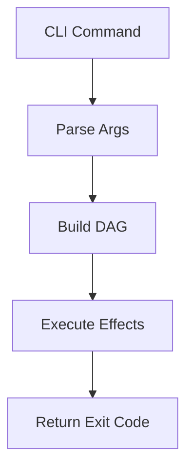

# Unified Documentation Guide

**Status**: Authoritative source
**Supersedes**: N/A
**Referenced by**: CLAUDE.md, README.md

> **Purpose**: Single Source of Truth (SSoT) for writing and maintaining documentation across prodbox.

---

## 1. Philosophy

### SSoT-First

Every concept has exactly one canonical document. Other documents may reference but never duplicate.

### DRY + Link Liberally

- Never copy-paste content between documents
- Use relative links with section anchors
- Prefer deep links: `./engineering/effectful_dag_architecture.md#effect-types`

### Separation of Concerns

- **Engineering docs**: Architecture, design decisions, patterns
- **Domain docs**: Business logic, configuration options
- **Reference docs**: API documentation, type definitions

---

## 2. Naming Conventions

### Primary Rule: snake_case

All documentation files use `snake_case.md`:
- `documentation_standards.md`
- `effectful_dag_architecture.md`
- `prerequisite_doctrine.md`

### Allowed Exceptions (ALL-CAPS)

- `README.md`
- `CLAUDE.md`
- `AGENTS.md`
- `PRODBOX_PLAN.md`

---

## 3. Required Header Metadata

Every document must include:

```markdown
# Document Title

**Status**: [Authoritative source | Reference only | Deprecated]
**Supersedes**: [N/A | path/to/old/doc.md]
**Referenced by**: [comma-separated list]

> **Purpose**: One-sentence description.
```

### Status Values

| Status | Meaning |
|--------|---------|
| `Authoritative source` | This is the SSoT for this topic |
| `Reference only` | Points to authoritative sources |
| `Deprecated` | Scheduled for removal |

---

## 4. Cross-Referencing Rules

### Relative Links with Anchors

```markdown
See [Effect Types](./engineering/effectful_dag_architecture.md#effect-types).
```

### Bidirectional Links

When document A references document B, document B's "Referenced by" should include A.

---

## 5. Duplication Rules

### Never Copy

- Configuration examples
- Code snippets
- Architecture diagrams

### Always Link

```markdown
For configuration details, see [Settings](../src/prodbox/settings.py).
```

---

## 6. Code Examples (Markdown)

### Always Specify Language

```python
# File: src/prodbox/cli/types.py
@dataclass(frozen=True)
class Success(Generic[T]):
    value: T
```

### File Path Comment

First line of code blocks should indicate source:

```python
# File: src/prodbox/cli/effects.py  # Actual source file
```

Or for teaching examples:

```python
# Example: Hypothetical usage
result = parse_int("42")
```

### Zero Tolerance for Any

Code examples must not use:
- `Any` type
- `# type: ignore`
- `cast()`

---

## 7. Docstrings (Python) - Google Style

```python
def parse_int(value: str) -> Result[int, str]:
    """Parse string to integer.

    Args:
        value: String to parse

    Returns:
        Success(int) if valid integer, Failure(str) with error message

    Raises:
        Never raises - uses Result type

    Example:
        >>> parse_int("42")
        Success(value=42)
    """
```

---

## 8. Mermaid Diagram Standards

### Allowed Types

- `flowchart TB` (top-bottom)
- `flowchart LR` (left-right)
- `graph TB` / `graph LR`
- `stateDiagram-v2`

### Forbidden

- Dotted lines (`-.->`)
- Subgraphs
- Complex nesting

### Example



---

## 9. Anti-Patterns

### Vague Status Values

- BAD: `**Status**: WIP`
- GOOD: `**Status**: Authoritative source`

### Copy-Pasted Content

- BAD: Duplicating configuration examples
- GOOD: Link to canonical source

### Examples Using Any

- BAD: `def foo() -> Any:`
- GOOD: `def foo() -> Result[str, str]:`

---

## Cross-References

- [Engineering docs index](./engineering/README.md)
- [CLAUDE.md](../CLAUDE.md) - AI assistant guidelines
- [AGENTS.md](../AGENTS.md) - Agent guidelines
