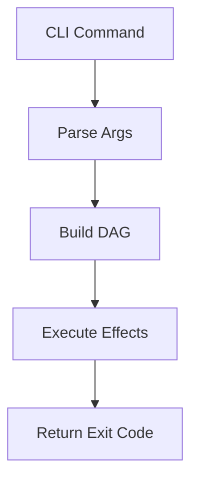

# Unified Documentation Guide

**Status**: Authoritative source
**Supersedes**: N/A
**Referenced by**: README.md, AGENTS.md, CLAUDE.md, DEVELOPMENT_PLAN/README.md, DEVELOPMENT_PLAN/development_plan_standards.md, documents/engineering/README.md, documents/engineering/aws_integration_environment_doctrine.md, documents/engineering/aws_test_environment.md, documents/engineering/cli_command_surface.md, documents/engineering/distributed_gateway_architecture.md, documents/engineering/helm_chart_platform_doctrine.md, documents/engineering/integration_fixture_doctrine.md, documents/engineering/local_registry_pipeline.md, documents/engineering/storage_lifecycle_doctrine.md, documents/engineering/tla_modelling_assumptions.md

> **Purpose**: Single Source of Truth (SSoT) for writing and maintaining documentation across prodbox.

---

## 1. Philosophy

### SSoT-First

Every concept has exactly one canonical document. Other documents may reference but never duplicate.

SSoT ownership, bidirectional links, and non-duplication rules are mandatory for all new doctrinal content.

### Development Plan Authority

`DEVELOPMENT_PLAN/README.md` is the single source of truth for phase order, sprint status,
blockers, remaining work, validation closure, and cleanup ownership.

Documents under `documents/` may explain architecture, doctrine, and verification boundaries, but
they must link back to the development plan instead of maintaining competing status ledgers.

### DRY + Link Liberally

- Never copy-paste content between documents
- Use relative links with section anchors
- Prefer deep links: `./engineering/effectful_dag_architecture.md#effect-types`

### Separation of Concerns

- **Engineering docs**: Architecture, design decisions, patterns, verification boundaries
- **Domain docs**: Business logic, configuration options, operator workflows
- **Reference docs**: API documentation, type definitions, indexes

---

## 2. Naming Conventions

### Primary Rule: snake_case

All documentation files use `snake_case.md`:
- `documentation_standards.md`
- `effectful_dag_architecture.md`
- `prerequisite_doctrine.md`

### Allowed Exceptions (ALL-CAPS)

- `README.md`
- `CLAUDE.md`
- `AGENTS.md`

### Development Plan Suites

Controlled repository-root documentation suites such as `DEVELOPMENT_PLAN/` may define their own
internal structure and maintenance rules.

The prodbox development plan is maintained by
[../DEVELOPMENT_PLAN/development_plan_standards.md](../DEVELOPMENT_PLAN/development_plan_standards.md).
The plan suite still uses repository header metadata and relative-link discipline.

---

## 3. Required Header Metadata

Every document must include:

```markdown
# Document Title

**Status**: [Authoritative source | Reference only | Deprecated]
**Supersedes**: [N/A | path/to/old/doc.md]
**Referenced by**: [comma-separated list]

> **Purpose**: One-sentence description.
```

### Status Values

| Status | Meaning |
|--------|---------|
| `Authoritative source` | This is the SSoT for this topic |
| `Reference only` | Points to authoritative sources |
| `Deprecated` | Scheduled for removal |

---

## 4. Cross-Referencing Rules

### Relative Links with Anchors

```markdown
See [Effect Types](./engineering/effectful_dag_architecture.md#effect-types).
```

### Bidirectional Links

When document A references document B, document B's "Referenced by" should include A.

---

## 5. Duplication Rules

### Never Copy

- Configuration examples
- Code snippets
- Architecture diagrams

### Always Link

```markdown
For sprint status and cleanup ownership, see [Development Plan](../DEVELOPMENT_PLAN/README.md).
```

---

## 6. Code Examples (Markdown)

### Always Specify Language

```haskell
-- File: src/Prodbox/Gateway/Types.hs
data GatewayRule = GatewayRule
    { rankedNodes :: [String]
    , heartbeatTimeoutSeconds :: Int
    }
```

### File Path Comment

First line of code blocks should indicate source:

```haskell
-- File: src/Prodbox/Gateway/Daemon.hs  -- Actual source file
```

Or for teaching examples:

```haskell
-- Example: Hypothetical helper
renderNodeId :: String -> String
renderNodeId nodeId = "node=" ++ nodeId
```

### Current-Surface Examples Only

Code examples must not use:
- removed paths from unsupported implementations
- unsupported toolchains or bridge layers
- stale commands that bypass the public `prodbox` surface

---

## 7. Function Documentation

```haskell
-- | Parse and validate the gateway daemon config from JSON text.
parseDaemonConfig :: String -> Either String DaemonConfig
```

---

## 8. Mermaid Diagram Standards

### Allowed Types

- `flowchart TB` (top-bottom)
- `flowchart LR` (left-right)
- `graph TB` / `graph LR`
- `stateDiagram-v2`

### Forbidden

- Dotted lines (`-.->`)
- Subgraphs
- Complex nesting

### Example



---

## 9. Anti-Patterns

### Vague Status Values

- BAD: `**Status**: WIP`
- GOOD: `**Status**: Authoritative source`

### Copy-Pasted Content

- BAD: Duplicating configuration examples
- GOOD: Link to canonical source

### Examples Pointing At Removed Paths

- BAD: `See the old Python settings module`
- GOOD: `See ../DEVELOPMENT_PLAN/README.md for sprint status and cleanup ownership`

---

## 10. Intent Ownership

This SSoT co-owns documentation-topology doctrine intention.

- Owned statement: SSoT ownership, bidirectional links, and non-duplication rules are mandatory for all new doctrinal content.
- Linked dependents: `documents/engineering/README.md`, `DEVELOPMENT_PLAN/development_plan_standards.md`.

---

## Cross-References

- [Engineering docs index](./engineering/README.md)
- [Development Plan](../DEVELOPMENT_PLAN/README.md)
- [CLAUDE.md](../CLAUDE.md) - AI assistant guidelines
- [AGENTS.md](../AGENTS.md) - Agent guidelines
