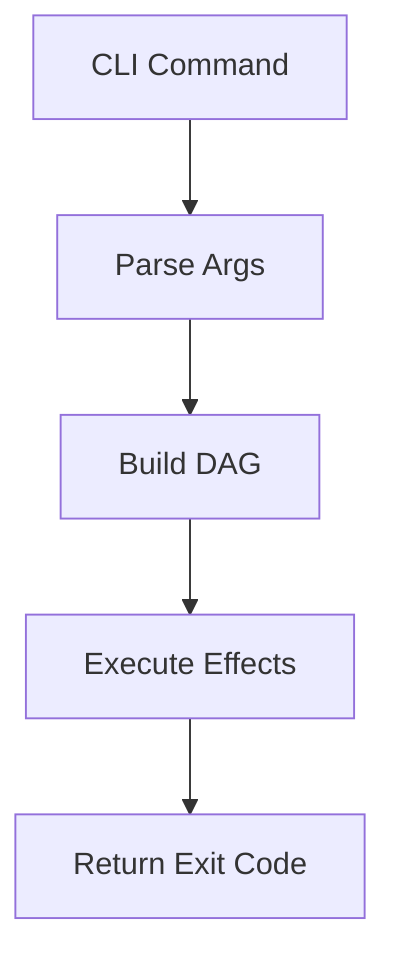

# Unified Documentation Guide

**Status**: Authoritative source
**Supersedes**: N/A
**Referenced by**: README.md, AGENTS.md, CLAUDE.md, DEVELOPMENT_PLAN/README.md, DEVELOPMENT_PLAN/development_plan_standards.md, DEVELOPMENT_PLAN/phase-0-planning-documentation.md, DEVELOPMENT_PLAN/phase-1-runtime-cli-aws-foundations.md, DEVELOPMENT_PLAN/phase-3-chart-platform-vscode.md, DEVELOPMENT_PLAN/phase-4-lifecycle-canonical-paths.md, documents/engineering/README.md, documents/engineering/aws_integration_environment_doctrine.md, documents/engineering/aws_test_environment.md, documents/engineering/cli_command_surface.md, documents/engineering/code_quality.md, documents/engineering/config_doctrine.md, documents/engineering/distributed_gateway_architecture.md, documents/engineering/envoy_gateway_edge_doctrine.md, documents/engineering/helm_chart_platform_doctrine.md, documents/engineering/integration_fixture_doctrine.md, documents/engineering/lifecycle_reconciliation_doctrine.md, documents/engineering/local_registry_pipeline.md, documents/engineering/storage_lifecycle_doctrine.md, documents/engineering/tla_modelling_assumptions.md
**Generated sections**: none

> **Purpose**: Single Source of Truth (SSoT) for writing and maintaining documentation across prodbox.

---

## 1. Philosophy

### SSoT-First

Every concept has exactly one canonical document. Other documents may reference but never duplicate.

SSoT ownership, bidirectional links, and non-duplication rules are mandatory for all new doctrinal content.

### Development Plan Authority

`DEVELOPMENT_PLAN/README.md` is the single source of truth for phase order, sprint status,
blockers, remaining work, validation closure, and cleanup ownership.

Documents under `documents/` may explain architecture, doctrine, and verification boundaries, but
they must link back to the development plan instead of maintaining competing status ledgers.

### DRY + Link Liberally

- Never copy-paste content between documents
- Use relative links with section anchors
- Prefer deep links: `./engineering/effectful_dag_architecture.md#effect-types`

### Separation of Concerns

- **Engineering docs**: Architecture, design decisions, patterns, verification boundaries
- **Domain docs**: Business logic, configuration options, operator workflows
- **Reference docs**: API documentation, type definitions, indexes

---

## 2. Naming Conventions

### Primary Rule: snake_case

All documentation files use `snake_case.md`:
- `documentation_standards.md`
- `effectful_dag_architecture.md`
- `prerequisite_doctrine.md`

### Allowed Exceptions (ALL-CAPS)

- `README.md`
- `CLAUDE.md`
- `AGENTS.md`

### Development Plan Suites

Controlled repository-root documentation suites such as `DEVELOPMENT_PLAN/` may define their own
internal structure and maintenance rules.

The prodbox development plan is maintained by
[../DEVELOPMENT_PLAN/development_plan_standards.md](../DEVELOPMENT_PLAN/development_plan_standards.md).
The plan suite still uses repository header metadata and relative-link discipline.

---

## 3. Required Header Metadata

Every document must include:

```markdown
# Document Title

**Status**: [Authoritative source | Reference only | Deprecated]
**Supersedes**: [N/A | path/to/old/doc.md]
**Referenced by**: [comma-separated list]
**Generated sections**: [comma-separated list of generated-section keys | none]

> **Purpose**: One-sentence description.
```

### Status Values

| Status | Meaning |
|--------|---------|
| `Authoritative source` | This is the SSoT for this topic |
| `Reference only` | Points to authoritative sources |
| `Deprecated` | Scheduled for removal |

### Generated sections metadata field

`**Generated sections**:` is mandatory in every governed document. The value is either
`none` or a comma-separated list of the `<key>` portion of every marker pair the document
contains (see Section 11). The header↔markers↔registry reconciler that enforces this — a
lint pass under `prodbox dev lint docs` that fails when the declared metadata and the markers
physically present in the file disagree (declaring `none` while markers are present, or
declaring a key whose markers are missing) — is the **intended** enforcement landing in
[Sprint 0.9](../DEVELOPMENT_PLAN/README.md); it does not exist in the current worktree, so
until it lands the metadata is maintained by review against this rule. The reference list of
generated sections per file is the `GeneratedSectionRule` registry described in
[code_quality.md#generated-artifacts](./engineering/code_quality.md#generated-artifacts).

---

## 4. Cross-Referencing Rules

### Relative Links with Anchors

```markdown
See [Effect Types](./engineering/effectful_dag_architecture.md#effect-types).
```

### Bidirectional Links

When document A references document B, document B's "Referenced by" should include A.

---

## 5. Duplication Rules

### Never Copy

- Configuration examples
- Code snippets
- Architecture diagrams

### Always Link

```markdown
For sprint status and cleanup ownership, see [Development Plan](../DEVELOPMENT_PLAN/README.md).
```

---

## 6. Code Examples (Markdown)

### Always Specify Language

```haskell
-- File: src/Prodbox/Gateway/Types.hs
data GatewayRule = GatewayRule
    { rankedNodes :: [String]
    , heartbeatTimeoutSeconds :: Int
    }
```

### File Path Comment

First line of code blocks should indicate source:

```haskell
-- File: src/Prodbox/Gateway/Daemon.hs  -- Actual source file
```

Or for teaching examples:

```haskell
-- Example: Hypothetical helper
renderNodeId :: String -> String
renderNodeId nodeId = "node=" ++ nodeId
```

### Current-Surface Examples Only

Code examples must not use:
- removed paths from unsupported implementations
- unsupported toolchains or bridge layers
- stale commands that bypass the public `prodbox` surface

### Committed Dhall Imports

`sha256:` freezes apply to any future **remote** or otherwise-untrusted committed import, where
the hash is an integrity pin against a source the editor does not co-own. The sole current local
import is `prodbox-config.dhall` → `./prodbox-config-types.dhall`, a co-edited sibling file in
the same repository; it is intentionally **not** frozen. Cryptographically freezing a co-edited
sibling adds re-freeze friction on every type-schema edit with no integrity benefit — the
schema and the config travel together in the same commit, so a stale hash would only ever block
legitimate edits.

The `prodbox dev check` surface **does not** enforce a sha256 freeze (the implement-or-strike
decision scheduled for [Sprint 0.9](../DEVELOPMENT_PLAN/README.md) was **struck**: there is no
phantom check to re-derive). Should a remote or untrusted committed import be introduced in the
future, freeze its hash and revisit enforcement at that point. Regardless, docs must not direct
contributors to delete or hand-edit any hash that a future remote import does carry.

---

## 7. Function Documentation

```haskell
-- | Parse and validate the gateway daemon config from JSON text.
parseDaemonConfig :: String -> Either String DaemonConfig
```

---

## 8. Mermaid Diagram Standards

### Allowed Types

- `flowchart TB` (top-bottom)
- `flowchart LR` (left-right)
- `graph TB` / `graph LR`
- `stateDiagram-v2`

### Forbidden

- Dotted lines (`-.->`)
- Subgraphs
- Complex nesting

### Example



---

## 9. Anti-Patterns

### Vague Status Values

- BAD: `**Status**: WIP`
- GOOD: `**Status**: Authoritative source`

### Copy-Pasted Content

- BAD: Duplicating configuration examples
- GOOD: Link to canonical source

### Examples Pointing At Removed Paths

- BAD: `See the old Python settings module`
- GOOD: `See ../DEVELOPMENT_PLAN/README.md for sprint status and cleanup ownership`

---

## 10. Intent Ownership

This SSoT co-owns documentation-topology doctrine intention.

- Owned statement: SSoT ownership, bidirectional links, and non-duplication rules are mandatory for all new doctrinal content.
- Linked dependents: `documents/engineering/README.md`, `DEVELOPMENT_PLAN/development_plan_standards.md`.

---

## 11. Generated Sections

This section documents the generated-sections discipline mandated by
[code_quality.md#generated-artifacts](./engineering/code_quality.md#generated-artifacts) and
[Project-level documentation
standards](./engineering/README.md). The doctrine is the authoritative source for the
underlying registry shape, marker conventions, paired check/write commands, and drift
enforcement; this section restates the contract for documentation contributors who do not
need to read the full doctrine.

### Marker conventions

Generated sections are delimited by paired sentinel comments in the host syntax of the
target file. The marker key is dotted, hierarchical, and unique across the
`GeneratedSectionRule` registry.

| File type | Start marker | End marker |
|-----------|--------------|------------|
| Markdown | `<!-- prodbox:<key>:start -->` | `<!-- prodbox:<key>:end -->` |
| Helm / Go templates | `{{/* prodbox:<key>:start */}}` | `{{/* prodbox:<key>:end */}}` |
| YAML | `# prodbox:<key>:start` | `# prodbox:<key>:end` |
| Haskell / PureScript / TypeScript | `-- prodbox:<key>:start` (or `//`) | mirror of the start marker |

Example: a generated command-registry table inside this file might look like:

```markdown
<!-- prodbox:command-registry:start -->
| Command | Summary |
|---------|---------|
| `prodbox config setup` | Interactively author the Dhall config |
<!-- prodbox:command-registry:end -->
```

### Authoritative list of files with generated regions

The single source of truth is the in-code `GeneratedSectionRule` registry consumed by
`prodbox dev docs check` and `prodbox dev docs generate`. Every file that contains markers must
declare its keys in its `**Generated sections**:` metadata field (Section 3); the
header↔markers↔registry reconciler that enforces that agreement is the **intended**
`prodbox dev lint docs` check scheduled for [Sprint 0.9](../DEVELOPMENT_PLAN/README.md) (see
Section 3), not a check the current worktree already runs.

Generation targets enumerated by
[code_quality.md#generated-artifacts](./engineering/code_quality.md#generated-artifacts) include CLI
help, command reference docs, route inventories, Helm chart sections, JSON schemas, and
cross-language types. The currently scheduled registry entries are:

| Generation target | Marker key prefix | Owning sprint |
|-------------------|-------------------|---------------|
| CLI command reference | `command-registry`, `cli-help.*` | Sprint 1.6 / Sprint 1.10 |
| Generated section index in this file | `documentation-standards.*` | Sprint 0.2 / Sprint 1.10 |
| Public-edge route inventory rendered into chart manifests | `route-registry` | Sprint 3.12 |
| Resource Lifecycle Classes table in `DEVELOPMENT_PLAN/substrates.md`, sourced from `Prodbox.Lifecycle.ResourceRegistry` | `resource-lifecycle-classes` | **Scheduled** — Sprint 4.22 (renderer + markers land then; hand-maintained until) |
| Cross-language types (TypeScript / Go / PureScript mirrors) | `cross-language-types.*` | **Deferred** — no non-Haskell consumer in scope |

The `prodbox dev lint docs --write` and `prodbox dev docs generate` surfaces share one Haskell
function; either name regenerates the registered sections.

### How to regenerate

Run `prodbox dev docs generate` to splice the current renderer output between every marker
pair declared in the registry. Hand edits between markers are reverted on the next
regenerate and fail `prodbox dev docs check` until reverted.

The check command emits the doctrine's three-element error message on drift:

1. The file path that drifted.
2. The marker key (so the contributor knows which renderer is responsible).
3. A literal remedy hint: ``Run `prodbox dev docs generate` to update.``

### How to add a new generated section

The doctrine's five-step extension protocol:

1. Define or extend the renderer in the relevant Haskell library module.
2. Add the marker pair to the target file using the conventions above.
3. Register a new `GeneratedSectionRule` or `TrackedGeneratedPath` entry in the in-code registry.
4. Run `prodbox dev docs generate` to populate the section.
5. Confirm `prodbox dev docs check` and `cabal test` pass.

### Fully generated, do-not-hand-edit paths

A separate tracked-generated-paths registry names files that are owned wholly by code
generators (no markers required because the entire file is generated). The current worktree
implements that registry in `src/Prodbox/CheckCode.hs` as `TrackedGeneratedPath` entries, with
`prodbox dev lint files` refusing drift on paths such as:

- `share/man/man1/prodbox.1`
- `share/man/man1/prodbox-*.1`
- `share/completion/bash/prodbox`
- `share/completion/zsh/_prodbox`
- `share/completion/fish/prodbox.fish`

The current registry contents are the authoritative source; future fully generated paths must
be added there in the same change that introduces them. The `prodbox-haskell-style` suite also
checks the renderer-source modules named by the registry for forbidden nondeterministic inputs
such as timestamps, random IDs, locale-dependent ordering, terminal-width state, and
environment-derived paths.

---

## Cross-References

- [Engineering docs index](./engineering/README.md)
- [Development Plan](../DEVELOPMENT_PLAN/README.md)
- [the engineering doctrine docs](./engineering/README.md) - canonical CLI doctrine
- [CLAUDE.md](../CLAUDE.md) - AI assistant guidelines
- [AGENTS.md](../AGENTS.md) - Agent guidelines
