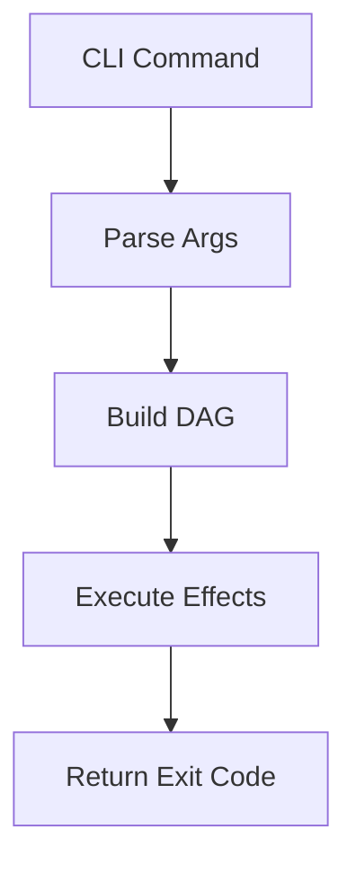

# Unified Documentation Guide

**Status**: Authoritative source
**Supersedes**: N/A
**Generated sections**: none

> **Purpose**: Single Source of Truth (SSoT) for writing and maintaining documentation across prodbox.

---

## 1. Philosophy

### SSoT-First

Every concept has exactly one canonical document. Other documents may reference but never duplicate.

SSoT ownership and non-duplication rules are mandatory for all new doctrinal content. A fact that
can be derived from another document is derived, never copied — that is why back-links are
recovered by search rather than authored (Section 4).

### Development Plan Authority

`DEVELOPMENT_PLAN/README.md` is the single source of truth for phase order, sprint status,
blockers, remaining work, validation closure, and cleanup ownership.

Documents under `documents/` may explain architecture, doctrine, and verification boundaries, but
they must link back to the development plan instead of maintaining competing status ledgers.

### DRY + Link Liberally

- Never copy-paste content between documents
- Use relative links with section anchors
- Prefer deep links: `./engineering/effectful_dag_architecture.md#effect-types`

### Separation of Concerns

- **Engineering docs**: Architecture, design decisions, patterns, verification boundaries
- **Domain docs**: Business logic, configuration options, operator workflows
- **Reference docs**: API documentation, type definitions, indexes

---

## 2. Naming Conventions

### Primary Rule: snake_case

All documentation files use `snake_case.md`:
- `documentation_standards.md`
- `effectful_dag_architecture.md`
- `prerequisite_doctrine.md`

### Allowed Exceptions (ALL-CAPS)

- `README.md`
- `CLAUDE.md`
- `AGENTS.md`

### Development Plan Suites

Controlled repository-root documentation suites such as `DEVELOPMENT_PLAN/` may define their own
internal structure and maintenance rules.

The prodbox development plan is maintained by
[../DEVELOPMENT_PLAN/development_plan_standards.md](../DEVELOPMENT_PLAN/development_plan_standards.md).
The plan suite still uses repository header metadata and relative-link discipline.

---

## 3. Required Header Metadata

Every document must include:

```markdown
# Document Title

**Status**: [Authoritative source | Reference only | Generated reference | Deprecated]
**Supersedes**: [N/A | path/to/old/doc.md]
**Generated sections**: [comma-separated list of generated-section keys | none]

> **Purpose**: One-sentence description.
```

### Status Values

| Status | Meaning |
|--------|---------|
| `Authoritative source` | This is the SSoT for this topic |
| `Reference only` | Points to authoritative sources |
| `Generated reference` | Wholly code-generated reference artifact; do not hand-edit. A document such as `documents/cli/commands.md`, with one generated marker plus hand-maintained prose, is instead `Reference only`. |
| `Deprecated` | Scheduled for removal |

### Generated sections metadata field

`**Generated sections**:` is mandatory in every governed document. The value is either
`none` or a comma-separated list of the `<key>` portion of every marker pair the document
contains (see Section 11). The header↔markers↔registry reconciler that enforces this — a
lint pass under `prodbox dev lint docs` that fails when the declared metadata and the markers
physically present in the file disagree (declaring `none` while markers are present, or
declaring a key whose markers are missing) — is implemented in
`src/Prodbox/CheckCode.hs` and runs as part of the canonical documentation lint. The source of
truth for generated sections per file is the `GeneratedSectionRule` registry described in
[code_quality.md#generated-artifacts](./engineering/code_quality.md#generated-artifacts).

---

## 4. Cross-Referencing Rules

### Relative Links with Anchors

```markdown
See [Effect Types](./engineering/effectful_dag_architecture.md#effect-types).
```

### Back-Links Are Derived, Never Authored

A document does not record who references it. The forward link is the single source of truth;
a back-link duplicates it in a second place, which Section 1 forbids and which no reader can
keep true by hand. Recover the reverse edge mechanically instead:

```bash
grep -rl 'config_doctrine.md' documents/ DEVELOPMENT_PLAN/ src/ test/
```

That answers the question the removed `**Referenced by**:` field tried to answer, and answers it
at section granularity the field never could — `lifecycle_reconciliation_doctrine.md § 3.1` alone
is cited from twelve source files. Sprint `0.21` struck the field; see
[legacy-tracking-for-deletion.md](../DEVELOPMENT_PLAN/legacy-tracking-for-deletion.md).

---

## 5. Duplication Rules

### Never Copy

- Configuration examples
- Code snippets
- Architecture diagrams

### Always Link

```markdown
For sprint status and cleanup ownership, see [Development Plan](../DEVELOPMENT_PLAN/README.md).
```

---

## 6. Code Examples (Markdown)

### Always Specify Language

```haskell
-- File: src/Prodbox/Gateway/Types.hs
data GatewayRule = GatewayRule
    { rankedNodes :: [String]
    , heartbeatTimeoutSeconds :: Int
    }
```

### File Path Comment

First line of code blocks should indicate source:

```haskell
-- File: src/Prodbox/Gateway/Daemon.hs  -- Actual source file
```

Or for teaching examples:

```haskell
-- Example: Hypothetical helper
renderNodeId :: String -> String
renderNodeId nodeId = "node=" ++ nodeId
```

### Current-Surface Examples Only

Code examples must not use:
- removed paths from unsupported implementations
- unsupported toolchains or bridge layers
- stale commands that bypass the public `prodbox` surface

### Committed Dhall Imports

`sha256:` freezes apply to any future **remote** or otherwise-untrusted committed import, where
the hash is an integrity pin against a source the editor does not co-own. There is no committed
remote Dhall import today. The tracked `dhall/TestTopologySchema.dhall` imports the co-edited local
`./cluster/Schema.dhall`; both live in the same repository and deliberately carry no hash. Four
algebra schemas and one golden fixture are version-controlled by design, while instance config and
secret fixtures (the binary-sibling `prodbox.dhall`, generated `*-types.dhall` schemas, and
`test-secrets.dhall`) are git-ignored. The former repo-root
`prodbox-config.dhall` → `./prodbox-config-types.dhall` local import is retired (Sprint 1.42; see
[config_doctrine.md §0](./engineering/config_doctrine.md#0-three-tier-config-model)). Were a
co-edited sibling import to return, cryptographically freezing it would add re-freeze friction on
every type-schema edit with no integrity benefit — a co-edited schema and config travel together
in the same commit, so a stale hash would only ever block legitimate edits.

The `prodbox dev check` surface **does not** enforce a sha256 freeze (the implement-or-strike
decision scheduled for [Sprint 0.9](../DEVELOPMENT_PLAN/README.md) was **struck**: there is no
phantom check to re-derive). Should a remote or untrusted committed import be introduced in the
future, freeze its hash and revisit enforcement at that point. Regardless, docs must not direct
contributors to delete or hand-edit any hash that a future remote import does carry.

---

## 7. Function Documentation

```haskell
-- | Parse and validate the gateway daemon config from JSON text.
parseDaemonConfig :: String -> Either String DaemonConfig
```

---

## 8. Mermaid Diagram Standards

### Allowed Types

- `flowchart TB` (top-bottom)
- `flowchart LR` (left-right)
- `graph TB` / `graph LR`
- `stateDiagram-v2`

### Forbidden

- Dotted lines (`-.->`)
- Subgraphs
- Complex nesting

### Example


```mermaid
flowchart TB
    CLI[CLI Command] --> Parser[Parse Args]
    Parser --> DAG[Build DAG]
    DAG --> Interpreter[Execute Effects]
    Interpreter --> Result[Return Exit Code]
```

---

## 9. Anti-Patterns

### Vague Status Values

- BAD: `**Status**: WIP`
- GOOD: `**Status**: Authoritative source`

### Copy-Pasted Content

- BAD: Duplicating configuration examples
- GOOD: Link to canonical source

### Examples Pointing At Removed Paths

- BAD: `See the old Python settings module`
- GOOD: `See ../DEVELOPMENT_PLAN/README.md for sprint status and cleanup ownership`

### Targets Stated As Current Fact

- BAD: "an unregistered literal fails `prodbox dev check`" — when the gate is scheduled, not built
- GOOD: the same sentence inside a `> **Target.**` region, or qualified "is to fail"

See [Section 12](#12-revision-scoped-claims). This is the most common defect in this repository's
governed documents, and the only one that reads as correct to every reviewer who does not check the
source.

---

## 10. Intent Ownership

This SSoT co-owns documentation-topology doctrine intention.

- Owned statement: SSoT ownership and non-duplication rules are mandatory for all new doctrinal content. A fact that
can be derived from another document is derived, never copied — that is why back-links are
recovered by search rather than authored (Section 4).
- Linked dependents: `documents/engineering/README.md`, `DEVELOPMENT_PLAN/development_plan_standards.md`.

---

## 11. Generated Sections

This section documents the generated-sections discipline mandated by
[code_quality.md#generated-artifacts](./engineering/code_quality.md#generated-artifacts) and
[Project-level documentation
standards](./engineering/README.md). The doctrine is the authoritative source for the
underlying registry shape, marker conventions, paired check/write commands, and drift
enforcement; this section restates the contract for documentation contributors who do not
need to read the full doctrine.

### Marker conventions

Generated sections are delimited by paired sentinel comments in the host syntax of the
target file. The marker key is dotted, hierarchical, and unique across the
`GeneratedSectionRule` registry.

| File type | Start marker | End marker |
|-----------|--------------|------------|
| Markdown | `<!-- prodbox:<key>:start -->` | `<!-- prodbox:<key>:end -->` |
| Helm / Go templates | `{{/* prodbox:<key>:start */}}` | `{{/* prodbox:<key>:end */}}` |
| YAML | `# prodbox:<key>:start` | `# prodbox:<key>:end` |
| Haskell / PureScript / TypeScript | `-- prodbox:<key>:start` (or `//`) | mirror of the start marker |

Example: a generated command-registry table inside this file might look like:

```markdown
<!-- prodbox:command-registry:start -->
| Command | Summary |
|---------|---------|
| `prodbox config setup` | Interactively author the Dhall config |
<!-- prodbox:command-registry:end -->
```

### Authoritative list of files with generated regions

The single source of truth is the in-code `GeneratedSectionRule` registry consumed by
`prodbox dev docs check` and `prodbox dev docs generate`. Every file that contains markers must
declare its keys in its `**Generated sections**:` metadata field (Section 3); the
header↔markers↔registry reconciler runs under `prodbox dev lint docs` (see Section 3).

Do not maintain a second hand-written registry table in documentation. The current keys, target
paths, marker pairs, renderer functions, and renderer-source files are the
[`generatedSectionRules`](../src/Prodbox/CheckCode.hs) values. `prodbox dev docs check` proves that
their rendered contents match the worktree; `prodbox dev lint docs` proves that every governed
document's header, physical markers, and registered keys agree. This document has no marker pair
**outside a fenced example** and therefore correctly declares `**Generated sections**: none` — the
reconciler strips fenced blocks and inline-code spans before extracting keys, which is why the
illustrative `command-registry` markers above do not count as a declaration. Corrected 2026-08-11:
the previous wording said the document contains no marker pair at all, which is literally false and
made the metadata look self-contradictory to a reader grepping for the marker text.

The `prodbox dev lint docs --write` and `prodbox dev docs generate` surfaces share one Haskell
function; either name regenerates the registered sections.

### How to regenerate

Run `prodbox dev docs generate` to splice the current renderer output between every marker
pair declared in the registry. Hand edits between markers are reverted on the next
regenerate and fail `prodbox dev docs check` until reverted.

The check command emits the doctrine's three-element error message on drift:

1. The file path that drifted.
2. The marker key (so the contributor knows which renderer is responsible).
3. A literal remedy hint: ``Run `prodbox dev docs generate` to update.``

### How to add a new generated section

The doctrine's five-step extension protocol:

1. Define or extend the renderer in the relevant Haskell library module.
2. Add the marker pair to the target file using the conventions above.
3. Register a new `GeneratedSectionRule` or `TrackedGeneratedPath` entry in the in-code registry.
4. Run `prodbox dev docs generate` to populate the section.
5. Confirm `prodbox dev docs check` and `cabal test` pass.

### Fully generated, do-not-hand-edit paths

A separate tracked-generated-paths registry names files that are owned wholly by code
generators (no markers required because the entire file is generated). The current worktree
implements that registry in `src/Prodbox/CheckCode.hs` as `TrackedGeneratedPath` entries, with
`prodbox dev lint files` refusing drift on paths such as:

- `share/man/man1/prodbox.1`
- `share/man/man1/prodbox-*.1`
- `share/completion/bash/prodbox`
- `share/completion/zsh/_prodbox`
- `share/completion/fish/prodbox.fish`

The current registry contents are the authoritative source; future fully generated paths must
be added there in the same change that introduces them. The `prodbox-haskell-style` suite also
checks the renderer-source modules named by the registry for forbidden nondeterministic inputs
such as timestamps, random IDs, locale-dependent ordering, terminal-width state, and
environment-derived paths.

---

## 12. Revision-Scoped Claims

Every claim in a governed document describes some revision of the repository. When a document does
not say which, a reader assumes the current one. A claim about a scheduled but unbuilt thing,
written in the present indicative, is therefore false — and it is false in the way that is hardest
to catch, because it reads as correct to every reviewer who does not open the source.

This section owns *which revision a claim describes*. It does not own sprint status, which is
[Development Plan Standard C](../DEVELOPMENT_PLAN/development_plan_standards.md), nor
deployment-qualification claims about the composed running system, which are Standard P. Neither of
those reaches an ordinary claim about a schema field or a lint.

### 12.1 Declared target regions

A `> **Target.**` blockquote declares that the region it opens describes an accepted end state
rather than the current revision. The declaration attaches to the **smallest named region that is
wholly target** — a document, a numbered section, or a subsection — and sets the default for every
claim inside it. A document whose entire subject is a target architecture declares once at the top
and is then written as ordinary declarative prose; it does not carry a banner per sentence.

Every declaration names where status lives, which is always
[Development Plan → Resume Here](../DEVELOPMENT_PLAN/README.md#resume-here). A declaration does not
name a sprint id: ids move between sprints, and a stale id inside doctrine is the drift this rule
exists to prevent.

`**Current revision.**` is the counter-marker. It opens a passage describing what the shipped binary
does inside an otherwise-target region — the shape a current/target split takes when both halves
belong together.

The defect is a target claim in an **undeclared** region.

### 12.2 Four claim kinds a declaration never covers

A region declaration is necessary and not sufficient. These four are read as claims about the
current revision no matter what encloses them, because a reader checks them against the tree rather
than against the roadmap:

1. **Enforcement** — that something is checked, refused, or gated. Name the violation function; a
   bare "fails `prodbox dev check`" is unverifiable and has been wrong before.
2. **Measurement** — counts, rates, digests, "zero false positives".
3. **Another document's contents** — "see § 3 for the gate", when § 3 does not carry one.
4. **Generated output** — what a command emits, what a generated file contains.

Each must be true of the current revision, or explicitly qualified in the sentence itself. A
document that lists an unbuilt guard as enforced states the defect it was written to prevent; see
[code_quality.md](./engineering/code_quality.md), which records exactly that correction against
itself.

### 12.3 What can and cannot be gated

"A present-tense claim that is false" is undecidable, and no gate will be built for it. Three
properties are decidable and are the whole of the mechanical surface: that a cited artifact
resolves, that a declaration carries its status pointer, and that no retired marker spelling
survives. Everything else in this section is a review obligation.

A future change may not describe this section as enforced beyond those three, and may not claim a
gate it has not built — which is § 12.2 rule 1 applied to this section.

### 12.4 Out of scope

Dated narrative — a session checkpoint, a phase-status entry, a ledger record — states what was true
on a date and is governed by Standard C, not by this section. It carries no marker and needs none.

## Cross-References

- [Engineering docs index](./engineering/README.md)
- [Development Plan](../DEVELOPMENT_PLAN/README.md)
- [the engineering doctrine docs](./engineering/README.md) - canonical CLI doctrine
- [CLAUDE.md](../CLAUDE.md) - AI assistant guidelines
- [AGENTS.md](../AGENTS.md) - Agent guidelines
