# Chaos Hardening: Extract, Model, Inject

**Status**: Authoritative source
**Supersedes**: N/A
**Referenced by**: DEVELOPMENT_PLAN/phase-2-gateway-dns.md, documents/engineering/README.md, CLAUDE.md, documents/engineering/distributed_gateway_architecture.md, documents/engineering/tla_modelling_assumptions.md
**Generated sections**: none

> **Purpose**: A treatise and working doctrine for hardening decisions made under concurrency — *Extract*
> the decision into a value, *Model* the protocol into a proof, *Inject* faults into the deployment — and
> for keeping an honest ledger that never reports tested or assumed as proven.

**Audience**: prodbox engineers hardening the parts of the system that decide under concurrency — and
anyone who wants the method, whether or not they have met TLA+, chaos engineering, or Haskell before.
**Scope**: this is **prodbox's** concurrency-hardening doctrine, worked in **Haskell** and grounded in the
live gateway. The method is general — three correctness layers, three moves (Extract → Model → Inject),
the supporting rules R1–R9, and the proven/tested/assumed ledger — but it is stated throughout in the
terms this codebase actually uses: pure functions and ADTs, the type system, QuickCheck, the **Plan /
Apply** boundary, `io-sim` / `io-classes`, TLA+, and the fault harness. Appendices A and B are real
single-domain prodbox patterns (Appendix B is the gateway); Appendices C and D are **forward-looking** —
the cross-cluster and async-replication shapes prodbox will meet, not subsystems that exist today. One
SSoT line, held throughout: the gateway's *formal model, invariant catalog, and CAP posture* are owned by
[tla_modelling_assumptions.md](./tla_modelling_assumptions.md) and
[distributed_gateway_architecture.md](./distributed_gateway_architecture.md); this doctrine grounds its
narrative in the gateway but never restates those as its own.

---

## 1. Prologue — the bug that only happens to other people

Two copies of the same service wake a microsecond apart and ask the same question: *is anyone already
handling this chat?* Each checks the shared broker; each sees nothing; each concludes it is safe to take
the work. In the space of that microsecond, two processes have both decided they are the only one.

The decision was correct — for the world each of them read. It was wrong for the world they acted in.

This is the bug that survives ten thousand green test runs and then pages you at three in the morning. It
is not a typo, not an off-by-one, not a missing null check. Every process did exactly what its code said,
and the code was *locally* right. The fault lives in the seam *between* two correct processes, in a
specific overlap of timing that your test suite — running one thing at a time — will never schedule on
purpose. It has exactly one shape, and once you can see the shape you can see it everywhere: **a decision
made on a premise that was true when you read it and false by the time you acted on it.**

Everything that follows is a campaign against trusting a premise you cannot prove is still current. The
campaign has three moves, and the rest of this document is an argument for why it takes all three —
because each move is blind to the failures the other two were built to catch.

We will name the bug precisely (§3), show why no single test can see it (§4), situate the two famous
traditions for fighting it and add a quieter third (§5–§7), then build the three moves — **Extract**
(§8), **Model** (§9), and **Inject** (§11), with an optional **Simulate** between them (§10). We close on
the only thing that separates real hardening from theatre: an honest account of what you have *proven*,
what you have merely *tested*, and what you only *assume* (§12). Readers whose systems cross a storage
boundary continue into the Second Axis (§16); everyone else can stop sooner, and §2 tells you where.

---

## 2. When this applies — and when it is over-engineering

This is a discipline for a specific and common kind of system. It earns its cost only when **all three**
of these hold:

1. **Decisions under concurrency** — the system takes branches (claim or yield, accept or reject, retry
   or fail, promote or wait) whose correctness depends on state that other actors can change *while the
   decision is being made*.
2. **Coordination only through a named shared protocol/substrate** — replicas and processes share no
   address-space state; they agree only through a database, a durable log, a broker, a cache, a
   consensus store, or an authenticated peer protocol with explicit recovery semantics. Durability is
   a property to name, not assume: the gateway's bounded hot state is recoverable from peers but is not
   the durable at-least-once store. (Shared in-process memory is a different problem with different
   tools; it is out of scope — see the honest limit at the end of this section.)
3. **A safety invariant no single process can enforce alone** — the property that must hold (*at most one
   owner*, *exactly-once effect*, *no split-brain write*) belongs to a protocol spanning several actors
   plus the substrate, not to any one process.

If your system meets all three, the defect in §3 is **present whether or not you have ever observed it**,
and this doctrine is how you make the decision explicit, the protocol checkable, and the deployment
survivable without quietly hiding the premises you could not prove. If your system fails the gate — a
single process, or no cross-actor invariant — then most of what follows is over-engineering for you, and
the most honest thing this document can do is tell you to close the tab.

**A handful of plain terms** carry the whole argument; meet them once here.

- **Decision** — a branch taken in effectful code on the basis of observed state.
- **Premise** — the state a decision assumes to be true at the instant it branches.
- **Snapshot** — a single, atomically-captured read of state. (Everything captured *together*, as of one
  instant.)
- **Observation** — the *typed* result of probing state that **may not resolve**: success, failure, or an
  explicit *not-yet-known*. An Observation is the opposite of quietly turning "I couldn't tell" into a
  definite answer.
- **The three layers** — *Decision* (inside one process), *Protocol* (across processes), *Runtime* (the
  live, deployed system). These are the spine of §4, and each has its own move.

That is the entire starter vocabulary. A second, harder vocabulary — *consistency boundary*,
*invariant-confluence*, *escrow* — is needed only by systems whose data is replicated across more than
one strongly-consistent domain. It is deliberately deferred to §16, behind a gate that tells you whether
you need it at all. If your substrate is a single domain, you will never have to learn it.

---

## 3. The defect class — one shape, two disguises

Name the enemy once and it stops hiding. Every defect this doctrine targets has the same shape: **a
decision taken across a sequence of non-atomic effects, on a premise that was true at snapshot time but
is trusted after it could have changed.** In its barest, language-neutral form:

```text
  premise  := atomically read shared state          -- true at instant t0
  evidence := probe an external authority            -- resolves at instant t1 > t0, non-atomically
  branch   := act on (premise, evidence)             -- but the world at t1 ≠ the world at t0
```

Between `t0` and `t1`, another actor can quietly invalidate the premise: register the consumer the probe
was checking for, advance the version the decision gated on, drop the lock the branch assumed it still
held. The branch is then taken on a **self-contradictory input** — a premise from one instant fused with
evidence from another. The two replicas in the Prologue are exactly this: each read "no consumer" at
`t0`, and each acted on it at `t1`, after the other had already become the consumer.

The shape wears two recurring disguises. Learn to spot both:

- **Timeout-coerces-unknown.** A probe that times out or errors is read as a *definite negative* — "no
  consumer exists" — when the truthful value is *unknown*. The decision then does the wrong thing with
  total confidence, on missing information. A timeout is not a "no"; it is a shrug.
- **State-conflation.** Two genuinely distinct conditions — *not-yet-true* vs *known-false*, *draining*
  vs *failed*, *absent* vs *unreachable* — are collapsed into a single branch, so the decision cannot
  even represent the cases that demand different actions.

Why does this bug survive your test suite? Because surfacing it requires a *specific interleaving of two
actors*, and a single-threaded test never runs two actors. It is the canonical "once in N thousand runs"
defect: real, rare, and never reproducible on demand. You cannot grind it out by running the suite again.
The whole of this document exists because that fact has a consequence — **you cannot test your way to
confidence here; you have to reason and experiment in three different registers** — which §4 makes
precise.

---

## 4. Three layers, and the blindness that binds them

A concurrency defect can live in any of three layers, and here is the load-bearing observation of the
entire doctrine: **each layer is structurally invisible to the tools that guard the others.** You cannot
cover one layer's risk with another layer's tool. Not because the tools are weak — because they are
*looking somewhere else*.

| Layer | The question it answers | What a defect here looks like |
|---|---|---|
| **Decision** (one process) | Is the branch taken on a single, consistent snapshot? | The stale-premise decision of §3: premise and evidence captured at different instants. |
| **Protocol** (across processes) | Is the *algorithm* sound, regardless of how it is coded? | The cross-actor invariant fails on some interleaving of claim / probe / register / crash — *no matter how perfectly each process is written.* |
| **Runtime** (the live system) | Does the deployed system actually survive faults? | Timeout tuning, failover timing, resource cleanup, real partition recovery — failures only a running cluster exhibits. |

The blindness property, stated as three flat facts:

- A perfect **Decision**-layer proof — the branch is a pure function of one snapshot — says **nothing**
  about whether the *protocol* those decisions compose into is sound. A locally-correct decision on a
  point-in-time read of a shared authority is still wrong if the protocol lets two actors read
  compatible-but-stale views.
- A green **Protocol** model says **nothing** about whether the code implements it, nor whether the live
  system's timeouts and cleanup actually hold under load.
- A passing **Runtime** fault test says **nothing** about the interleavings it did not happen to
  schedule, and can never tell you an invariant is *sound* — only that it survived the faults you chose
  to inject.

This is why the discipline is plural by *necessity*, not taste. Each move covers a layer the others
cannot see. Here is the whole spine on one page — the table you carry from here:

| Layer | The move that guards it | What that move still cannot see | Strongest claim it yields |
|---|---|---|---|
| **Decision** | **Extract** (§8), with the type system as a free head start | whether the *protocol* those decisions compose into is sound | **proven** (purity/totality in code; the property when finite) |
| **Protocol** | **Model** (§9) | whether the *code* refines the model; real-time/clock-skew premises | **proven for the model only** |
| **Runtime** | **Inject** (§11) | the interleavings you did not inject; soundness | **tested**, never proven |

There is a fourth blindness, and it is orthogonal to these three: **every move is blind to a storage
consistency boundary unless that boundary is explicitly modeled in.** A system whose data is replicated
across two strongly-consistent domains has a whole second axis of failure that no amount of Extract,
Model, or Inject on a single domain will reveal. That axis is real, and it is hard, and it is deferred on
purpose to §16 — because most of this document is worth absorbing before you meet it, and many systems
never need it at all.

---

## 5. Two great traditions — and the quiet third

You already hold an intuition about how to trust a distributed system. The industry has built two
celebrated traditions around two halves of that intuition, and most engineers have absorbed one of them
deeply and the other barely.

The first tradition says: **prove the design.** Before you trust a protocol, write it down with enough
precision that a machine can explore every way it could interleave, and check that the bad thing never
happens. This is the world of *formal methods* — Leslie Lamport's TLA+, Daniel Jackson's Alloy — and §6
tells its story. It guards the **Protocol** layer.

The second tradition says: **break the deployment.** You cannot reason your way to confidence about how a
large system fails, so induce the failures on purpose, in production, while you are watching, and learn
what actually happens. This is *chaos engineering* — Netflix's Chaos Monkey and the Simian Army — and §7
tells its story. It guards the **Runtime** layer.

Here is the social restatement of the blindness property (§4): **each tradition tends to believe its
layer is the whole game.** The formal-methods camp can prove a protocol impeccable and still ship code
that doesn't match it. The chaos camp can survive every fault it injects and never learn that the
algorithm was unsound to begin with. Each is a specialist standing guard over one layer with its back to
the other two.

And there is a third discipline, quieter and less celebrated, that most teams already practice without
naming: **make the decision explicit.** Pull the branch out of the tangle of effects and into a pure,
typed function of its inputs, so that it becomes a *value* you can examine, exhaust, and reason about —
the world of types, pure functions, and property-based testing (QuickCheck; Claessen & Hughes, ICFP
2000). It guards the **Decision** layer. It is the cheapest of the three, it removes a real class of bug
on its own, and — the rhetorical turn of this whole treatise — **it is the move you should do first**,
because it produces the vocabulary the other two need in order to say anything at all.

Three traditions, three layers, three moves. Christen them:

> **Extract** the decision · **Model** the protocol · **Inject** the faults.

That cadence is the heartbeat of everything below. It returns as the order of the sections, as the arrows
of a dependency graph (§14), as the columns of an audit grid (§15), and as the liturgy each worked
example performs (Appendices A–D). An optional fourth technique — **Simulate** (§10) — sits between Model
and Inject for the rare case that needs it, and is kept deliberately subordinate.

**And in this codebase, all three are Haskell.** That is not incidental. The quiet third move — make the
decision a pure value — is the native idiom of a typed functional language, and prodbox already lives
there: pure decision functions over bounded semantic replica state (`canWriteDns`, `nodeDisposition` in
`src/Prodbox/Gateway/Types.hs`), the **Plan / Apply** split (a pure `build` produces a value; an effectful
`apply` is the only thing that touches the world), the type system as a zero-cost design check. The payoff,
and the spine of §10, is a single ladder: make the **decision** pure (Extract), then the **command** pure
(Plan / Apply), then — with `io-classes` and `io-sim` — the **whole concurrent program** pure, run as a
deterministic model under test and as the production daemon from one source. *Build it pure; lift it
whole.* First, though, the two traditions deserve their histories, because the moves inherit both their
power and their honest limits from them.

---

## 6. Why we model: TLA+ and the long argument about trusting distributed systems

The case for **Model** is old, and it was made by people who learned the hard way that a distributed
algorithm can be wrong in a way no amount of staring will reveal.

**The man who taught computers to agree on "before".** In 1978, Leslie Lamport published *Time, Clocks,
and the Ordering of Events in a Distributed System* (CACM 21(7)). It is, by his own account, his most
cited paper — "Many computer scientists claim to have read it" — and it did something deceptively simple:
it defined what it means for one event to happen *before* another in a system with no shared clock, the
"happens-before" relation, and the logical clocks that track it. It is the origin of causal reasoning in
distributed systems, and it won the field's highest honours (the 2000 PODC Influential Paper Award, later
the Dijkstra Prize; an ACM SIGOPS Hall of Fame Award in 2007). Lamport went on to invent Paxos (*The
Part-Time Parliament*, written ~1990, published in TOCS in 1998 only after he was persuaded to drop the
parable) and to win the **2013 ACM Turing Award** for "fundamental contributions to the theory and
practice of distributed and concurrent systems… causality and logical clocks, safety and liveness,
replicated state machines, and sequential consistency."

**The generals who could lie.** In 1982, Lamport, Robert Shostak, and Marshall Pease published *The
Byzantine Generals Problem* (ACM TOPLAS 4(3):382–401), the famous allegory for agreement when components
fail not by stopping but by behaving *arbitrarily* — sending conflicting information to different peers.
(The impossibility bound came first, in Pease, Shostak & Lamport's *Reaching Agreement in the Presence of
Faults*, JACM 1980; the colourful name was minted for the 1982 retelling — Lamport originally wrote "the
Albanian Generals Problem" and changed it after a colleague worried about offending Albanians.) The
result is sharp: with unsigned ("oral") messages, agreement is **impossible** unless more than two-thirds
of the generals are loyal — no solution exists for fewer than `3m + 1` participants when `m` are
traitors. The paper's two interactive-consistency conditions, in its own words: **IC1 — "All loyal
lieutenants obey the same order,"** and **IC2 — "If the commanding general is loyal, then every loyal
lieutenant obeys the order he sends."**

A necessary honesty, stated up front: **the Byzantine Generals problem is intellectual lineage here, not
a claim about our systems.** Tolerating arbitrary, lying nodes (Byzantine fault tolerance) needs `3f + 1`
replicas and heavy machinery. The systems this doctrine hardens assume the gentler fault models —
*crash-recovery* (a node stops, perhaps later recovering from durable storage) and *omission/partition*
(messages are lost or delayed, as in a network split), the world of Paxos and Raft, which need only
`2f + 1`. We invoke Byzantium for the discipline it founded — *formalize agreement under faults and prove
the impossibility lines* — not because anything here defends against traitors.

**From the logic to the tool.** Lamport distilled decades of this into a way to write specifications a
machine can check. *The Temporal Logic of Actions* (TOPLAS, 1994) became **TLA+**, the specification
language (*Specifying Systems*, 2002), with **TLC**, the model checker Yuan Yu wrote in 1999 that
enumerates every reachable state of a finite model — and immediately earned its keep by finding errors in
a Compaq multiprocessor's cache-coherence protocol. PlusCal (2009) put a pseudocode face on it.

**Why we use it.** The argument that mattered to industry was made by Amazon. In *How Amazon Web Services
Uses Formal Methods* (Newcombe et al., CACM 58(4):66–73, 2015), seven teams reported applying TLA+ to S3,
DynamoDB, EBS, and an internal lock manager. The keystone story: in a DynamoDB replication and
group-membership algorithm, model checking found a bug whose **shortest error trace was 35 high-level
steps** — a defect that had survived extensive design review, code review, and testing, and that the
authors believed could not have been found by any conventional means. The lesson is the whole reason
**Model** exists: *the improbability of a 35-step compound event is not the same as its impossibility.* A
test will not get that lucky. A model checker explores every interleaving in scope, and so it gets
"lucky" by construction. (AWS's 2025 retrospective, Brooker & Desai, CACM June 2025, reports modeling an
Aurora commit protocol in TLA+ and P and finding a way to cut its cost from two network round-trips to
1.5 with no loss of safety — and explicitly extends the practice beyond model-checking into deterministic
simulation and code-level proof, which is the very gap §9's honest limit names.)

**What it cannot do.** A model checker is not a magic wand, and pretending otherwise is the exact sin §12
forbids:

- It checks a **model, not your code.** A green model does not prove the implementation refines it; the
  two are separate artifacts that drift.
- It explores a **bounded, finite scope.** State spaces explode; you check 3 nodes, not 3,000, and a bug
  that needs more actors than your scope hides from you.
- It runs in **logical time, not real time.** Clock skew, lease timing, and heartbeat bounds are
  abstracted away, not verified — they must be named and bounded separately (R8).
- It only checks the **invariants you thought to state.** It cannot tell you that you forgot one.

These limits are not a weakness to apologize for; they are precisely the boundary where **Model** hands
off to **Inject** and to the §13 rules. Hold onto them — they reappear, named, in the ledger (§12).

---

## 7. Breaking things on purpose: a short history of chaos engineering

The case for **Inject** was made not in a theorem but in an outage.

**Resilience is a trained reflex.** Before "chaos engineering" had a name, Amazon had a man whose
manager-approved job title was literally **"Master of Disaster."** Jesse Robbins, a trained volunteer
firefighter, was responsible for the availability of every Amazon property, and around 2003 he built
**GameDays**: deliberately injecting major failures into critical systems, on a schedule, to make sure
people and systems could take the hit. The insight came straight from the fire service — you survive an
emergency by *rehearsing* it, not by hoping it never comes. Google built an equivalent, **DiRT**
(Disaster Recovery Testing), under Kripa Krishnan around 2006.

**The outage that changed Netflix.** In August 2008, a database corruption took Netflix down for about
three days and stopped DVDs from shipping. The trauma drove a decision: move to the AWS cloud, an
environment where any single machine can vanish at any instant — and then *embrace* that fragility rather
than fight it. The most famous expression of that philosophy, disclosed in a December 2010 blog post and
named in the July 2011 "Netflix Simian Army" post, was **Chaos Monkey**, whose job was, in Netflix's own
words, "to randomly kill instances and services within our architecture" — in production, during business
hours, while engineers were awake to watch. The blast radius then grew on a deliberate ladder: **Chaos
Monkey** kills one instance, **Chaos Gorilla** takes out an entire availability zone, **Chaos Kong**
fails a whole region. (Chaos Monkey was open-sourced in 2012; the broader "Simian Army" added Latency
Monkey, which injects delay, and several others.)

**The discipline gets a name and a method.** In 2015 Netflix's Chaos Engineering team published the
**Principles of Chaos Engineering**, which define it as "the discipline of experimenting on a system in
order to build confidence in the system's capability to withstand turbulent conditions in production,"
with a method: form a hypothesis about steady-state behaviour, vary real-world events, run experiments
(ideally in production), automate them, and **minimize the blast radius**. The free O'Reilly report
(Rosenthal, Hochstein, Blohowiak, Jones, Basiri, 2017) and the later book (Rosenthal & Jones, 2020) gave
it its philosophy.

**Why we inject.** That philosophy is the keystone, and it is the precise complement to §6. The report
puts it plainly: software has *no transfer function* — unlike a physical control system, a complex
software system "exhibits behavior for which we cannot build predictive models," so to learn how it fails
"we must use an empirical approach." Chaos engineering is "a practice for generating new information." You
cannot *deduce* how the running system behaves under turbulence; you have to *ask it*. Where Model reasons
about the design, Inject experiments on the deployment — and each is blind to the other's layer, exactly
as §4 insists.

**What it cannot do.** Like Model, it has honest limits that the ledger (§12) will record:

- It **samples** faults; it is never exhaustive. It surfaces only what you inject.
- It can prove *survival of the faults you chose*, never *soundness*. A green chaos run is evidence, not
  proof.
- It needs **observability and a steady-state signal** to mean anything — and disciplined blast-radius
  control, so the experiment is a fire drill and not an arson.

Done as Netflix did it — scheduled, watched, escalating, blast-radius-bounded — Inject is fire-drill
engineering. Done carelessly it is just an outage you caused yourself. §11 is about doing it the first
way.

---

## 8. Move I — Extract: make the decision a value

> **Extract** the decision · Model the protocol · Inject the faults.

**The move.** Take the branch out of the effects. A decision must be a **pure function of typed inputs
captured with an explicit freshness contract** — effectful code may *capture* the inputs and *apply* the
result, but it **must not compute the branch in the middle of a race.** For a safety-critical premise, the
input is valid only if it is one atomic snapshot, or if it carries a version / fence / lease token that
the apply step revalidates atomically before acting. Concretely, every decision follows a four-stage
pipeline:

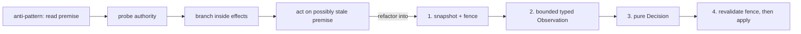

Three sub-rules make the pipeline sound:

- **The typed-unknown rule.** A probe that times out, errors, or has not resolved must yield an explicit
  *not-yet-observed* value — never a coerced definite. The decision branches on a type that *names the
  unknown*, so it can never silently treat "I could not tell" as "the answer is no." This is the direct
  remedy for both disguises of §3. The rule binds every decision whose **safety** depends on the
  observation. A decision may deliberately coerce an unknown to a definite *only when* the coercion can
  affect **liveness** but **not** the safety invariant — i.e. a separate mechanism (a convergent-log
  gate, a fail-closed apply step) enforces safety regardless of the coerced value. State which case you
  are in; an unexamined coercion is the §3 defect by default.
- **Bound everything.** Every probe, retry, queue, and wait carries an explicit finite bound. An
  unbounded effect inside the pipeline reintroduces an instant the decision cannot reason about.
- **Fence or revalidate safety-critical freshness.** If safety depends on "the premise is still true,"
  the snapshot carries a version, lease, epoch, CAS token, or log offset that the apply step revalidates
  in the *same atomic operation* as the effect. Without that fence, Extract proves only that the branch
  is pure over its inputs; it does **not** prove the inputs are still current.

**Why it works.** When the branch is pure over typed inputs, the policy cannot silently collapse unknown
into false, and it cannot hide an effectful branch in the middle of a race. When safety-critical
freshness is also fenced or atomically revalidated, no interleaving can make the apply step act on a
premise that was invalidated after capture. The branch has become a *value* — and a value can be
exhaustively property-tested without a cluster, a clock, or a network. (This is the level the type system
already operates at, for free: a type-indexed state machine makes illegal transitions *compile errors* —
the cheapest verification there is. Extract is where you extend that reach to the runtime values the type
system can't see.)

**How you know you've done it.** The branch logic exists as a pure function with no effectful argument;
its input types make *unknown* and each distinguished state representable; safety-critical premises carry
an explicit fence or live in one atomic snapshot; the apply step revalidates that fence when required; and
a property test exhausts `(Snapshot × Observation) → Decision`. If the only test of a decision is an
integration test, you have not done it — the decision is still entangled with effects. This is already the
shape of the landed prodbox gateway: `Prodbox.Gateway.State` owns the pure bounded semantic fold,
`Prodbox.Gateway.Peer` owns pure signed delta/repair verification, and
`Prodbox.Gateway.DnsAuthority` constructs an effect action only from agreeing credential,
continuity, and claim witnesses. The daemon loops only *apply* what those functions decide. The repo's
[interpreter-only mocking doctrine](./unit_testing_policy.md) is the same rule from the test side — pure
code never touches a mock, because there is no effect in it to stub.

**What this move cannot see.** It cannot establish the *cross-process* invariant. A pure decision is only
ever as sound as the observation and fence handed to it; a point-in-time read of a shared authority can
be invalidated immediately after capture unless the protocol or the apply step handles that invalidation.
Whether the protocol of *snapshot → observe → decide → fenced apply* guarantees the cluster-wide
invariant is a question this move structurally cannot answer. **That is Model (§9).** (The strongest form
of Extract makes the observation a *fold over convergent replicated state* — an append-only durable log
where history is required, or a compactable semilattice/semantic snapshot where superseded history is
not — so the decision is pure *because its input is convergent*, not merely because it was wrapped. But
that convergent-fold form converges **only within one
consistency boundary** (§16): where the log is replicated asynchronously across a boundary and both sides
append, each side's fold stays perfectly pure and the two results can still disagree. Purity does not
imply agreement once the substrate has a boundary — a thread §16 picks up.)

---

## 9. Move II — Model: prove the protocol, not the program

> Extract the decision · **Model** the protocol · Inject the faults.

**The move.** State the cross-actor safety invariant and machine-check it against a **model of the
protocol** that includes the adversarial actions — concurrent claim, message reordering and duplication,
and **actor crash** — explored to exhaustion within a bounded scope. (TLA+/TLC and Alloy are the usual
tools, per §6; the technique, not the tool, is the rule.)

**Why it works.** The *catastrophic* failure — two actors both believing they own the same singleton —
lives in the Protocol layer, which Extract cannot reach (§4). A flaw there is wrong *regardless of how
perfectly the code is written*, so no test of the implementation can reveal it; only checking the
algorithm can. This is the cheapest way into the multi-actor design space, because the model throws away
all implementation detail and explores the interleavings a test would have to be astronomically lucky to
hit — the DynamoDB 35-step trace of §6 is the canonical proof that "astronomically lucky" is not a plan.

**How you know you've done it.** There is a model of the protocol; it encodes crash and reordering, not
just the happy path; it states the safety invariant (e.g. *cardinality of owners ≤ 1*) and at least one
liveness property (*demand is eventually served*); and a checker explores it to exhaustion at a scope that
**matches the real actor count** — do not model 2 actors if you deploy 3. The model's vocabulary — the
snapshot and observation *types* — should be the very ones Extract named. If Extract and Model disagree
about a case, you have found either a protocol bug or an implementation bug, and you will know which.
prodbox does exactly this for the gateway: `documents/engineering/tla/gateway_orders_rule.tla` states the
six safety/liveness invariants and `prodbox dev tla-check` explores them to exhaustion (~4.4M states at
scope 3); the model and its documented divergences are owned by
[tla_modelling_assumptions.md](./tla_modelling_assumptions.md).

Where the invariant is **impossibility-bounded** (R7), state it *conditionally* — e.g. *≤ 1 owner once
views converge* — model it with that condition explicit, and verify two things: that the invariant holds
inside the condition, and that any violation outside it (under partition) is **bounded and self-healing**
rather than permanent. The canonical failover hazard the model must rule out is a **deposed actor that
still believes it owns the resource and keeps acting.** The remedy is not a local flag but to gate every
owner-only action on **convergent proof of current ownership** — the §8 semantic fold, where the action is
permitted only when the actor observes its own current claim unsuperseded in replicated state — so a
stale owner cannot act on a belief the rest of the cluster has already overwritten.

**What this move cannot see — the honest limit.** Model checks the **design, not the code.** A green
model does not prove the implementation refines it; model and code are separate artifacts that drift — in
prodbox the correspondence between `gateway_orders_rule.tla` and `Daemon.hs` is kept as documentation
(`tla_modelling_assumptions.md` §3), not executed, which is precisely the gap §10 exists to close — and a
bounded scope hides any bug that needs more actors than the scope allows. And a model in **logical
time** says nothing about the **real-time / clock-skew** assumptions the implementation actually depends
on — those are abstracted away, not verified, and must be named and bounded separately (R8). Its unique,
irreplaceable value is finding algorithm flaws that are wrong no matter how perfectly implemented.
**That a believed-correct system actually holds up under stress is the question for Inject (§11).** Record
these limits explicitly (§12) so a green model is never mistaken for a proof of the running system.

(Once the substrate has a **consistency boundary** (§16), the deposed-actor remedy *weakens*: the proof
of supersession must now propagate across an asynchronous gate, so its latency is the replication lag, and
a deposed side can keep acting for up to that lag. The remedy then no longer *prevents* the deposed-actor
window — it only **bounds it to the lag** — leaving a residual, self-healing violation §18 must state and
reconcile.)

---

## 10. Simulate — the pure program, lifted: io-sim

> Extract the decision · *(Simulate the schedule)* · Model the protocol · Inject the faults.

This is the section the rest of the codebase has been pointing at. Extract made the *decision* a pure
value; Plan / Apply makes the *command* a pure value applied by one effectful boundary; the last rung of
the ladder makes the **whole concurrent program** a pure value too — and runs it as a deterministic model
under test and as the production daemon from a single source. *Build it pure; lift it whole.*

**The move (conditional).** Where the in-process concurrency is intricate enough that Extract's purity
boundary still leaves real schedule-dependent behaviour — interacting retry loops, cancellation, async
exceptions, several loops racing over shared state — run the **real in-process code** against an
**adversarial deterministic scheduler with simulated time**, so a rare interleaving becomes
*deterministically replayable* instead of a once-a-month flake.

**The Haskell way to do it: io-sim and io-classes.** In Haskell the technique has a precise home.
[`io-classes`](https://hackage.haskell.org/package/io-classes) is a set of typeclasses — `MonadSTM`,
`MonadAsync`, `MonadTimer`, `MonadFork`, `MonadThrow`/`MonadCatch` — that mirror `base`, `stm`, and
`async` and act as a drop-in replacement for `IO`. You write a component polymorphic over a monad `m`
carrying those constraints; then you choose an interpreter:

- in production, `m = IO` — the real daemon;
- under test, `m = IOSim s` — a **pure, discrete-event simulator** with deterministic scheduling, simulated
  time, and a granular execution trace, down to the order in which STM transactions commit.

The same source is the model **and** the implementation. Its `IOSimPOR` interpreter adds **partial-order
reduction** to discover races and *systematically explore schedules* — the adversarial scheduler this move
calls for — and the whole library is built to drive QuickCheck, so a discovered interleaving comes back as
a *minimal, replayable counterexample* (the same QuickCheck lineage that powers Extract's property tests).
io-sim was built and hardened for Cardano's `ouroboros-network` stack (IOG / Well-Typed; now maintained
under IntersectMBO) — a production distributed system, the Haskell peer of FoundationDB's deterministic
"Flow" and its descendants Antithesis and TigerBeetle.

**Why it is the move that would close prodbox's real gap.** Recall Model's honest limit (§9): a green TLA+
model does not prove the *code* refines it, and in prodbox that correspondence — between
`gateway_orders_rule.tla` and the eight loops of `src/Prodbox/Gateway/Daemon.hs` — is maintained as prose
(`tla_modelling_assumptions.md` §3), not executed. Today those loops race over shared `TVar`s only on the
wall clock, and the gateway's `gatewayPartitionValidation` test exercises the *pure* decision functions,
never the concurrent schedule. Lifting the daemon onto io-classes would let the **real loops** run under
`IOSimPOR`, exercising interleavings that neither the TLA+ model nor the pure test can reach, and turning
the model↔code correspondence from documentation into something a test executes. That is the unique value
here: not a second protocol proof, but evidence that *this code* — not a model of it — survives the
schedules.

**The cost, named concretely (why it is optional, and kept subordinate).** Lifting onto io-classes means
the concrete `Control.Concurrent.STM`, `Control.Concurrent.Async`, and `threadDelay` calls in `Daemon.hs`
become a polymorphic `m` with `MonadSTM m`, `MonadAsync m`, `MonadTimer m` constraints — and that
abstraction then propagates through *every* concurrency-touching signature: a **standing tax on all future
change**, not a one-time edit. (prodbox starts from a good place — structured concurrency is already the
rule: `withAsync`, not `forkIO`, which `CheckCode.hs` forbids — so the shapes lift cleanly.) And the move
has a fidelity ceiling: its marquee scenario, several simulated actors racing, only faithfully reproduces
production when they genuinely share *in-process* state. The gateway daemons do **not** — they coordinate
through the network and replicated semantic state — so an `IOSim` run of one daemon rests on a hand-built stub of its
peers, and the catastrophic *cross-actor* invariant (two writers) is still better served by the TLA+
model. So Simulate stays the one technique the cadence keeps parenthetical: never a fourth move beside
Extract, Model, and Inject, and **not adopted in prodbox today** — it is the gap-closer to reach for,
scoped to one subsystem, after Extract, gated on evidence the tax is worth paying.

**How you would know you'd done it (if adopted).** The same source runs unchanged in production (`IO`) and
under the simulator (`IOSim`); at least one QuickCheck property explores schedules over the real code with
`IOSimPOR` and asserts the gateway invariant plus the absence of leaked or orphaned concurrency. Until
then, the honest ledger entry (§12) reads: the gateway's concurrent *schedule* is **unverified** — proven
pure at the decision layer, proven-for-the-model at the protocol layer, and not yet exercised under a
controlled scheduler at all.

---

## 11. Move III — Inject: break the running thing on purpose

> Extract the decision · Model the protocol · **Inject** the faults.

**The move.** Subject the live system to **fault injection that asserts the exact invariants Extract and
Model established** — and make the injection *adversarial*, not merely benign. This is chaos engineering
(§7) pointed at a specific target: not "does it survive a reboot?" but "does the ownership invariant we
modeled actually hold when we kill the owner mid-claim under load?"

**Why it works.** Some failures exist only in the running system, and no static move can see them: timeout
tuning, failover timing, resource cleanup, real partition recovery. Inject is also the *only* thing that
confirms a believed-correct system — pure decisions, sound protocol — actually holds up under stress.
Software has no transfer function (§7); you have to ask the deployment.

**Extend, don't build.** Most high-availability systems already inject *some* faults — rolling restarts,
single-node outage, failover-in-isolation. The work is rarely to build a fault harness from nothing; it is
to **extend the existing one** with the scenarios that target what Extract and Model newly assert. Adding a
parallel harness when one already exists is waste.

**The benign-vs-adversarial axis — the maturity measure for a fault suite:**

- *Benign* (where most suites stop): one fault at a time, the system quiesced between faults — node
  restart, isolated failover, single dependency bounce. This proves *recovery from outages*.
- *Adversarial* (what this move demands): a fault injected **during** a critical operation, **under
  load**, with **concurrent** actors — kill an actor mid-claim while writes are in flight; two actors
  racing one singleton; partition, latency, packet loss; message reordering against an at-least-once
  guarantee; failover *concurrent with* live queries; cascading faults with no recovery between. This
  proves the *correctness core holds under stress.* (Netflix's ladder — Monkey to Gorilla to Kong, §7 —
  is exactly this escalation, named.)

**How you know you've done it.** For each invariant Extract and Model establish, a live scenario injects
the adversarial fault that targets it and asserts the *declared form* of the invariant survives:
unconditional when the protocol claims unconditional safety, or conditional and bounded when R7 says the
only honest invariant is "once views converge" plus a bounded, self-healing violation. A suite that only
injects benign faults conforms to *"recovers from outages,"* not to this doctrine.

**Where prodbox stands.** Be honest by the doctrine's own rule. The gateway's `gatewayPartitionValidation`
is a *pure assertion test* over the decision functions — it folds claim/yield events and checks
`canWriteDns` / `NoTugOfWar` / `NoSimultaneousDNSWriters` — which is real and valuable, but it is
Extract-layer evidence, **not** live adversarial fault injection: no process is killed, no schedule is
contended, no clock is skewed against a running daemon. The live `prodbox test integration
gateway-partition` surface is partly still plan-owned. So the gateway's Inject tier is an **open
conformance gap** — named here as the doctrine demands, not papered over.

**What this move cannot see.** It cannot prove soundness, and it cannot see the interleavings you did not
inject. A green Inject run is the strongest *empirical* confidence you can buy and the weakest *logical*
guarantee — which is the whole reason the moves are plural, and the whole reason the next section exists.

---

## 12. The moral core — proven, tested, assumed

Here is the conviction at the centre of this document, the one it would keep if it had to discard
everything else:

> A system is "provably chaos-hardened" only to the degree it can say, for each technique, **what is
> proven, what is merely tested, and what is assumed.**

Conflating those three is the entire difference between provable hardening and "we ran some chaos tests
and it seemed fine." The moves are powerful precisely because each yields a *different strength* of
knowledge, and the cardinal sin — the thing this manifesto exists to forbid — is to launder a tested or
assumed result and report it as proven. Keep this ledger explicitly:

| Technique | Establishes | Strength | Does **not** establish |
|---|---|---|---|
| Type-indexed state machine | Illegal in-process transitions are compile errors | **Proven** (machine-checked, exhaustive) | Anything across processes |
| **Extract** — pure decision + property test | The branch is a total function of typed inputs; unknowns and distinguished states are explicit; safety-critical freshness is fenced or atomically revalidated when required | **Proven** for purity / totality / fence wiring in code; **tested** (sampled) for the property unless the input space is finite and exhausted | That the protocol composing these decisions is sound; that an unfenced external observation is current |
| **Model** — design model-checking | The *algorithm* upholds the (possibly *conditional*, R7) invariant under modeled crash/reorder, within scope | **Proven for the model**; **assumed** for model↔code refinement and for actor counts beyond scope | That the code refines the model; behaviour above the bounded scope; real-time/clock-skew premises (R8) |
| **Simulate** (optional) | The *real code* upholds the invariant under the schedules explored | **Tested** (sampled schedules, not exhaustive) | Schedules not explored; anything outside the simulated subsystem |
| **Inject** — live fault injection | The deployed system survived the injected faults | **Tested** (the faults you chose), never proven | Faults/interleavings not injected; that the invariant is *sound* |
| Synchrony / real-time assumption (R8) | The timing premise the live system relies on (clock-skew bound, lease, heartbeat) is named, bounded, and monitored | **Assumed** — monitored at runtime, never proven by any move | Behaviour when the bound is exceeded; that the premise actually holds in the field |

(Three further rows — the cross-boundary consistency premise, the failover budget, and the
invariant-confluence classification — belong to systems that cross a storage boundary, and are recorded in
§19 so the honesty discipline scales with the hardness.)

Applied to prodbox today, the ledger is blunt and that is the point: **Extract** is *proven* (the gateway's
pure decision functions, property-tested); **Model** is *proven-for-the-model* (the TLA+ check, ~4.4M
states at scope 3); **Simulate** is *empty* (io-sim not adopted — the concurrent schedule is unexercised,
§10); **Inject**'s live tier is *open* (the partition test is pure, not a fault drill, §11). That is the
difference between claiming "the gateway is hardened" and stating exactly which layers carry evidence and
which do not.

The rule, stated once and meant absolutely: **never report a tested, assumed, or merely argued result as
proven.** Type-checking, decision purity, and finite-and-exhausted decision properties can be *proven* at
the code layer; everything else above the line is *evidence*, not proof, and the ledger must say so. The
ledger is the deliverable. It is not a trophy that says "we are safe"; it is a confession that says "here
is exactly what we know, and how we know it" — and an honestly *conditional* invariant a system enforces
is worth more than an *absolute* one it silently violates under partition.

---

## 13. The supporting rules — the conditions the moves need to hold

The three moves do not float free. They rest on a set of standing conditions — the things that must be
*true* for Extract, Model, and Inject to mean anything. Each is also a portable best practice in its own
right. (Rules R1–R8 have a first-axis core, stated here; several gain a cross-boundary extension in §18,
and R9 is purely cross-boundary and lives there.)

- **R1 — No shared in-memory state between replicas; name the substrate's consistency boundary.**
  Replicas coordinate through a named shared substrate or authenticated peer protocol whose
  durability and recovery semantics are explicit. Any unstated in-memory cross-replica assumption is
  a split-brain waiting to happen, and it is invisible to Model. (A substrate's atomicity, ordering,
  and convergence hold only *within* one consistency boundary; across one, the substrate is
  asynchronous — the §16 axis. The classification rule that belongs to R1 in that world is stated in
  §17.)
- **R2 — Determinism in tests: inject time and scheduling; never assert on wall-clock.** Tests drive
  timing and ordering through injected hooks and seams, not real delays. Wall-clock tests are slow,
  flaky, and — fatally — cannot deterministically reproduce the interleaving that exposes a §3 defect.
  This rule is what makes Extract and Simulate fast and repeatable.
- **R3 — At-least-once delivery with idempotent handlers is a named invariant.** Treat "no effect lost,
  none double-applied under redelivery and crash-mid-acknowledge" as a first-class protocol invariant
  worth its own Model and its own Inject fault — not an implementation afterthought. The idempotency key
  must be a stable identity (content- or call-identity, not a local sequence number), because §18 will
  ask it to survive replication.
- **R4 — Crash-only / fail-closed recovery.** On an unrecoverable fault, fail loudly and let a supervisor
  restart from clean state (negatively-acknowledge in-flight work, kill the child, exit non-zero) rather
  than attempting intricate in-process recovery. Crash-only paths have far smaller state spaces for Model
  and Inject to cover. (The pattern is Candea & Fox, *Crash-Only Software*, HotOS 2003.)
- **R5 — Bound everything.** Every retained-state cardinality, byte/frame size, parser input,
  in-flight operation count, child-process concurrency, timeout, retry budget, queue depth, and wait is
  explicitly finite. A cgroup limit contains an omitted bound; it does not supply one. Likewise, a
  point-in-time Ready result does not prove stability across a window. (This is Extract's "bound
  everything" sub-rule promoted system-wide: an unbounded effect is an instant no decision can reason
  about and no model can scope.)
- **R6 — Structured concurrency only.** Coordination paths use scoped concurrency (spawn-within-a-scope,
  race, cancel-on-exit) — never unstructured fire-and-forget tasks or ad-hoc sleeps. Structured scopes
  make cancellation and async-exception safety analyzable; unstructured tasks leak and hide races. (The
  term was popularized by Nathaniel J. Smith's 2018 essay, building on a much older idea descending from
  structured programming.)
- **R7 — Impossibility-bounded invariants are stated conditionally, with the failure mode chosen
  explicitly.** Some safety invariants *cannot* hold unconditionally in an asynchronous system that
  admits partitions. **FLP** (Fischer, Lynch & Paterson, JACM 1985) showed that no deterministic protocol
  can guarantee consensus in an asynchronous system if even one process may fail; **CAP** (conjectured by
  Brewer ~2000, proved by Gilbert & Lynch, 2002) makes "absolute safety *and* always-available autonomous
  progress under partition" unachievable. **PACELC** (Abadi, 2010/2012) adds that the tradeoff does not
  even wait for a partition: *else, latency* — even fully healthy, synchronous cross-domain coordination
  costs latency on every operation, while asynchronous coordination buys that back at the price of lag and
  the divergence it permits. So when the invariant you need is one of these: (a) **state the condition**
  under which it holds (e.g. *under view convergence* or *under bounded synchrony*); (b) **choose the
  failure mode explicitly** — *safety-first* (fail closed: refuse to act under uncertainty) or
  *availability-first* (act, and accept a **bounded** violation that deterministically heals on
  reconvergence) — and document which; and (c) **record the chosen mode and its condition** in the ledger
  (§12). An honestly conditional invariant a system enforces is worth more than an absolute one it
  silently violates under partition. (R7's cross-boundary forms — active vs passive healing, and the
  fail-closed promotion gate — are in §18.)
- **R8 — Name and bound every synchrony assumption; no move verifies it.** Where correctness rests on a
  real-time premise — bounded cross-node clock skew, a lease/TTL, heartbeat timing — that premise is
  proven by **none** of the moves: Extract abstracts it, Model uses logical not wall-clock time, and
  Inject only samples the timings it happens to inject. Therefore (a) **name** the assumption and give it
  an explicit numeric **bound**; (b) **enforce and monitor** it at runtime (reject inputs outside the
  bound; export the observed maximum so drift is visible before it crosses); and (c) record it as
  **assumed** in the ledger (§12). A safety property built on an unstated or unmonitored synchrony
  assumption is unsound the instant that assumption silently fails. (R8's cross-boundary extension — the
  replication lag itself as a synchrony premise — is in §18.)

---

## 14. Sequencing — a fixed dependency, a free order

The moves have a **genuine dependency order**, which is doctrine, and a **sequencing-by-ROI**, which is a
per-project judgment. Keep the two apart.

### 14.1 The dependency DAG (portable)

Each move emits the vocabulary the next consumes. This ordering is structural, not preferential:

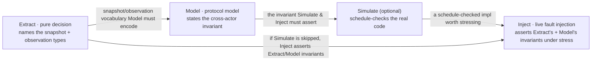

- You cannot **Model** a protocol until you have **Extracted** the decision's snapshot and observation —
  the model needs that vocabulary.
- You cannot **assert** an invariant in Inject or Simulate until it has been **stated** by Model, or at
  minimum the decision made pure and checkable by Extract.
- Simulate sits between Model and Inject: once there is a design to conform to and a pure decision to
  exercise, it checks the real code against schedules before the expense of live injection.

### 14.2 Sequencing by ROI (per-project — not doctrine)

*Which* move to invest in first, and how far, is a project-specific cost/benefit call, not a rule. The
considerations: how cheaply each move reuses existing patterns and harnesses; how large the blast radius
of each layer's defect is; and how much of each move already exists. A typical — but not mandatory —
judgment is **Extract first** (cheapest, removes a real defect now, and sharpens Model by forcing the
vocabulary), **then Model** (a small focused model against a catastrophic blast radius), **then extend
Inject** (most meaningful once the decision is pure and the protocol sound), with **Simulate** only if
Extract leaves a real schedule question. State your project's actual reasoning explicitly; do not present
it as doctrine.

A useful anchor for *where to start*: a machine-checked **type system is already a zero-cost design
check** for the state machines it covers — illegal transitions are compile errors, the cheapest
verification there is. It also marks exactly where types *stop* reaching: the distributed, multi-actor,
runtime invariants — which is precisely the territory Model and Inject exist to cover.

---

## 15. The conformance matrix — what does this project demonstrate here?

Turn the doctrine into a self-audit. For each **correctness layer** crossed with each **concurrency
primitive you use**, you should be able to name the demonstration. The cell is not "is there a test" but
"what does the project *demonstrate* here?"

| Concern | Extract (pure decision) | Sequential state-machine test | **Concurrent / interleaved test** | Model (cross-process) | Inject (live adversarial fault) |
|---|:--:|:--:|:--:|:--:|:--:|
| Each branch that reads externally-mutable state | required (+ fence/revalidate if safety-critical, §8) | — | required where the branch races | — | — |
| Each take-then-act / lock / handle primitive | — | required | **required** (contention + async-exception) | — | — |
| Each cross-actor singleton/ownership invariant | the decision is pure | — | required | **required** | **required** (kill mid-operation) |
| At-least-once + idempotency (R3) | — | required | required | **required** | **required** (reorder/redeliver, incl. post-failover cross-boundary replay) |
| Crash/recovery & failover (R4) | — | the recovery decision is pure | — | recommended | **required** (failover under load, incl. cross-boundary failover) |
| Impossibility-bounded invariant (R7) | — | — | — | **required** (state condition; choose failure mode; model the *conditional* invariant) | **required** (partition; assert the violation is bounded & self-healing) |
| Synchrony / real-time assumption (R8) | name + bound | — | — | recorded *assumed* (a logical-time model cannot prove it) | **required** (inject skew/lease beyond the bound) |

(Systems that cross a consistency boundary add three further rows — replication lag, failover budget, and
the non-confluent invariant — recorded in §19.)

Reading the matrix:

- A **blank** cell where the column applies is a conformance *gap*, not a neutral absence.
- The **"Concurrent / interleaved"** column is where most suites are empty — and emptiness there is the
  signature of a single-threaded suite that cannot, even in principle, surface a §3 defect. A
  take-then-act primitive with **zero** contention test is the most common and most glaring instance: its
  entire reason to exist is correct behaviour under concurrent modification, and it is "verified" by code
  review alone.
- The **"Model"** and **"Inject"** columns are where benign-only suites stop. Their emptiness means the
  catastrophic invariant (§9) and its survival under stress (§11) are simply unverified.

Conformance is layered: a project can be fully conformant at the Decision layer — every branch pure and
property-tested — and entirely non-conformant at the Protocol and Runtime layers. By the blindness
property (§4), the Decision-layer conformance tells you *nothing* about the other two. Audit all three.

---

## 16. The Second Axis — when one substrate becomes two

> **Gate.** Everything above assumed a single, strongly-consistent domain: one database, one log, one
> broker, where a committed write is immediately visible to every reader. If that describes your system,
> **you can stop here** — Appendices A and B are your worked examples, and the rest of this document is a
> harder world you do not live in. Read on only if your data is replicated across more than one
> strongly-consistent domain with *asynchronous* replication between them.

For systems that do cross that line, the same §3 defect returns in a new and more dangerous form, and a
fourth blindness opens up. Recall it from §4: **every move is blind to the consistency boundary unless
the boundary is modeled in.** Extract's convergent fold is pure *because its input converges* — and is
blind to the fact that convergence *stops at the boundary*. Model, written against a single substrate in
logical time, sees no boundary unless it encodes **two** substrates with asynchronous replication between
them. Inject exercises only the lag and partitions it happens to inject. So the boundary — exactly like
the R8 synchrony premise — must be **named (§17), its lag bounded and monitored (R8), and its failover
budgeted (R9)**, because no move proves it.

And the defect itself recurs, with **replication lag** now playing the role of the gap between `t0` and
`t1`. A read from a replica that lags the authoritative history is a premise true at the replica's
last-applied instant but trusted after the history has moved on — the stale-premise decision (§3) lifted
to the storage layer. It carries both disguises: a not-yet-arrived conflicting write read as "no such
write" is *state-conflation*; "I have not observed it, therefore it does not exist" is
*timeout-coerces-unknown*. The typed-unknown remedy (§8) applies unchanged — an un-fresh read is
*not-yet-known*, not *current* — and the safety remedy is bounded authority (R7), never a coerced "I read
it, therefore it holds." The next three sections give that world its vocabulary (§17), scale the rules to
it (§18), and extend the honest ledger to it (§19).

---

## 17. The boundary and its classifier

A **consistency boundary** is the perimeter within which a shared substrate provides synchronous,
strongly-consistent coordination — atomic snapshots, the substrate's contracted ordering, quorum-durable
convergence. *Across* that boundary, the same substrate replicates **asynchronously**: bounded lag, no
global ordering across the boundary, possible duplication, and — if both sides accept writes — possible
**divergence into independently-advanced histories.** Every coordination guarantee this doctrine otherwise
relies on (an atomic snapshot, a convergent fold, "heals on reconvergence") holds **only within one
boundary** unless stated otherwise.

The boundary forces a question about *every mutable, multi-record invariant* that must cross it: **will it
survive being merged?** The governing result is **invariant-confluence**.

- **Invariant-confluence (I-confluence)** — a multi-record invariant is *confluent* iff the set of
  invariant-valid states is **closed under merge** of concurrent, independently-applied updates. The
  theorem (Bailis, Fekete, Franklin, Ghodsi, Hellerstein & Stoica, *Coordination Avoidance in Database
  Systems*, PVLDB 2014) is that an invariant has a **coordination-free**, available, convergent
  implementation across an asynchronous boundary **if and only if** it is I-confluent; the corollary the
  doctrine leans on is that a **non-confluent** invariant **requires coordination**. (A convergent result,
  **CALM** — *consistency as logical monotonicity* — reaches the same place by a different road, via
  program monotonicity: it was conjectured by Hellerstein in his 2010 PODS keynote, *proved* by Ameloot,
  Neven & Van den Bussche in 2013, and restated for practitioners in "Keeping CALM," Hellerstein & Alvaro,
  CACM 2020. CALM and I-confluence are two convergent results, not one theorem.) The consequence you must
  internalize: **a per-record merge cannot manufacture a *non-I-confluent* cross-record invariant** — a
  global floor, global uniqueness, "the parts sum to the whole" — that the substrate did not synchronously
  enforce. Cross-record invariants that *are* confluent (referential-integrity inserts with causal parent
  presence, monotone aggregates in the safe direction, delta-merged sums) do survive merge.

That test sorts every crossing invariant into one of two buckets:

- **(i) Confluent** — convergent / idempotent / content-addressed data, *and* every mutable multi-record
  invariant *proven* confluent — may cross and be applied active-active on both sides, bounded only by
  replication lag, healing by a deterministic total merge (R7).
- **(ii) Non-confluent — held by bounded authority** — may cross only under R7's conditional forms, never
  as an absolute and never by a fabricated per-record merge, in one of these sub-forms: *singleton
  ownership* via R7's claim/yield pattern; an *aggregate-numeric floor/ceiling budget* via
  **escrow/reservation**; a *uniqueness namespace* via **disjoint-namespace allocation**; a coordinating
  *single writer / consensus / lock*; *downgrade* to a weaker confluent invariant; or *restructure* into a
  confluent representation (after which it re-classifies into (i)).

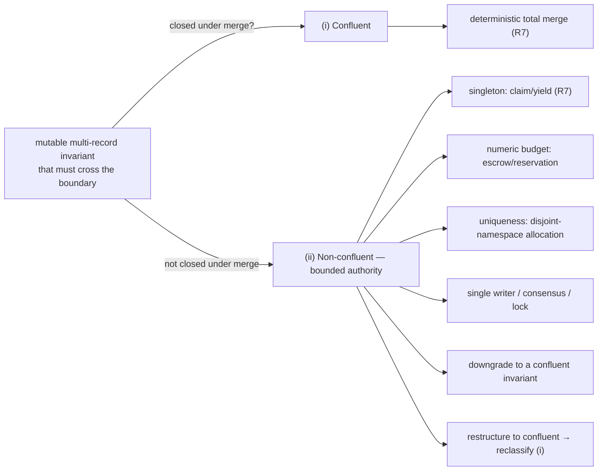

Two of those sub-forms have enough structure to name precisely:

- **Escrow / reservation** — a coordination-free protocol for a non-confluent **aggregate-numeric** budget
  (a count, a sum, a remaining floor/ceiling): partition the global budget into disjoint per-side
  **allowances**, so each side acts coordination-free *up to its allowance* — turning a *global*
  non-confluent invariant into a *per-side* confluent one bounded by the allowance. Allowances are
  **leased** (a bounded-time premise, R8) and may be **re-partitioned** (rebalanced / refilled) only under
  a single coordinating authority on a bounded timer (a rebalance *moves* budget, never *creates* it);
  when that coordination is unavailable a side runs to exhaustion and **fails closed** (R4). The technique
  is O'Neil's *escrow transactional method* (ACM TODS, 1986). Escrow governs *numeric* budgets only.
- **Disjoint-namespace allocation** — the sibling route for **uniqueness**: each side is leased a disjoint
  block of substrate-assigned identifiers and mints only from its own block, so two sides can never
  collide. Not escrow (which is numeric); the same *bounded-authority* idea applied to a namespace.

Run the I-confluence test (R1) *before* assigning a bucket: that two records each merge cleanly says
nothing about whether a constraint *between* them (a sum, a floor, a uniqueness namespace, a
referenced-row deletion) is confluent. An **unclassified mutable multi-record invariant defaults to
non-confluent**, and to R7's bounded-authority treatment, until proven confluent.

---

## 18. The rules scale to the boundary

Each first-axis rule (§13) gains a cross-boundary extension, and one new rule — R9 — exists only here.

- **R1, cross-boundary.** Naming the boundary is now mandatory, and so is classifying every crossing
  mutable multi-record invariant by confluence (§17) before you choose a mechanism. Coordination that
  silently assumes a single global view across a boundary is a cross-boundary split-brain in waiting — the
  same §3 defect one level up, equally invisible to a single-substrate model.
- **R3, cross-boundary.** Asynchronous replication can re-present, after a failover, work a now-lost side
  already applied — so the idempotency key must be a stable identity that *survives replication* (content-
  or call-identity, not a local sequence number). The invariant widens from "none double-applied under
  redelivery and crash-mid-acknowledge" to "none double-applied under **post-failover cross-boundary
  replay**."
- **R4, cross-boundary.** When a whole side of the boundary is lost, the surviving side recovers from its
  own durable, replicated — and therefore *stale-by-the-lag* — state, rather than reaching across the
  boundary to reconcile with the failed side. This keeps the failover state space small (R4's original
  motive) and turns the accepted staleness into an explicit budgeted loss (R9) instead of a hidden
  recovery attempt.
- **R7, cross-boundary — "heals" has two forms.** Within one convergent substrate, healing is *passive*:
  a single ordering makes the losing action observe its supersession and stop. Where divergence spans a
  boundary and **both sides advanced independently**, there is no single ordering to defer to; healing
  must be *active* — a deterministic, **total** reconciliation/merge over the divergent histories, with
  conflict resolution defined and any unmergeable conflict surfaced explicitly rather than silently
  dropped. A merge may be claimed total **only for a confluent invariant** (§17). "Active-active" on a
  **non-confluent** invariant is reached only by *bounding concurrent authority* — single writer /
  consensus, escrow, disjoint-namespace, downgrade, or restructure. Reaching for a bare merge on a
  non-confluent invariant is the §3 stale-premise defect lifted to the storage layer. **Safety-first
  additionally means a fail-closed promotion gate:** the surviving side withholds authority until it
  proves freshness — caught up to a known commit watermark, or holding a fence — trading recovery time
  (R9's RTO) for zero divergence beyond the suffix already lost at the instant of failover. This is the
  only form in which the R8 lag bound is *enforceable*: not by un-losing the suffix, but by refusing to
  promote a too-stale replica into service.
- **R8, cross-boundary.** The **replication lag** the asynchronous substrate runs at is itself a synchrony
  premise: name it, bound it, and monitor it (export the observed maximum lag / replica-offset gap so
  drift is visible before a failover relies on it). Its enforcement differs from clock skew in *what* the
  bound gates: the un-replicated suffix that exists *at the instant of failover* is already lost — that
  irrecoverable window cannot be rejected after the fact and becomes a **data-loss budget** (handed to
  R9), though the bound is still enforceable as the fail-closed gate on the *promotion decision* above.
- **R9 — Budget every cross-boundary failover (bounded data loss and bounded recovery time).** A failover
  across a boundary incurs a cost R7's transient-violation-that-heals does **not** capture: the
  un-replicated suffix is *permanently* lost. Declare the budget in two dimensions — a bounded **data-loss
  window** (how much acknowledged-but-un-replicated work may be lost; *this is the replication-lag bound of
  R8 at the instant of failover*, not a separately-derived quantity) and a bounded **recovery time** (how
  long until a surviving side resumes authority). Monitor the live lag against the first, and validate the
  second by **drill, not assertion.** This is R5's "bound everything" raised to the failover *event*, with
  a permanent-loss dimension R5 never had: the recovery-time bound is **tested** (drilled) and the
  data-loss bound is **assumed** under real disaster. Every other rule's violation is transient and heals;
  R9's data-loss dimension is permanent, accepted, and never heals — which is why no other rule can host
  it.

---

## 19. The cross-boundary ledger and conformance rows

The honesty discipline (§12) scales with the hardness. A system that crosses a boundary adds these rows to
its ledger —

| Technique | Establishes | Strength | Does **not** establish |
|---|---|---|---|
| Cross-boundary consistency premise (R1/§17, R8) | The boundary is named; replication lag is bounded and its observed maximum monitored; the data-loss window equals the lag at the instant of failover; a fail-closed promotion gate can refuse a too-stale replica | **Assumed** — monitored at runtime, never proven by any move | That field lag stays within bound during a real disaster; the data already lost beyond the bound; that a single-substrate / logical-time model saw the boundary at all |
| Cross-boundary failover budget (R9) + reconciliation (R7) | The two-dimensional budget — bounded permanent data loss and bounded recovery time — is declared and exercised by drill; where divergence is admitted, a deterministic merge reconciles the divergent histories | Recovery time and reconciliation **tested** (drilled), never proven; the data-loss bound **assumed** under real disaster | That an un-drilled disaster stays within budget; that every conflict is mergeable; behaviour when divergence exceeds the modeled scope |
| Invariant-confluence classification + bounded-authority protocol (§17, R7) | Each crossing mutable invariant is classified confluent (mergeable) or held by single-writer / escrow / namespace-partition / downgrade / restructure; the chosen protocol never overspends the global budget or collides a namespace, and fails closed on exhaustion | Classification is **proven only when** the invariant and merge are formalized and closure under merge is shown; otherwise an explicit design assumption. Protocol safety **proven for the model** (Model); exhaustion-under-partition survival **tested** (Inject) | The per-side lease/rebalance bound in the field (R8, **assumed**); the replication-lag bound (R8, **assumed**); model↔code refinement; behaviour above modeled scope; the un-replicated suffix lost at failover (R9) |

— and these rows to its conformance matrix (§15):

| Concern | Extract (pure decision) | Model (cross-process) | Inject (live adversarial fault) |
|---|:--:|:--:|:--:|
| Cross-boundary consistency / replication lag (R1/§17, R8) | name the boundary + lag bound | recorded *assumed* unless replication is modeled as two substrates | **required** (partition the boundary; drive lag beyond bound; assert the promotion-freshness gate fires before service resumes from a too-stale replica, and measure induced loss against the declared budget) |
| Cross-boundary failover budget & reconciliation (R9, R7) | the merge/reconciliation decision is pure | **required** (model divergence + merge; assert merge converges and preserves the invariant) | **required** (drill failover across the boundary; assert measured loss ≤ declared data-loss window for the drill, recovery ≤ recovery-time bound, histories reconcile, no double-applied effect) |
| Non-confluent invariant across a boundary (§17, R7) | classify confluent / non-confluent; the per-side allowance-or-namespace spend is a pure decision | **required** (model the budget/namespace partition: each per-side allowance is confluent; no path overspends the global budget or collides; exhaustion fails closed) | **required** (exhaust an allowance under partition; assert fail-closed, *not* overspend; assert the global budget is honored after reconvergence) |

The rule is unchanged across the axis: **never report an assumed-and-monitored result as proven.** A
confluence claim is proof only when its closure argument is shown; the data-loss bound is forever an
assumption you monitor and a disaster may exceed.

---

## 20. Epilogue — the honest system

We began with two services that each decided, correctly, that they were the only one — and were both
wrong. The whole of this document is the answer to that microsecond: a discipline that is plural because
*reality is layered*, and three moves that are partial *by design*.

**Extract** the decision into a value, so the branch cannot lie about what it knew. **Model** the
protocol into a proof, so the algorithm cannot be wrong in a way no test could ever catch. **Inject** the
faults into the deployment, so the running system cannot hide a failure that only stress reveals. None of
the three is sufficient; each is blind exactly where the next one looks. And when your data crosses a
boundary, the same three moves return, transposed — each now carrying a caveat about the boundary none of
them can see alone.

But the deliverable was never the moves. It is the **ledger** — the document's moral core and its last
word. A system is "provably chaos-hardened" only to the degree it can say what it *proved*, what it merely
*tested*, and what it only *assumed*; and the cardinal discipline is to never let the first word stand in
for the other two. That is not modesty for its own sake. It is the difference between a system you can
reason about under pressure and one that merely passed its tests until the night it didn't.

> Extract the decision · Model the protocol · Inject the faults — and keep the ledger honest.

An honestly conditional invariant a system *enforces* will always be worth more than an absolute one it
silently violates under partition. Build the first kind. Write down which kind you built.

---

## Appendix A — Worked example (fenced): cluster-wide single-consumer ownership

> A first worked example, on the simplest substrate — a single shared broker — chosen because it is the
> cleanest instance of the §3 defect. It is a *representative* single-domain prodbox pattern
> (worker/consumer ownership), not a claim about one specific module; the diagrams are reusable templates.

**The system.** A multi-replica service routes chat prompts through a shared message broker. The
invariant: **at most one active consumer per chat topic, cluster-wide.** Each replica keeps its own
in-memory claim registry; the only shared truth is the broker's view of "does a consumer exist on this
topic?" The invariant is therefore a property of a protocol across N replicas plus the broker — it meets
the §2 gate (decisions under concurrency; coordination only via the broker; an invariant no replica can
enforce alone).

**The defect (§3 made concrete).** When a topic is activated, a replica *atomically claims* it in its
local registry (establishing the premise "no consumer here yet"), then *probes the broker over one or
more non-atomic calls* to decide whether it owns the worker. Between the atomic claim's snapshot and the
probe's response, another replica can register a consumer, or the local registry can change — and the
branch is taken on the stale premise. A probe timeout coerced to "no consumer exists" is the
*timeout-coerces-unknown* species; conflating "not yet registered" with "will not be registered" is the
*state-conflation* species.

**Extract applied.** Split the entangled path into the four-stage pipeline of §8: atomically snapshot the
registry, claim, and claim version/fence; route the broker probe through a bounded observation so a
timeout becomes an explicit *not-yet-observed* (never a false "no consumer"); move every branch-worthy
choice into a pure `decide : (Snapshot, Observation) → Decision` where `Decision` enumerates the outcomes
(keep-local / wait-remote / retry-after-delay / release); and leave effects only carrying out the chosen
outcome after the local claim fence is still valid. The pure `decide` is then exhausted by property tests.
(Where the broker exposes an append-only ownership record, the stronger form folds the observation over
that log so the decision is pure *because its input is convergent* — see §8's deeper-structural note.)
This makes the *in-process* branch explicit and locally fenced; it does **not** settle the cross-replica
race — see Model.

The before/after, as the §8 template instantiates:

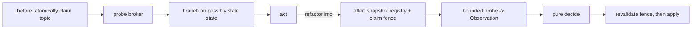

**Model applied.** Model the protocol: N replicas each with a private claim registry; the broker's shared
consumer-existence view; actions *claim / probe / register / release / crash*. State the safety invariant
— *for every topic, the number of replicas with an active consumer is ≤ 1* — and a liveness property — *a
topic with demand eventually gets exactly one consumer*. Check it to exhaustion at a scope matching the
real replica count (e.g. 3 replicas, 2 topics), including crash-mid-probe and stale-broker reads. This
reaches the cross-replica design space Extract cannot. Its honest limit (§9, §12): a green model does not
prove the code refines it. Two further invariants qualify for their own models once this one proves the
approach: at-least-once + idempotent delivery (R3), and recovery after an availability-zone outage (R4).

**Inject applied.** The system already injects benign faults (rolling restarts, isolated failover,
dependency bounces). Extend that existing harness with the adversarial scenarios of §11 that target the
invariants Extract and Model established: kill a replica *during* the claim under active write load and
assert the declared ownership invariant once the protocol reaches its stable condition; two replicas
racing one topic at the same instant; partition and latency; message reordering against the at-least-once
guarantee; failover concurrent with live queries.

**The dependency, instantiated** (the §14 template):

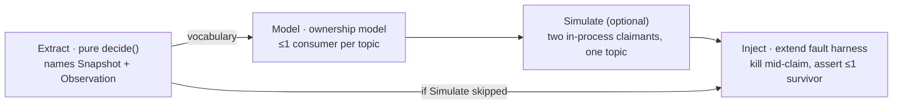

**The conformance gap this example exposes** (reading §15's matrix against a typical such system): the
pure decision modules are well tested; the live fault tier is real but benign-only; and the "Concurrent /
interleaved" column is empty — the take-then-act registry primitive has no contention test, no test
reproduces the claim+probe race, and there is no cross-process model. That emptiness is the
single-threaded-suite signature of §15: the system proves its decisions correct *in isolation* and has not
yet proven they stay correct *under concurrency*, nor that the protocol they serve is sound. Extract →
Model → (Simulate) → extend-Inject is exactly the sequence that closes it.

---

## Appendix B — Worked example (fenced): single authoritative writer elected over replicated semantic state

> A second worked example, and the one this whole doctrine is grounded in: **the prodbox gateway** — the
> ranked daemons that keep exactly one public DNS A record on the elected leader. It exercises what
> Appendix A does not: an impossibility-bounded conditional invariant (R7) and a load-bearing synchrony
> premise (R8), still within a single consistency domain.
>
> **SSoT note.** This appendix narrates the gateway to teach the method; it does **not** own it. The
> gateway's formal model, its invariant catalog (the safety/liveness properties below), its divergence
> tracking, and its CAP posture are owned by
> [tla_modelling_assumptions.md](./tla_modelling_assumptions.md) (§5 invariant catalog, §6 FLP posture),
> [tla/README.md](./tla/README.md), and
> [distributed_gateway_architecture.md](./distributed_gateway_architecture.md). Cite those when scheduling
> or implementing gateway work; cite this appendix for the method it illustrates.

> **Implementation-status note.** Sprint
> [2.31](../../DEVELOPMENT_PLAN/phase-2-gateway-dns.md) landed the bounded
> state/delta/per-emitter-repair and credential-gated effect shape used in this worked example.

**The system.** A small fixed set of ranked daemons must keep exactly one public DNS A record pointing at
whichever of them is the elected leader, so traffic always reaches a live owner. The daemons share no
address-space state; they converge a **bounded signed semantic replica state**: latest heartbeat and
ownership evidence per Orders member, bounded replay/diagnostic windows, and a monotonic
receive-cursor vector keyed by emitter.
Peers reconcile by idempotent bounded deltas or a signed per-emitter semantic checkpoint plus a
bounded suffix. Each daemon separately retains only its own committed continuity anchor and at most
one exact staged assertion; that authority prevents sequence reset across a total peer restart but
does not preserve the discarded semantic history. The only externally-visible effect is the DNS
write. The invariant: **at most one daemon writes the DNS record —
once the daemons' views have converged.** That conditional clause is deliberate and load-bearing (R7): the
invariant is *not* absolute. It meets the §2 gate — decisions under concurrency (claim / yield / write),
coordination only through the peer protocol, and a *no-two-writers* invariant no single daemon can enforce
alone.

**The defect (§3 made concrete).** Each daemon decides "am I the owner, and may I write DNS?" from its
local view of peer liveness (heartbeat ages) and replicated ownership evidence. The naive path reads a *peer heartbeat older
than the timeout* as "that peer is dead," elects itself, and writes DNS on the premise "I am the sole
owner" — a premise that may already be false. This is *timeout-coerces-unknown*: a missing heartbeat means
*unreachable-or-slow*, not provably *dead*. It compounds with *state-conflation* if the daemon collapses
"I successfully pushed to the peer's socket" (outbound reachability) with "the peer is alive and emitting"
(inbound freshness) — two distinct facts that a one-way partition drives apart, and that must be tracked as
**separate** observations, not one boolean.

**Extract applied.** Make the decision a pure function of a convergent bounded input (§8). Election
is `decide : (orders, heartbeat-observations, up-set) → owner`, a *deterministic* total function over the
ranked node set — given identical observations, every daemon computes the same owner, so convergence alone
removes accidental split-brain. The owner-only action is gated by a second pure predicate over the
**semantic ownership view**: *may-write = (I am the computed owner) ∧ (my latest replicated claim is
unsuperseded by a later yield) ∧ (a usable DNS credential generation was observed) ∧ (the retained
continuity fence is current) ∧ (the claim is bound to that generation and fence)*. Because the gate
folds over a convergent semantic projection rather than local belief, it is pure *because its input
converges*. Note the §8 typed-unknown scoping at work: the daemon **does** coerce "stale heartbeat →
drop peer from the up-set," but that coercion only changes *who attempts to lead* (liveness); it never
authorizes a write, because the write is gated by ownership, credential, claim, and continuity
evidence, not by the heartbeat. The coercion is therefore
licensed — it cannot violate safety. The pure `decide` and `may-write` are exhausted by property tests
with no cluster or clock.

The before/after, as the §8 template instantiates:

```mermaid
flowchart LR
  T1["before: read peer heartbeats"] --> T2["coerce stale heartbeat to peer dead"]
  T2 --> T3["self-elect and write DNS"]
  T3 --> T4["act on sole-owner belief"]
  L1["after: snapshot orders + observations"] --> L2["pure deterministic owner decision"]
  L2 --> L3["may-write checks claim + credential + continuity fence"]
  L3 --> L4["construct typed DNS action only if gate passes"]
  T4 -->|"refactor into"| L1
```

**The impossibility and the synchrony premise (R7, R8).** Under partition you cannot have both *no two
writers* and *autonomous failover progress* (FLP/CAP). This system makes the R7 choice **explicit and
availability-first**: an isolated daemon may self-elect as a failsafe, so under severe partition the
absolute single-writer invariant is not claimed. The DNS write stays gated by the local semantic view, which
means any split-brain admitted by the availability choice is *temporary* — its duration bounded by the
partition itself, and its healing latency once views reconverge bounded by propagation — and
**deterministically heals on reconvergence** (the losing side observes a superseding claim or yield and
stops writing). The invariant is therefore stated conditionally — *≤ 1 writer once views converge* —
exactly as R7 demands, and the chosen mode is recorded in the ledger. (The prodbox gateway is the concrete
instantiation — also **availability-first** under partition — and its model and posture are owned by
[tla_modelling_assumptions.md §6](./tla_modelling_assumptions.md#6-flp-impossibility-acknowledgment) and
[distributed_gateway_architecture.md §5](./distributed_gateway_architecture.md#5-safety-boundary-important);
the §5 "safety boundary" is the FLP impossibility *limit*, not a safety-first choice.) Safety further rests
on a **bounded clock-skew premise** (R8): heartbeat freshness compares wall-clock UTC stamps across
daemons, so a drifting clock breaks the liveness view the election consumes. Claim/yield ordering
itself uses the fixed emitter epoch/sequence cursor. The skew premise is named with an explicit
bound (`max_clock_skew_seconds`), **enforced** by rejecting inbound heartbeats whose stamps fall
outside it, and **monitored** by exporting the maximum observed inter-node skew so drift is visible
before it crosses the bound. No move proves this premise; it is recorded **assumed**.

**Model applied.** The finite TLC model explores two ranked nodes with bounded epoch, sequence,
Orders, and time domains. It checks the documented safety invariants, including bounded types,
cursor/authority ordering, credential-and-continuity prerequisites, claim-before-write, no sequence
wrap, and at most one eligible writer once views are stable. It does not claim liveness or coverage
of the production three-peer cardinality. Its `ClaimPrecedesWrite` invariant ensures the abstract
writer has a current self-claim; native semantic-fold and partition tests exercise the corresponding
yield/takeover convergence behavior. Honest limits (§9, §12): the model is
in **logical time with a bounded scope**, so it proves nothing about node counts beyond two, nothing
about unbounded runs, and — critically — nothing about the **real-time clock-skew premise** it abstracts
away (that lives in R8's ledger row, not the model). Native properties separately exercise concrete
delta/repair merge, cursor recovery, byte bounds, and retained-authority crash points.

**Inject applied.** The system already injects benign faults (rolling restarts, isolated failover). Extend
that harness with the §11 adversarial scenarios that target what Extract and Model assert: partition the
mesh and assert the chosen R7 mode — possible bounded divergence during the partition, plus
**single-writer once views converge** and the expected claim/yield markers after heal; kill the current
owner *mid-claim under active write load* and assert exactly one writer survives after convergence; drive
a **one-way** partition and confirm inbound-vs-outbound health stay distinguished rather than collapsed;
and inject **clock skew beyond the configured bound** to confirm the daemon rejects the out-of-bound events
(R8) rather than silently corrupting the ordering.

**The dependency, instantiated** (the §14 template):

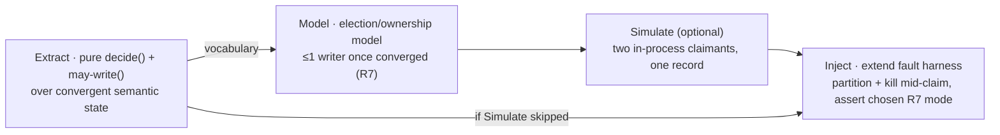

**The ledger this example must keep** (§12): *proven* — pure decision-layer properties and the seven
modeled safety invariants for the finite two-node model; *tested* — bounded delta/repair convergence,
continuity crash points, credential-gate refusal, and the native partition scenario; *assumed* — the
bounded clock-skew premise (R8), model↔code refinement, and behaviour above the modeled node count.
Reading §15's matrix, the rows that make this
subsystem distinctive are *impossibility-bounded invariant (R7)* — the condition stated, the
availability-first mode chosen, the conditional invariant modeled, and a partition fault asserting the
violation is bounded and heals — and *synchrony assumption (R8)* — the skew bound named, enforced,
monitored, recorded assumed, and exercised by an out-of-bound-skew fault.

---

## Appendix C — Worked example (fenced): geo-replication failover of a realtime data workflow

> A third worked example, the first to cross the Second Axis (§16): a **consistency boundary** with
> asynchronous cross-domain replication (R1/§17, R9), a bounded-staleness / **data-loss premise** and an
> explicit **failover budget** (R8, R9), and **reconciliation/merge** of divergent histories under an
> availability-first choice (R7). It is **forward-looking**: prodbox runs no active-active geo-replication
> today, but its cross-cluster federation and async-replicated MinIO object store
> (see [cluster_federation_doctrine.md](./cluster_federation_doctrine.md)) are exactly this shape, so the
> doctrine works it through before the need is live.

**The system.** A realtime workflow — `command → event* → result` — runs over a message log, with durable
outputs written as **content-addressed, write-once blobs** (key = hash of payload; a duplicate write of
identical bytes is idempotent and succeeds) plus a single mutable **CAS "latest" pointer** advanced by
compare-and-swap. *Within* one region the log and object store are strongly consistent. The system spans
**two regions, full active-active** — both serve live traffic **and** both advance the shared control
state, replicating **asynchronously** in both directions. Region authority for any genuinely-singleton
operation reuses the elected-owner pattern of Appendix B, lifted to region scale: a ranked set of regional
endpoints, **DNS owner = the active region** — and that meta-election is *itself* only **R7-conditional**
(both regions may briefly self-elect under partition). The invariant: *for effects that have replicated or
are later reconciled, no effect is double-applied; at most one region holds singleton authority once views
converge; acknowledged-but-unreplicated work is bounded by the R9 data-loss budget.* This meets the §2
gate. The load-bearing fact, named up front per R1/§17, is the **consistency boundary**: strong within a
region, asynchronous across. Per §17's classification, the content-addressed blobs are confluent and cross
safely; the single CAS pointer and the region authority are non-confluent singletons that cross only in
R7's conditional form with reconciliation.

**The defect (§3 made concrete).** Crossing the boundary opens a new species of the same §3 shape, where
the "instant that could have changed" is a **replication lag**:

- *Topology-scale timeout-coerces-unknown.* On failover, a region reads its lagging replica at offset `X`
  and treats `X` as the *complete* history — coercing *not-yet-replicated* into *does-not-exist*. The
  truthful value of "are there committed effects past `X`?" is **unknown**; coerced to absence, the region
  silently drops the unreplicated tail, or regenerates it as "new" and risks double-applying them on
  failback.
- *State-conflation.* The region collapses *partitioned-from-the-peer* with *peer-region-dead* — two
  distinct conditions an inter-region partition drives apart. Read as "dead," it asserts singleton
  authority while the peer still holds it → split-brain at region scale; read as "alive, must wait," it
  stalls when the peer is truly gone. They demand different actions and must be tracked as **separate**
  observations (Appendix B's inbound-vs-outbound distinction, lifted across the boundary).

**Extract applied.** The consumer decision is a pure function of a convergent input: a fold over the
replicated message log plus the content-addressed artifacts. Because blobs are content-addressed and
write-once (identical content → identical key → idempotent) and the log dedup is a pure fold keyed by a
replication-surviving work-id, **duplication, reordering around the boundary, and late arrival after heal
are absorbed structurally for any effect that eventually appears in the merged history** — pure *because
the input converges* (§8's strongest form), carrying cross-boundary redelivery (R3). Per the substrate's
real ordering, per-producer order is preserved across replication and there is **no global cross-producer
total order**, which the fold tolerates by construction. The **typed-unknown scoping** (§8) is the crux:
"I have not seen entries past `X`, so I will serve" decides *which region serves* — a **liveness** coercion
that authorizes no effect, hence licensed; "those effects do not exist / were never durable" is a
durability **safety** claim and is the §3 defect — durability of the tail beyond `X` stays a typed
*not-yet-observed* value. It is reconciled when the boundary heals; if the failed side is permanently lost,
that tail is accounted for only by the R9 data-loss budget, never silently resolved to "absent."

The two-region data path:

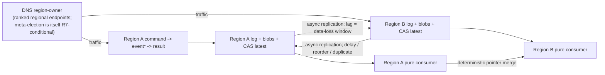

**The impossibility, posture, and reconciliation (R7, R9).** Over an asynchronous boundary admitting
inter-region partition, **no strongly-consistent cross-region singleton exists** (FLP/CAP at region
scale). The invariant is stated **conditionally** per R7/R9: *replicated or recovered effects are
deduplicated and merged exactly once; effects committed in one region but not yet replicated at the moment
of failover may be permanently lost within the declared data-loss budget.* This system chooses
**availability-first**: both regions serve immediately and **reconcile on failback**, so divergence is the
*normal* case, not just a partition edge. Two distinct sources of lost/divergent state are kept separate:
(1) the **irrecoverable data-loss window** — the un-replicated tail already gone at the instant of failover,
regardless of mode (R8/R9); and (2) the **deposed-actor window** — a region that loses singleton authority
keeps acting for up to the replication lag until the superseding claim propagates across the async gate
(§9's remedy *weakened across the boundary*) — a bounded, self-healing R7 violation. The merge is where
Appendix B's single semantic convergence domain "heals itself" does **not** generalize (R7
reconciliation): **content-addressed
blobs merge trivially** (the union of immutable, self-naming objects is conflict-free); the **CAS "latest"
pointer is the only divergent point and needs an explicit deterministic, total merge** — a
**timestamp-free** fold over the union of both regions' pointer-advance claims (ordered by
`(causal-predecessor-set, region-rank)`), so every node computes the same post-heal pointer **without** a
clock dependence. *If* you instead order by a commit timestamp, that ordering is a **bounded clock-skew
premise** and must be named, bounded, and monitored as an explicit R8 assumption. (Object-store conflict
handling rests on immutable versioning + heal-from-latest-version, not a last-writer-wins-by-modtime
algorithm.)

**The staleness premise and the recovery budget (R8, R9, PACELC).** Replication lag is the synchrony-style
premise this system rests on (R8): name it, bound it, **monitor** it (export observed lag and the max
log/pointer offset gap). The failover budget (R9) is the pair **(data-loss window, recovery time)** — the
window is assumed/monitored; the recovery-time bound is **tested by drill**. PACELC (R7): even **absent** a
partition, every cross-boundary write trades latency for consistency; this system chooses **latency**
(asynchronous replication), and the data-loss window *is* the price of that explicitly-recorded posture —
synchronous cross-region replication would pay cross-region RTT per publish, a cost a realtime hop
typically cannot afford.

**Model applied.** Model the **two-region protocol** with the cross-boundary adversary as **first-class**:
a replication channel that delays, reorders, and duplicates entries and can be **cut** (inter-region
partition); the region-owner election (lifted from Appendix B); actions *produce / replicate / consume /
advance-pointer / fail-over / fail-back / partition / heal*, explored to exhaustion at scope **2 regions**.
Safety: **exactly-once for replicated-or-recovered effects** (idempotent dedup absorbs redelivered/late
copies — R3); **bounded, mergeable divergence** (the deterministic pointer-merge yields a single convergent
state on heal — R7); **≤ 1 region authority once views converge** (Appendix B's invariant, lifted).
Liveness: *a workflow with a live region eventually completes through one authority.* The model rules out
the §9 deposed-actor hazard at topology scale, but per the §9 note the remedy is **bounded to the lag, not
eliminated**. The honest limit (§9, §12): the model is in **logical time** — it encodes "an effect either
had or had not crossed the boundary before the cut" but says **nothing** about the real size of that
window; whether field lag stays within bound is the **R8/R9 assumed premise**, in the ledger, not the
model. Two adjacent invariants earn their own models once this proves out: cross-boundary at-least-once +
idempotent merge (R3) and recovery after a full-region outage (R4).

**Inject applied.** The system already injects intra-cluster adversarial faults (partition, kill-mid-claim,
reorder/redeliver — Appendices A/B). **Extend that harness into the inter-region dimension:** cut the
replication channel and the cross-region control path and assert divergence stays **bounded and mergeable**
and **≤ 1 region authority once views converge**; **kill a region mid-workflow** and assert the peer
**resumes with bounded loss (≤ the measured data-loss window)**, no double-application for every replicated
or recovered effect, and authority transfer **within the recovery-time budget** (R9); **inject replication
lag** toward and past the bound and assert the **promotion-freshness gate** fires and the **lag monitor
alarms before a breach** (R8); **fail back with late + duplicate arrivals** from the recovered region and
assert **idempotency absorbs them** (content-addressed + log-fold dedup — R3) and the **CAS-pointer merge
converges deterministically** (R7) — no double effect, no lost merge.

The dependency, instantiated (the §14 template):

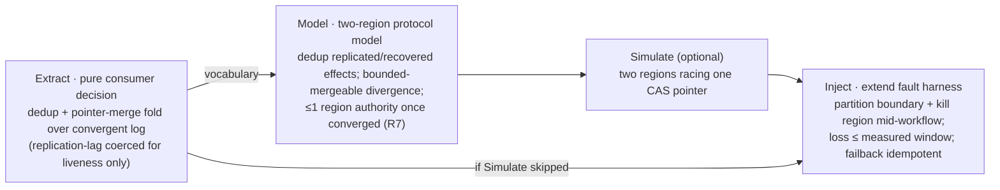

**The ledger this example keeps (§12, §19).** *Proven* — the consumer decision's purity and the dedup +
pointer-merge fold over the convergent input (decision layer); the modeled two-region safety/liveness
properties at scope 2 (dedup for replicated/recovered effects; bounded-mergeable divergence; ≤ 1 region
authority once converged). *Tested* — the inter-region-partition, kill-region-mid-workflow (**recovery
within budget, loss ≤ measured window**), replication-lag/promotion-gate, and
failback-late-arrival-idempotency scenarios. *Assumed* — the **data-loss-window / replication-lag bound**
(R8/R9), monitored, never proven; the **PACELC latency-for-consistency posture** (R7); model↔code
refinement and behaviour beyond 2 regions; the clock-skew premise inherited from the lifted election
(Appendix B's R8), plus any clock-skew premise introduced if the pointer-merge is ordered by timestamp
rather than the preferred timestamp-free fold. The **data-loss bound is assumed-and-monitored; the
recovery-time bound is tested**.

**Appendix C rests on doctrine (zero orphans).**

| Appendix C claim / mechanism | Doctrine home it instantiates |
|---|---|
| Substrate strong within a region, asynchronous across; blobs confluent, CAS pointer + authority singletons | §17 *Consistency boundary* + classifier; R1 |
| Topology-scale timeout-coerces-unknown (offset `X` read as complete history); partitioned ≠ dead | §16 (storage-layer recurrence + fourth blindness) |
| Pure dedup + pointer-merge fold over convergent log + content-addressed artifacts | §8 (convergent-log fold); R3 (replication-surviving key) |
| Per-producer order preserved / no global cross-producer order, tolerated by the fold | §17 (async-replication semantics); §8 |
| Coercion licensed for liveness, forbidden for a durability safety claim | §8 typed-unknown scoping |
| No strong cross-region singleton; invariant stated conditionally; availability-first | R7 (impossibility-bounded, conditional, mode chosen) |
| Blobs merge trivially; the CAS pointer *state* converges via a timestamp-free deterministic total merge, but the pointer's *authoritative-value* invariant is non-confluent — the merge discards one side's update (a lost update charged to the R9 budget) | §17 bucket (i) for state convergence; bucket (ii) / R7 for the discarded-update invariant; R9 |
| Timestamp-ordered merge would be an explicit clock-skew premise | R8 |
| Deposed region keeps acting up to the lag = bounded self-healing violation | §9 note + R7 |
| Replication lag named/bounded/monitored; data-loss window; promotion-freshness gate | R8; R7 (fail-closed promotion gate) |
| Failover budget = (data-loss window assumed, recovery time drilled) | R9 |
| PACELC: async posture chosen; sync would pay cross-region RTT | R7 (PACELC) |
| Two-region model; ≤1 authority once converged; honest logical-time limit | §9 Model; R7 |
| Extend the harness with partition / kill-region / lag-injection / failback | §11 Inject (extend-don't-build) |
| Ledger proven/tested/assumed; conformance rows | §12 + §19 (cross-boundary rows) |

---

## Appendix D — Worked example (fenced): active-active transactional state across a consistency boundary

> A fourth worked example, included because it exercises what Appendices A–C do not: a **mutable,
> multi-record, transactional** source of truth replicated **active-active** across a consistency
> boundary, where the governing classifier is **invariant-confluence / CALM** (§17). Appendix C kept its
> substrates confluent *by construction* (an append-only log + a content-addressed object store, both
> merging trivially); this one cannot, and must show what changes when the schema carries invariants that
> **do not merge**. Like Appendix C it is **forward-looking** — prodbox runs no active-active OLTP store
> today; it is worked here because the invariant-confluence question governs any future multi-master state,
> and the method should exist before the schema does.

**The system and the §2 gate.** A realtime workflow's source of truth is a mutable relational store,
geo-replicated **active-active (multi-master)** across two regions, `R_west` and `R_east`. Both accept
local writes and serve local reads; the link between them is the **consistency boundary** (§17): *inside*
a region the store is synchronously strongly-consistent; *across* the boundary it replicates
**asynchronously** — bounded lag, no global cross-region transaction order, possible duplication on retry,
possible divergence into two independently-advanced histories. It meets the §2 gate: decisions under
concurrency (debit/reject, mint-key/reject, promote/wait); coordination only through durable substrates
(the two regional stores + their replication stream); safety invariants no single region can enforce alone
(a global balance floor; a global uniqueness constraint).

**Classify every invariant by the boundary (R1, §17).** R1 demands we name the boundary and classify each
schema invariant by confluence *before* bucketing. Per the I-confluence classification (Bailis et al.,
2014), the schema's invariants fall into two destinations:

- **(i) Confluent** — maintained active-active with no coordination, bounded only by replication lag: an
  **insert-only event/audit table**; a **grow-only usage counter** (monotone in the safe direction);
  **content-addressed columns** (identical content ⇒ identical key ⇒ trivial merge); a **set-union tag
  column**; **NOT NULL / per-record CHECK** constraints whose predicates are local to one record;
  **referential-integrity inserts** when the parent is insert-only or causally present; and derived
  secondary indexes/materialized views rebuilt from the merged base state. Cascading deletes are confluent
  only under an explicit tombstone/delete-wins protocol with causal closure; otherwise deletion of
  referenced rows belongs in bucket (ii). A pure merge/fold reconciles the bucket-(i) cases (Extract; R7).
- **(ii) Non-confluent — held by bounded authority** — cannot merge, because the invariant spans records or
  imposes a global bound a per-record merge cannot reconstruct; each carries a *distinct* sub-form: a
  **numeric floor** (prepaid credit `balance ≥ 0`, decremented) → **escrow/reservation** (a per-region
  allowance partition of the global budget); a **uniqueness constraint** on a chosen value (at most one row
  per natural key, cluster-wide) → **disjoint-namespace allocation** (each region leased a disjoint key/ID
  block — *not* escrow); **"sum of line amounts = parent total"** and the **unmodeled deletion of a
  referenced row** (the *non-confluent* slice of referential integrity) → **restructure** to a confluent
  shape (lines insert-only, total a *derived fold*) **or** co-locate the aggregate under a **single-writer**
  scope; **which region is the promotion authority** at failover → the R7-conditional **singleton
  claim/yield** pattern (reused from Appendices B/C). Naming the sub-form **is** the design decision.

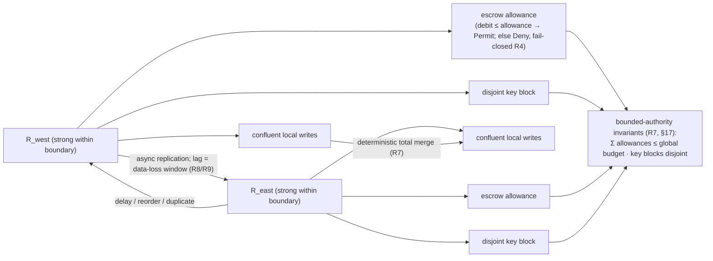

**The defect (§3 made concrete).** Two §3 species, both fatal to a naive multi-master debit:

- *Stale-read off a lagging replica (storage-layer §3).* `R_east` reads `balance = 1` from its local
  replica. The premise "one unit remains" was true at `R_east`'s snapshot `t0`, but `R_west` already
  debited that last unit at `t0' < t0`; the debit **has not crossed the boundary yet**. `R_east` branches
  *debit → balance = 0, valid locally* on a premise the boundary has already invalidated.
- *Write-write conflict mis-read as no-conflict.* "No conflicting row has replicated, therefore no conflict
  exists" coerces an **unknown** (*I have not yet observed a conflicting write*) into a **definite** (*there
  is no conflicting write*): *timeout-coerces-unknown* lifted to the replication boundary, and
  *state-conflation* (not-yet-replicated collapsed into not-existent).

The canonical breach: both regions hold `balance = 1`; each debits the last unit; **each commit is locally
valid and locally floor-respecting**; replication carries both debits across. A merge that replays both
debit operations yields `balance = -1`; a last-writer-wins merge hides one committed debit and violates
conservation/audit semantics instead. Either way a *cross-region* invariant was breached by two *locally
correct* decisions — the floor (`balance ≥ 0`) in the replay case, conservation/audit (a silently dropped
debit, leaving `balance = 0`) in the last-writer-wins case. **A per-record merge cannot manufacture a
non-I-confluent cross-record invariant** (§17; the §8 boundary-scoped-convergence note — two pure folds
over two divergently-advanced histories can each be pure yet jointly violate a global bound).

**Extract applied — three paths, by sub-form.**

- *Confluent path (pure merge/fold; R7).* For each confluent invariant the reconciliation is a **pure,
  deterministic, total merge** over convergent input — set-union for tags, max/sum for the grow-only
  counter, content-address identity for blob columns, append-union for the event table, FK-insert union
  when parent presence is causal, and tombstone/delete-wins cleanup only when that protocol is explicitly
  modeled — the §8 log-fold form, pure *because the input is convergent*.
  Commutative/associative/idempotent, so replay order and duplication cannot change the result;
  property-tested with no cluster and no clock.
- *Numeric escrow path (pure decision over LOCAL escrow state).* Escrow converts the global floor into a
  **local, confluent** invariant *up to a budget*. Each region holds a **local allowance**; the decision is
  `decide : (local_allowance, requested_amount) → Permitted | Denied`, a **pure function of purely local
  state**. Because the allowance is owned solely by this region, the debit needs **no cross-boundary
  coordination** up to the budget and is *correct under any replication lag* — it never reads the remote
  balance. Exhaustion (`requested > allowance`) → **Denied**, fail-closed (R4).
- *Uniqueness namespace path (pure decision over LOCAL key-block).* Each region is leased a **disjoint
  key/ID block**; `mint : (local_block, next) → Identifier | BlockExhausted` mints only from its own block,
  so two regions can never collide — a sibling of escrow, *not* O'Neil escrow. Block exhaustion fails
  closed / triggers a coordinated re-lease (R8/R4).
- *Typed-unknown scoping (§8).* The replication-unknown — *has a conflicting remote write happened?* —
  **may** be coerced for **liveness** (serve a stale read; render last-known balance) but is **never**
  coerced for the **safety** invariant: the floor is enforced by the *local allowance* and uniqueness by
  the *local block*, not by any read of the remote side. Exactly the §8 license — coerce the unknown only
  where a separate mechanism enforces safety regardless. State the case explicitly; the unexamined coercion
  is the §3 defect by default.

**R7 + invariant-confluence — the only honest "active-active."**

- *Confluent invariants* are held **availability-first** (R7): both regions write freely; the deterministic
  total merge heals divergence on reconvergence. Per R7, "heals" is passive *within* a region but across
  the boundary must be an **active deterministic total merge** of two divergent histories — which these
  invariants admit by construction.
- *Non-confluent invariants* are held by **bounded authority** — the only honest active-active for them. No
  merge maintains a global floor or global uniqueness; escrow/namespace sidestep the impossibility by
  **partitioning the global budget/namespace** so each side enforces a *local* bound and **the sum of local
  allowances never exceeds the global budget** / **the local blocks never overlap** (the *bounded-authority
  safety invariants*). What is genuinely active-active is the *budgeted/blocked* portion; beyond it the
  system fails closed or re-balances under coordination. **sum=total** is instead made confluent by
  **restructure** (derived fold) or kept **single-writer** — neither is active-active by merge.
- *PACELC posture (R7).* Else-Latency: even absent partition, escrow trades a *little consistency* (a
  region may reject a request it could have served had it held more budget) for *coordination-free
  low-latency local writes*. Under partition each region serves up to its current allowance/block and
  cannot reach across. **The allowance/block IS the bounded availability-first envelope** — the explicit
  finite amount of autonomous progress each side is licensed for.
- *Fail-closed promotion gate (R7)* is reused unchanged at failover: a region refuses to assume the other's
  allowance/block until it can **prove** the other has truly yielded it.

**R8 + R9 — the synchrony premises and the failover budget.**

- *Replication lag is a synchrony premise (R8)* — named, bounded, monitored (export observed max lag; alarm
  before it crosses); no move proves it; recorded *assumed*.
- *The escrow / namespace lease and rebalance is itself a bounded-time premise (R8).* Allowances and
  key-blocks are not static: an idle region's unused budget must be **reclaimable** and a busy region must
  be able to **refill / re-lease** — a lease with an explicit bound. That rebalance is a *coordinated* step
  on a *bounded* timer (a rebalance only *moves* budget, never *creates* it; §17 escrow term); if
  coordination is unavailable the region runs to exhaustion and fails closed (R4). Name, bound, monitor;
  recorded *assumed*.
- *The failover budget (R9)* is **(bounded data-loss window, bounded recovery time)**. The window = the
  **R8 lag at the instant of failover**: committed-but-un-replicated writes in the lost region are
  **irrecoverably lost** (data-loss budget, assumed by construction). Recovery time is **tested by drill**.
  A second R9 obligation specific to bounded authority: **the lost region's outstanding allowances and
  key-blocks must be reclaimed within RTO**, or the global budget/namespace permanently shrinks — and the
  survivor may not re-issue them until R7's fail-closed gate proves the lost region has yielded them (or its
  lease has provably expired).

**Model applied — model the multi-master protocol.** Model two regions, each with a local store, a local
allowance, and a local key-block; an async replication channel that may **delay, reorder, duplicate**;
**partition**; **region crash**. Actions: *local-write (confluent), local-debit (escrow), local-mint
(namespace), replicate, merge, partition, heal, crash, refill/rebalance, promote*. Assert, to exhaustion at
a scope matching the real region count (2 regions, ≥ 2 keys/accounts):

1. **Confluent convergence** — for every confluent invariant, all interleavings of
   delay/reorder/duplicate/partition-then-heal reach **one identical merged state** (merge
   commutative/associative/idempotent).
2. **Bounded-authority safety holds under partition** — `Σ local_allowances ≤ global_budget` **and**
   `local_blocks pairwise-disjoint` are preserved by every action, including during partition and across
   rebalances (a rebalance only *moves* budget/block, never *creates* it). The floor and uniqueness can
   never be breached, on any interleaving.
3. **Exhaustion is fail-closed** — a region whose allowance reaches zero (or whose block is spent)
   **rejects** further debits/mints, never borrows-on-faith across the boundary.
4. **No fabricated cross-record invariant (CALM made executable)** — the model demonstrates the per-record
   merge does **not** silently satisfy a cross-record invariant: for "sum of lines = total" it shows the
   naive merge *breaks* it, and that the only sound options are (a) co-locate the aggregate under a
   **single-writer** scope, or (b) **restructure** it confluent (lines insert-only; total a *derived fold*,
   after which it re-classifies into bucket (i)).

Honest limits (§9, §12): the model is in **logical time at a bounded scope** — it proves nothing about real
replication lag, real lease timing, or region counts beyond scope; those live in R8/R9's ledger rows,
*assumed*.

**Inject applied — extend the harness (don't build).** Extend the existing fault harness with the §11
adversarial scenarios that target what Extract and Model newly assert:

- **Partition during bounded-authority writes** — partition the boundary while both regions actively debit
  and mint; assert each keeps serving **up to its allowance/block** and the global floor/uniqueness never
  breaks in either partition.
- **Drive a region to exhaust its escrow / key-block under partition** — push `R_east` past its allowance
  (and spend its block) with the boundary down; assert **fail-closed reject**, never a floor breach or
  collision, never a silent borrow.
- **Failback with late + duplicate writes** — heal and replay the backlog with deliberate **reordering and
  duplication**; assert the **confluent merge converges**, **idempotency absorbs duplicates** (stable
  replication-surviving identity key, R3), and **no non-confluent invariant is ever violated** during or
  after convergence.
- **Region loss + RTO drill (R9)** — kill `R_east` entirely; assert (i) the data-loss window is bounded by
  the measured lag at failover, and (ii) `R_east`'s outstanding allowances and key-blocks are **reclaimed
  within RTO** under R7's fail-closed gate before `R_west` re-issues them — measuring the recovery time R9
  leaves to be *tested*.

The dependency, instantiated (the §14 template):

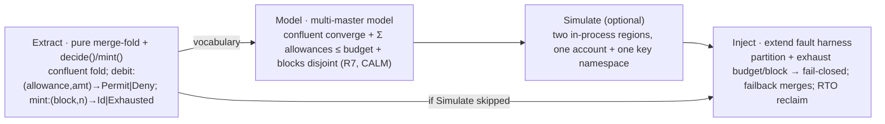

**The ledger this example keeps (§12, §19).** *Proven* — the **confluent-merge purity**
(commutativity/associativity/idempotence of each fold) and the **bounded-authority safety protocol** in the
model: `Σ allowances ≤ budget` ∧ `blocks disjoint` ⇒ floor/uniqueness hold under modeled
partition/reorder/crash at scope 2. *Tested* — partition-during-writes, **escrow/block exhaustion
fail-closed**, failback-with-duplicates, and **RTO-reclaim** drills. *Assumed* — the **replication-lag
bound** and the **escrow/namespace-lease bound** (both R8); the failover **data-loss window** (R9, = lag at
failover); model↔code refinement; behaviour above modeled scope.

**Honest limits this example must state.** Active-active OLTP is **not universal**: an invariant that is
neither confluent, escrow-able (aggregate-numeric), namespace-partitionable (uniqueness), nor restructurable
to a derived fold — e.g. an arbitrary cross-record CHECK kept as an independently-mutable field — **must
stay single-writer (coordinated) or be downgraded**. "Multi-master" applies only to the
budgeted/blocked/restructured subset; name the invariants it does *not* cover. And restructure shifts —
does not remove — the burden: making "sum=total" a derived fold moves correctness onto the fold's
**idempotent replay**, so R3's replication-surviving key must be verified to survive cross-boundary
post-failover replay, or duplicates re-corrupt the derived total.

**Appendix D rests on doctrine (zero orphans).**

| Appendix D claim / mechanism | Doctrine home it instantiates |
|---|---|
| Active-active mutable relational state across a boundary | §17 *Consistency boundary* (invariant-confluence classifier) |
| Merge the confluent invariants (events, counter, blobs, tags, FK inserts with causal parent presence, modeled tombstone/delete-wins deletes) | §17 bucket (i); R7 (total merge only when confluent) |
| Numeric floor `balance ≥ 0` → per-region **escrow** allowance | §17 *escrow/reservation*; R7 (bounded-authority) |
| Uniqueness → per-region **disjoint key-block** (not escrow) | §17 bucket (ii) namespace-partition sub-form; R7 |
| "sum of lines = total" → **restructure** (derived fold) or **single-writer** | §17 bucket (ii) restructure / single-writer; R7 |
| FK arbitrary-delete non-confluent; FK inserts and deletes only confluent under their stated causal/tombstone protocols | §17 I-confluence classification; R1 (test before bucketing) |
| Pure `decide(allowance,amount)` / `mint(block,n)` | §8 Extract (pure decision; typed-unknown scoping) |
| Stale lagging-replica read driving a debit | §16 storage-layer recurrence; §8 typed-unknown |
| Escrow/namespace **lease + rebalance/refill** on a bounded timer | §17 escrow term (R8); R8 |
| Escrow/block **exhaustion → fail-closed reject** | §17 escrow term (R4); R4 |
| Model the partition so it never overspends / never collides | §9 Model; §19 ledger row; §19 matrix row |
| Exhaust an allowance/block under partition (fault) | §11 Inject; §19 ledger row; §19 matrix row |
| PACELC posture; fail-closed promotion gate at failover | R7 (PACELC; promotion gate) |
| Data lost / allowance & block stranded at failover; RTO reclaim | R9 (data-loss assumed, recovery-time tested) |
| Idempotent absorption of duplicate replayed writes | R3 (replication-surviving identity key) |
| No global cross-record invariant fabricated by merge | §17 (I-confluence corollary); §8 boundary-scoped note |

---

## Cross-References

- [Development Plan](../../DEVELOPMENT_PLAN/README.md) — sprint sequencing, adoption ownership, and validation closure. This doctrine maintains no competing status ledger; scheduling of any conformance work lives in the plan.
- [Documentation Standards](../documentation_standards.md)
- [Engineering Docs Index](./README.md)
- [TLA+ Modelling Assumptions](./tla_modelling_assumptions.md) — SSoT for the formal model and invariant catalog of the gateway that Appendix B narrates.
- [TLA+ Models index](./tla/README.md)
- [Distributed Gateway Architecture](./distributed_gateway_architecture.md) — the gateway's leadership/failover design and §5 safety boundary.
