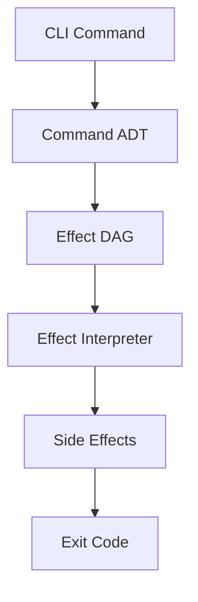

# Effectful DAG Architecture

**Status**: Authoritative source
**Supersedes**: N/A
**Referenced by**: CLAUDE.md, documents/engineering/README.md

> **Purpose**: Design documentation for the pure effectful DAG system in prodbox CLI.

---

## 1. Overview

The prodbox CLI uses a pure effectful DAG (Directed Acyclic Graph) system for command execution. This architecture separates:

1. **Command Definition** - What the user wants to do (Command ADTs)
2. **Effect Specification** - What side effects are needed (Effect types)
3. **DAG Construction** - How effects relate to each other (prerequisites)
4. **Effect Execution** - Actually performing the side effects (Interpreter)

---

## 2. Architecture Layers



### 2.1 Command ADTs

Commands are immutable frozen dataclasses that represent user intent:

```python
# File: src/prodbox/cli/command_adt.py
@dataclass(frozen=True)
class DNSUpdateCommand:
    force: bool = False
```

Smart constructors validate commands at construction time:

```python
# File: src/prodbox/cli/command_adt.py
def dns_update_command(*, force: bool = False) -> Result[DNSUpdateCommand, str]:
    return Success(DNSUpdateCommand(force=force))
```

### 2.2 Effect Types

Effects are declarative specifications of side effects:

```python
# File: src/prodbox/cli/effects.py
@dataclass(frozen=True)
class FetchPublicIP(Effect[str]):
    """Fetch current public IP address."""
```

Effects do NOT execute anything - they only describe what should happen.

### 2.3 Effect DAG

EffectNodes wrap Effects with prerequisite declarations:

```python
# File: src/prodbox/cli/effect_dag.py
@dataclass(frozen=True)
class EffectNode(Generic[T]):
    effect: Effect[T]
    prerequisites: frozenset[str] = frozenset()
```

The DAG auto-expands prerequisites transitively:

```python
# File: src/prodbox/cli/dag_builders.py
dag = EffectDAG.from_roots(
    dns_update_node,
    registry=PREREQUISITE_REGISTRY
)
# Expands: settings_loaded -> aws_credentials_valid -> route53_accessible
```

---

## 3. Effect Types

### 3.1 Platform Effects

| Effect | Description |
|--------|-------------|
| `RequireLinux` | Require Linux platform |
| `RequireSystemd` | Require systemd availability |

### 3.2 Tool Validation Effects

| Effect | Description |
|--------|-------------|
| `ValidateTool` | Check external tool is available |
| `ValidateEnvironment` | Check multiple tools |

### 3.3 Subprocess Effects

| Effect | Description |
|--------|-------------|
| `RunSubprocess` | Execute command, return exit code |
| `CaptureSubprocessOutput` | Execute and capture stdout/stderr |
| `RunSystemdCommand` | Execute systemctl command |
| `RunKubectlCommand` | Execute kubectl command |
| `RunPulumiCommand` | Execute Pulumi CLI command |

### 3.4 AWS/Route53 Effects

| Effect | Description |
|--------|-------------|
| `FetchPublicIP` | Get current public IP |
| `QueryRoute53Record` | Query DNS A record |
| `UpdateRoute53Record` | Upsert DNS A record |
| `ValidateAWSCredentials` | Check AWS credentials |

### 3.5 Composite Effects

| Effect | Description |
|--------|-------------|
| `Sequence` | Execute effects sequentially (short-circuit on failure) |
| `Parallel` | Execute effects concurrently |
| `Try` | Execute with fallback on failure |
| `Pure` | Return value without side effects |

---

## 4. DAG Construction

### 4.1 Prerequisite Registry

All prerequisites are defined in a central registry:

```python
# File: src/prodbox/cli/prerequisite_registry.py
PREREQUISITE_REGISTRY: PrerequisiteRegistry = {
    "platform_linux": PLATFORM_LINUX,
    "tool_kubectl": TOOL_KUBECTL,
    "aws_credentials_valid": AWS_CREDENTIALS_VALID,
    # ...
}
```

### 4.2 Transitive Expansion

Prerequisites expand transitively:

```
k8s_cluster_reachable
    -> tool_kubectl
    -> kubeconfig_exists
```

When you depend on `k8s_cluster_reachable`, you automatically get both `tool_kubectl` and `kubeconfig_exists`.

### 4.3 Command to DAG

The `command_to_dag()` function uses exhaustive pattern matching:

```python
# File: src/prodbox/cli/dag_builders.py
def command_to_dag(command: Command) -> Result[EffectDAG, str]:
    match command:
        case DNSUpdateCommand():
            return Success(_build_dns_update_dag(command))
        case RKE2StatusCommand():
            return Success(_build_rke2_status_dag(command))
        # ... all cases handled
```

---

## 5. Interpreter Pattern

### 5.1 Single Entry Point

All commands execute through `execute_command()`:

```python
# File: src/prodbox/cli/command_executor.py
def execute_command(cmd: Command) -> int:
    async def _run() -> int:
        match command_to_dag(cmd):
            case Success(dag):
                interpreter = create_interpreter()
                summary = await interpreter.interpret_dag(dag)
                return summary.exit_code
            case Failure(error):
                return render_error_and_return_exit_code(error)
    return asyncio.run(_run())
```

### 5.2 Effect Interpretation

The interpreter pattern-matches on Effect types:

```python
# File: src/prodbox/cli/interpreter.py (to be implemented)
async def interpret(self, effect: Effect[T]) -> Result[T, str]:
    match effect:
        case FetchPublicIP():
            return await self._interpret_fetch_public_ip(effect)
        case RunSubprocess():
            return await self._interpret_run_subprocess(effect)
        # ... all cases handled
```

---

## 6. Railway-Oriented Programming

### 6.1 Result Type

All fallible operations return `Result[T, E]`:

```python
# File: src/prodbox/cli/types.py
Result = Union[Success[T], Failure[E]]
```

### 6.2 Short-Circuit Behavior

`Sequence` short-circuits on first failure:

```python
# If FetchPublicIP fails, QueryRoute53Record never runs
Sequence([
    FetchPublicIP(...),
    QueryRoute53Record(...),
    UpdateRoute53Record(...)
])
```

### 6.3 Pattern Matching

Always use exhaustive pattern matching:

```python
match result:
    case Success(value):
        return process(value)
    case Failure(error):
        return handle_error(error)
# No else clause - mypy enforces exhaustiveness
```

---

## 7. Testing

### 7.1 DAG Structure Tests

Test DAG construction without execution:

```python
def test_dns_update_dag_includes_aws_prereqs() -> None:
    cmd = DNSUpdateCommand(force=True)
    match command_to_dag(cmd):
        case Success(dag):
            assert "aws_credentials_valid" in dag
            assert "route53_accessible" in dag
        case Failure(_):
            pytest.fail("DAG construction should succeed")
```

### 7.2 Effect Mock Tests

Test effects with mock interpreter:

```python
def test_fetch_public_ip_effect(fp: FakeProcess) -> None:
    fp.register(["curl", "https://api.ipify.org"], stdout="1.2.3.4")
    # Test effect interpretation
```

---

## Cross-References

- [Prerequisite Doctrine](./prerequisite_doctrine.md)
- [Types Module](../../src/prodbox/cli/types.py)
- [Effects Module](../../src/prodbox/cli/effects.py)
- [DAG Module](../../src/prodbox/cli/effect_dag.py)
